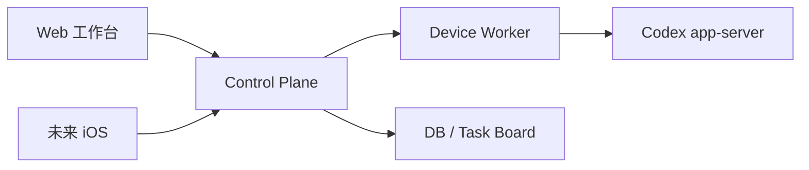
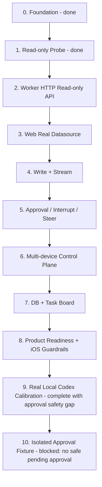
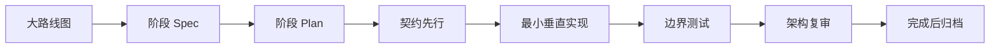

# Codex Remote Development Overview

## 总目标

构建一个自托管的多设备 Codex Web 控制台。

核心能力是在一个 Web 工作台中管理多台设备上的 Codex：查看设备状态、项目、对话和输出流，发送 follow-up，中止任务，处理 approval，并把不同设备上的 Codex conversations 关联到任务看板。

当前子目标是在不改变上述产品定位的前提下，让 Web 工作台尽量具备 Codex App-like 的功能体验：会话生命周期、实时 timeline、文件、Shell、Git、搜索、模型、配置、技能、插件、MCP、账户和实时语音等能力。

长期拓扑：

## 维护规则

`PLAN.md` 是项目路线图和进度综述的活文档。阶段状态、下一步建议、风险判断或调研结论变化时，必须同步更新本文件；阶段细节仍写入 `docs/superpowers/specs/` 和 `docs/superpowers/plans/`。

目录职责和依赖方向以 `PROJECT_STRUCTURE.md` 为准。新增阶段目录或移动代码前，先更新该文件。

产品定位和 MVP 范围以 `PRODUCT.md` 为准；视觉系统和组件风格以 `DESIGN.md` 为准。

Codex App-like 能力对齐以 `CODEX_APP_PARITY.md` 为准；`FEATURE_SUPPORT.md` 记录当前支持状态和 app-server 协议覆盖。

## 架构原则

- `packages/api-contract/openapi.yaml` 是 Web、Worker、Control Plane、未来 iOS 的唯一 API 事实源。
- `packages/codex-protocol` 是 Codex app-server 协议唯一事实源。
- `apps/worker` 是唯一直接连接或启动 Codex app-server 的模块。
- `apps/web` 不接触 app-server 原始协议。
- 每阶段必须有明确目标和 non-goals，避免顺手扩范围。
- 每阶段只交付一个可验证主链，不铺无用架子。
- 抽象延迟：一次使用不抽象，第二次重复再提取。

## 阶段路线

| 阶段 | 目标 | 当前状态 |
| --- | --- | --- |
| 0. 架构底座 | monorepo、包边界、contract/protocol 事实源 | 已完成 |
| 1. Read-only Worker Probe | 验证本机 app-server read-only 主链 | 已完成 |
| 2. Worker HTTP API Read-only | 把 probe 能力变成 Web 可调用 API | 已完成本地可验证切片 |
| 3. Web 接真实数据 | Web 从 Worker/Control Plane-shaped API 读取设备、项目、对话、timeline | 已完成本地可验证切片 |
| 4. 写操作主链 | start、follow-up、stream 输出 | 已完成本地可验证切片 |
| 5. 控制主链 | interrupt、steer、approval request/response | 已完成本地可验证切片 |
| 6. Control Plane 多设备 | 多 Worker 注册、路由、状态聚合 | 已完成本地可验证切片 |
| 7. 持久化与任务看板 | DB、任务关联、conversation 到任务映射 | 已完成本地可验证切片 |
| 8. 产品化与扩展 | 本地 self-hosted readiness、运行手册、安全检查、iOS API guardrails | 已完成本地可验证切片 |
| 9. 真实本机 Codex 闭环校准 | 用真实 Codex app-server 验证 Stage 3-8 已声明能力 | 已完成本地可验证切片；approval decision 为安全 real-gap |
| 10. Isolated Approval Fixture | 用隔离 fixture 验证真实 approval decision decline/cancel；no accept/policy amendment/production approval model | 已实现校准 fixture；blocked 于 app-server 未产生 safe pending approval |

Stage 9 当前证据：

- Fake smoke evidence：Stage 3-8 的 fake Worker smoke 覆盖过 Web/Control Plane/Worker-shaped flows，但它只能证明 contract/UI/fallback 行为；Task 5/6 已实现 real calibration runner 和 smoke gate 后，fake Worker smoke 不再能作为 real readiness。
- Real app-server evidence：Worker-owned `stdio` app-server lifecycle 已实现为当前默认路径；`pnpm real:start` 可启动 Worker、Control Plane 和 Web，`pnpm real:status` 看到三项 running。
- Real calibration evidence：`pnpm real:check` 生成 ignored `logs/real-check/latest.json`，当前 summary 为 `total=19 realPass=18 fixedPass=0 realGap=1`。Worker app-server proof 为 `appServerConnected=true` 且 `transport=stdio`；public project/conversation/task refs 保持 opaque。
- Web real entrypoint evidence：`pnpm web:e2e:smoke` 在真实栈上通过，覆盖 Web -> Control Plane -> Worker 的加载、start、任务创建/关联和无外部 runtime asset 请求检查。
- Fixed in current slice：Control Plane task conversation links now reject arbitrary invalid ids before persisting; `task link` and `task link invalid ids` both record `real-pass`.
- Fixed in current slice：Q24 Control Plane degraded-vs-empty fixtures now record `real-pass`; all-workers-down and invalid-worker-token make `/v1/conversations` return a sanitized dependency error instead of `200 []`, while health/devices remain sanitized degraded inventory.
- Fixed in current slice：Worker specific conversation routes now prove access with `thread/read` followed by Worker-local realpath verification; start, timeline, follow-up, approval pending list, and interrupt record `real-pass`.
- Fixed in current slice：`real:check` now waits briefly for post-start timeline visibility and uses separate steer/interrupt samples where available; same-turn steer-before-interrupt was tested and rejected because it regressed earlier evidence.
- Fixed in current slice：`steer` readiness is now guarded by public active-turn proof; without that proof, `real:check` records sanitized `active-turn-gap` instead of a generic Worker error or product-ready pass.
- Fixed in current slice：Q23 cwd scope and pagination now use a Control Plane device-scoped Worker probe. `thread/list cwd scope` and `thread/list pagination` record `real-pass` with `exactCwdListProven=true`, `completedUntilNextCursorNull=true`, and sanitized page/count evidence.
- Fixed in current slice：`steer` now uses an independent safe steer-only sample and records `real-pass` with `activeTurnProven=true` plus accepted public steer status.
- Fixed in current slice：Real Chrome verification found app-server-derived conversation name/preview could expose calibration prompt text; Worker conversation projection now uses project fallback title and empty summary instead of public `thread.name` / `thread.preview`.
- Documented safety gap：approval decision has no safe pending approval in the current real project stack. Approval pending list is real, but approval decision is excluded from product-ready claims until a separate isolated approval fixture proves at least decline/cancel; automatic accept, persistent policy amendment, and production approval safety model are out of Stage 9.
- Transport/readiness rule：`debug-websocket` 仅是 explicit local debug fallback；`real:check` 和 readiness 只接受 `stdio` proof。
- Output streaming：仍是单独 out-of-scope，不随 Stage 9 校准默认为完成。

Stage 10 当前证据：

- Implemented in current slice：Worker calibration runtime flag, isolated approval fixture process orchestration, sanitized fixture report checks, and decline-only decision path are implemented without OpenAPI/Web/Control Plane public contract changes.
- Real verification：`pnpm real:start` and `pnpm real:status` prove Worker, Control Plane, and Web running on loopback; `pnpm web:e2e:smoke` passes against the real stack.
- Current `pnpm real:check` evidence：`logs/real-check/latest.json` currently records `total=19 realPass=18 fixedPass=0 realGap=1`. `approval decision` remains `real-gap` with `reasonCode=approval_fixture_no_pending_request`; `interrupt` records `real-pass` with `activeTurnProven=true`.
- Fixed in current slice：interrupt now uses an independent safe interrupt-only active-turn sample before calling the public interrupt route, avoiding the previous follow-up/interrupt race on the original conversation.
- Focused fixes attempted：workspace-write/on-request, read-only/on-request, read-only/untrusted, stdout-only command prompt, and explicit generated-protocol `approvalsReviewer: "user"` were tested. The retained implementation is read-only/on-request with user-routed approvals because it matches Q22's safer fixture direction; no automatic accept, `acceptForSession`, policy amendment, production approval model, user-layer rules edit, or auth-copying path was added.
- Remaining risk：current app-server behavior does not emit a pending approval for the isolated fixture prompt within the bounded polling window, so approval decision is still not product-ready. The next safe evidence source is a trusted project-local rules layer or equivalent app-server-supported rules injection; do not modify user `~/.codex/rules` automatically.

当前大目标差距：

- 已真实验证：Web -> Control Plane -> Worker -> Codex app-server 的本机主链，设备、项目、对话、start、follow-up、interrupt、steer、task create/link、本地 self-hosted 运行路径均有 real evidence。
- 已纠偏：fake Worker smoke 只保留为 UI/contract/fallback 验证，不再作为 real readiness 证据。
- 未闭环：approval decision 还没有真实 pending approval 可供 Web/Control Plane/Worker decline/cancel；因此 approval 不能宣称 product-ready。
- 未进入：用户可控权限模式、自动审批、production approval safety model、installer/keychain/pairing、reverse WSS、外部部署、iOS、streaming event log。

当前 Codex App parity 方向：

- 根路线文档：`CODEX_APP_PARITY.md`。
- 支持状态矩阵：`FEATURE_SUPPORT.md`。
- 下一阶段不再默认等同于权限控制 / approval productionization；应先围绕 Codex App-like 能力面拆分 stage，再为选中的能力面写 spec 和 plan。

当前 active Superpowers 文档：

- 无。下一阶段开始前先从 `CODEX_APP_PARITY.md` 选择一个能力面，写新的 stage spec 和 plan。

已归档 Superpowers 文档：

- Stage 2-9 的 spec/plan 已移动到 `docs/archives/specs/` 与 `docs/archives/plans/`。
- Stage 10 的 isolated approval fixture spec/plan 已移动到 `docs/archives/specs/` 与 `docs/archives/plans/`；归档含义是实现切片结束且 blocked，不代表 approval decision product-ready。

## 每阶段交付标准

每个阶段都必须产出：

- `docs/superpowers/specs/YYYY-MM-DD-xxx-design.md`
- `docs/superpowers/plans/YYYY-MM-DD-xxx.md`
- 明确目标、非目标、包边界和唯一事实源。
- 最小但有效的测试。
- fresh verification：`pnpm lint && pnpm typecheck && pnpm test && pnpm build`。

## 执行方式

建议按主链推进，而不是按技术层铺空架子：

1. 先确认本阶段服务哪条用户主链。
2. 先写 contract，再实现 Worker/Web。
3. 每次只做一个垂直切片。
4. 用边界测试守住事实源、安全和包依赖方向。
5. 阶段完成后复审、归档，再进入下一阶段。

## 主要风险

| 风险 | 影响 | 应对 |
| --- | --- | --- |
| app-server 协议变化 | Worker 调用断裂 | `codex-protocol` 生成物作为唯一事实源，协议变更先更新生成物 |
| WebSocket app-server 不稳定 | 本机 Worker 不可靠 | Stage 2 以 Worker-owned stdio 为目标方向，loopback WebSocket 仅保留为 probe/debug fallback；实现前必须用本机 Codex CLI 验证 |
| 多设备安全边界复杂 | token、project、approval 泄露风险 | Worker fail-closed，Control Plane 不保存 provider secrets |
| 过早做 Control Plane / DB | 偏离主链，产生冗余 | 先单设备 read/write 主链闭环 |
| Web 直接绑定 mock 数据 | 后续替换困难 | 先建立 datasource boundary |
| Approval 处理不严谨 | 可能误执行命令或文件操作 | approval 独立主链，显式用户决策，不自动接受 |
| streaming 不是可靠 event log | Web timeline 乱序、重复或断线后丢状态 | Worker 生成 `seq/eventId`，Web 做 snapshot reconciliation，断线补偿不依赖 app-server replay |
| DB 过早复杂化 | 分散主链实现成本 | Stage 7 默认 SQLite + Drizzle；多实例写入、remote sync、PostgreSQL 等到真实需求出现再评估 |
| 运行时版本承诺过早 | 本地可跑但产品化不可维护 | 本地开发可用当前 Node；产品/runtime 支持矩阵按 Node LTS 做阶段验证 |
| API contract 过度 Web-specific | 未来 iOS/Worker 破坏性迁移 | 保持 stable `operationId`、opaque cursor、明确 `additionalProperties` 和标准错误形态 |
| device-bound token 误降级 | 普通 bearer 被误当设备绑定凭证 | Stage 6 先写 threat model；bearer+rotation 只能作为明确降级或开发姿态 |

## 调研状态

已导入并初步解析的调研回答位于 `docs/references/questions/`。

| 范围 | 状态 | 结论 |
| --- | --- | --- |
| Q1-Q4 下一阶段 P0 调研 | 已回答 | Stage 2 可进入 Worker HTTP API Read-only MVP；建议 Hono 作为 HTTP 边界、5 个 read-only endpoint、stdio 作为目标 transport、`thread/turns/list` 作为可选 experimental capability |
| Q5-Q8 写/流/控制链路调研 | 已回答，Q8 需本地验证 | streaming 需 Worker event envelope/replay；start/follow-up/steer 分开建模；approval 需 Registry/CAS/idempotency；interrupt/steer 需 `expectedTurnId` 和 per-thread 串行化 |
| Q9-Q12 多设备/DB/iOS/产品化调研 | 已回答，Q11 只采纳 guardrails | 多设备采用 one-time pairing + device identity + reverse connection；DB 默认 SQLite + Drizzle；iOS 当前只固化 API guardrails；Worker 产品化 user-mode first |
| Q13 E2E / Playwright | 已回答 | 第一个可交互用户纵切链路出现时引入 Playwright smoke；Node/API integration 仍是主验证层 |
| Q14-Q17 DB driver / reverse connection / device auth / secret storage | 已回答，Q16 需 Stage 6 threat model 裁剪 | DB driver 默认 `better-sqlite3`；reverse connection 默认 WSS + 应用层 ack/lease/resume；device-bound token 长期方向为 DPoP-compatible sender-constrained token；Worker identity secret 默认 OS keyring |
| Q18-Q20 Stage 9 app-server/session/project identity | 已回答 | Worker 使用 initialized long-lived app-server session；public project id 必须 opaque，路径/cwd 留在 Worker；Worker-owned app-server transport 目标为 stdio，loopback WebSocket 仅 debug fallback |
| Q21-Q24 Stage 9 实机验证项 | partial，进入当前执行计划 | start/follow-up/interrupt/steer、active turn/approval、`thread/list(cwd)` scope/pagination、Control Plane degraded-vs-empty 必须由 `pnpm real:check` 和真实本机栈给出 real-pass/fixed-pass/real-gap |
| Q25-Q28 Stage 9 readiness guardrails | 已回答 | Stage 9 需要最小 Web browser smoke；real-check 默认写 ignored `logs/real-check/`；task-link 必须验证资源/归属；self-hosted Web 不应运行时请求外部字体或静态资源 |

当前不新增全网调研问题。Stage 9 本机实证计划已归档到 `docs/archives/plans/2026-06-20-real-local-codex-calibration.md`。

## 当前技术栈

- TypeScript
- pnpm
- Turborepo
- Next.js Web
- OpenAPI 3.1
- openapi-typescript
- Node built-in test runner
- Node `fetch` / `WebSocket`
- Codex CLI app-server
- `packages/api-contract`
- `packages/codex-protocol`
- `apps/worker`

产品化支持矩阵以后续阶段 spec 为准；本地开发可用当前 Node 版本，但长期运行和分发优先按 Node LTS 验证。

`docs/references/codex-app-server.md` 是 app-server 协议解释性参考；`packages/codex-protocol` 的生成物仍是 Worker 代码使用的协议类型事实源。

## 下一步建议

最近完成的 Superpowers spec：

- `docs/archives/specs/2026-06-20-worker-write-stream-design.md`

最近完成的 Superpowers plan：

- `docs/archives/plans/2026-06-20-worker-write-stream.md`

Stage 4 已完成：

- `packages/api-contract/openapi.yaml` 定义版本化写接口：`POST /v1/conversations` 与 `POST /v1/conversations/{conversationId}/follow-up`；旧的未版本化 follow-up 写路径已移除。
- `apps/worker` 是唯一 app-server 写调用边界，使用生成的 `packages/codex-protocol` 方法类型映射 `thread/start` 和 `turn/start`。
- Worker 写路径实现 project/conversation guard、process-local bounded idempotency、same-key different-fingerprint conflict、sanitized `ErrorEnvelope`。
- Web 只通过 Worker HTTP client 发送 existing-conversation follow-up；成功显示 accepted、清空 composer 并刷新 metadata-only timeline；失败显示 compact failed 状态并保留 composer 文本。
- fake Worker smoke server 支持 Stage 4 POST endpoints，用于浏览器正常和失败路径验证。
- Web start conversation UI 明确延期；Worker/API start 已实现并测试。
- 未引入 Control Plane、DB、durable stream、SSE/WebSocket、approval、interrupt、steer、iOS、pairing 或产品化 auth。
- Chrome smoke 修复项：
  - 自定义 contenteditable composer 不能使用 `ComposerPrimitive.Send`，否则按钮会受 assistant-ui 内部 composer 状态限制并保持 disabled；已改为普通 send button。
  - shell 将 Worker failure 脱敏为 resolved failed result 后，composer helper 必须按显式结果判断是否清空 draft；已改为仅 `accepted` 清空。

验证：

- `pnpm --filter @codex-remote/api-contract test`
- `pnpm --filter @codex-remote/api-contract build`
- `pnpm --filter @codex-remote/worker test`
- `pnpm --filter @codex-remote/worker typecheck`
- `pnpm --filter @codex-remote/web test`
- `pnpm --filter @codex-remote/web typecheck`
- `pnpm lint`
- `pnpm typecheck`
- `pnpm test`
- `pnpm build`

Chrome 验证：

- 正常路径：fake Worker read state 加载为 `Smoke Worker conversation`、datasource `loaded`；输入 follow-up 后发送按钮启用；提交后显示 accepted、composer 清空、timeline 刷新出 metadata-only `turn in_progress`。
- 失败路径：输入 `smoke-fail` 后显示 `发送失败`，composer 文本保留，Chrome console 无 error。
- 泄漏检查：UI 不显示 token、raw Worker URL、prompt echo on success、command output、full diff、stack/cause 或 raw JSON-RPC。

最近完成的 Superpowers spec：

- `docs/archives/specs/2026-06-20-control-main-chain-design.md`

最近完成的 Superpowers plan：

- `docs/archives/plans/2026-06-20-control-main-chain.md`

Stage 5 已完成：

- `packages/api-contract/openapi.yaml` 定义版本化控制接口：interrupt、steer、pending approval list、approval decision；生成类型和 public aliases 从该 schema 派生。
- `apps/worker` 是唯一 app-server 控制调用和 JSON-RPC approval response 边界，使用生成的 `packages/codex-protocol` 类型映射 `turn/interrupt`、`turn/steer` 和 approval response。
- Worker control/approval 路径实现 allowed-project proof、`expectedTurnId`/expected approval identity guard、process-local bounded idempotency、same-key different-fingerprint conflict、sanitized `ErrorEnvelope`。
- Approval registry 只公开 command/file/legacy exec/legacy apply-patch 的 sanitized metadata；permissions approval、command text、cwd、patch、raw JSON-RPC id、raw URL、token、stack/cause 和私密路径不公开。
- Web 只通过 Worker HTTP client 执行 interrupt、steer、approval decision；成功后显示 accepted 并刷新 timeline/approval snapshot，失败只显示 compact failed 状态。
- fake Worker smoke server 支持 Stage 5 control endpoints，用于浏览器正常和 fallback 路径验证。
- 未引入 Control Plane、DB、reverse WSS、durable stream/event log、task board、iOS、pairing、产品化 auth、sandbox override、policy amendment UI 或 permission grant UI。
- Review 修复项：
  - approval observer 需要长生命周期 Worker session；已改为 HTTP context 复用 shared app-server session。
  - approval response 发送失败不能删除 pending approval；已改为 `sendApprovalResponse` 成功后才 `completeApproval`。
  - unknown approval start time 不能落 Unix epoch；已改为 Worker capture time。
  - approval list/decision 必须先证明 conversation 在 allowed root 内；已补 `assertConversationAllowed` 和 forbidden 回归测试。

验证：

- `pnpm --filter @codex-remote/api-contract test`
- `pnpm --filter @codex-remote/api-contract build`
- `pnpm --filter @codex-remote/worker typecheck`
- `pnpm --filter @codex-remote/worker test`（143/143）
- `pnpm --filter @codex-remote/web typecheck`
- `pnpm --filter @codex-remote/web test`（76/76）
- `pnpm lint`
- `pnpm typecheck`
- `pnpm test`
- `pnpm build`

Chrome 验证：

- 正常加载：fake Worker 数据显示 `Smoke Worker conversation`、datasource `loaded`、active turn `smoke-turn-1`、pending approval `command_execution · medium · Run smoke command`。
- Steer：提交后显示 accepted，draft 清空，active turn 保持；UI 不显示 raw Worker URL 或 token。
- Approval：点击 `accept` 后 pending approval 消失并显示 accepted；UI 不显示 raw Worker URL 或 token。
- Interrupt：点击前按钮可用；点击后显示 accepted、`turn completed`、`no active turn`，Interrupt/Steer 禁用。
- Fallback：停止 fake Worker 后刷新，显示 `request_failure`，无 smoke 数据，无 active turn，控制按钮禁用，且不显示 raw Worker URL 或 token。

Stage 5 剩余限制：

- Approval registry 和 idempotency memory 仍是 process-local；Worker restart 会丢 pending approval 和 accepted-command replay memory。
- Approval UI 仍只显示 sanitized summary/risk/kind，不展示命令、路径、patch 或权限详情。

最近完成的 Superpowers spec：

- `docs/archives/specs/2026-06-20-control-plane-multidevice-design.md`

最近完成的 Superpowers plan：

- `docs/archives/plans/2026-06-20-control-plane-multidevice.md`

Stage 6 已完成：

- `packages/api-contract/openapi.yaml` 定义 Control Plane 多设备接口：`GET /v1/control-plane/health`、`GET /v1/devices`、聚合 `GET /v1/conversations`、以及 `/v1/devices/{deviceId}/...` 下的 Worker health、capabilities、timeline、approvals、start、follow-up、interrupt、steer、approval decision。
- `apps/control-plane` 实现本地配置的 Worker upstream registry、device-scoped proxy 和设备/对话聚合；只调用 Worker public HTTP API，不直接调用 Codex app-server。
- Control Plane 对 `WorkerHealth`、`WorkerCapabilities`、`CodexConversation`、`ConversationTimeline` 做配置 `deviceId` 归一化；对未知 device、上游失败、非法 JSON、额外字段和 upstream public errors fail closed 且脱敏。
- Web datasource 改为读取 Control Plane 聚合端点；timeline、follow-up、interrupt、steer、approval list/decision 均使用选中 conversation 的 `deviceId` scoped route。
- Web 内部使用 `conversationKey = deviceId + conversationId` 作为 UI 选择键，避免两个设备返回相同 `conversationId` 时串到错误设备。
- fake Worker smoke server 支持参数化 `deviceId`、conversation ids、project id/name，可启动两个 Worker 实例用于 Control Plane Chrome smoke。
- 未引入 DB、pairing、reverse WSS、stream/event log、task board、iOS、产品化 auth、token rotation、revocation、外部部署或持久审计。

验证：

- `pnpm --filter @codex-remote/api-contract test`
- `pnpm --filter @codex-remote/api-contract build`
- `pnpm --filter @codex-remote/control-plane typecheck`
- `pnpm --filter @codex-remote/control-plane test`（22/22）
- `pnpm --filter @codex-remote/web typecheck`
- `pnpm --filter @codex-remote/web test`（82/82）
- `pnpm --filter @codex-remote/web test -- --test-name-pattern "fake Worker smoke server"`（24/24）
- `pnpm --filter @codex-remote/web test -- --test-name-pattern "project ids collide|conversation ids collide|remote conversations are empty"`（19/19）
- `pnpm --filter @codex-remote/worker typecheck`
- `pnpm --filter @codex-remote/worker test`（143/143）
- `pnpm lint`
- `pnpm typecheck`
- `pnpm test`
- `pnpm build`

Chrome 验证：

- 两个 fake Worker + 本地 Control Plane + Web 拓扑通过；Control Plane 聚合出 `Smoke A` / `Smoke B` 两个设备和两个同名 `shared-thread` conversation。
- 选择 `Project B` 的 `shared-thread` 后，Chrome CDP 捕获到 Web 请求 `/v1/devices/smoke-b/conversations/shared-thread/timeline` 与 approvals；未串到 `smoke-a`。
- Steer 和 approval decision 均走 `/v1/devices/smoke-b/...` device-scoped routes，界面状态更新且 pending approval 消失。
- Worker B 下线、Worker A 在线时，设备页显示 `Smoke A Connected`、`Smoke B Not connected`，可用对话仍来自 Worker A。
- Stage 6 fake Worker smoke 曾覆盖“两台 Worker 全部下线时不回退到 mock 对话”的 UI 行为；这不是 Stage 9 real readiness 证据。Stage 9 Q24 现在要求 all-workers-down / invalid-worker-token 对 `/v1/conversations` 显示为 sanitized degraded/error，而不是 `200 []` 空真实数据。
- Chrome DOM 检查未出现 upstream Worker 端口或示例 token。

最终复审修复：

- Web 项目分组不再假设 `projectId` 跨设备全局唯一；本地 sidebar 使用 `projectKey = deviceId + projectId` 做展开状态、React key 和分组，API 的 `RemoteProject.id` 保持原 contract 语义。
- `apps/web/next-env.d.ts` 已恢复稳定 `.next/types` 路径，避免提交本机 dev 产物路径。

Stage 6 剩余限制：

- Control Plane Worker registry 来自本地 runtime JSON config；没有 DB、pairing、token hash、revocation、audit log 或 reverse WSS。
- Control Plane auth 是本地开发姿态 bearer token，不是 device-bound token。
- Worker upstream tokens 只在进程配置中使用；生产级 secret storage 和 rotation 属于后续产品化阶段。

最近完成的 Superpowers spec：

- `docs/archives/specs/2026-06-20-db-task-board-design.md`

最近完成的 Superpowers plan：

- `docs/archives/plans/2026-06-20-db-task-board.md`

Stage 7 已完成：

- `packages/db` 已建立为 SQLite + Drizzle 持久化边界，包含 schema、生成迁移、DB client 和 `TaskRepository`；DB 字段以 `packages/db/src/schema.ts` 为唯一事实源。
- `packages/api-contract/openapi.yaml` 定义版本化 task board API：`GET /v1/tasks`、`POST /v1/tasks`、`POST /v1/tasks/{taskId}/conversation-links`、`DELETE /v1/tasks/{taskId}/conversation-links/{deviceId}/{conversationId}`；生成类型从 OpenAPI 派生。
- `BoardTask` 包含 `createdAt` / `updatedAt`；`TaskConversationLink` 包含 `deviceId`、`conversationId`、`projectId`、`linkedAt`；task 列表按 `updatedAt desc` 返回。
- `apps/control-plane` 使用 `@codex-remote/db` 持久化 task routes；仍不直接调用 Codex app-server，不依赖 `packages/codex-protocol`，也不保存 provider/Codex secrets、Worker bearer token 或 raw upstream URL。
- Web task board 从 Control Plane 读取任务，支持创建任务和把当前 device-scoped conversation 关联到已有任务；无 `projectId` 时 fail closed。
- Web 在 task API 失败时显示 task datasource failed state，不把 mock tasks 当作已持久化任务；空 DB 显示明确空态。
- 未引入 remote sync、pairing、reverse WSS、token rotation、revocation、iOS、installer、产品化 auth、自动任务推断、durable stream/event log 或多租户能力。
- 最终复审修复项：
  - 追加并落实 required `clientRequestId`、`projectId`、`createdAt`、`updatedAt`、`linkedAt` 字段。
  - missing task 404 只用于 task link/unlink 路由；conversation routes 继续使用 `ConversationNotFoundError`。
  - 移除测试中的敏感形态 fixture 字面量。

验证：

- `pnpm --filter @codex-remote/api-contract test`
- `pnpm --filter @codex-remote/db test`
- `pnpm --filter @codex-remote/control-plane test`
- `pnpm --filter @codex-remote/web test`
- `pnpm lint`
- `pnpm typecheck`
- `pnpm test`
- `pnpm build`

Chrome 验证：

- 空 DB 启动时，Web 显示 task empty state，不显示 mock task 或错误态。
- 创建 `Stage 7 Chrome task` 后，分别从两个 fake Worker 的同名 conversation 链接到同一 task；刷新后显示 `2 links` 和两个带不同 device id 的 link。
- Chrome DOM 检查未出现 token、raw Worker URL、private path、raw JSON-RPC、prompt、command output、full diff、stack/cause。

Stage 7 剩余限制：

- SQLite 是本地单机文件持久化；未承诺多进程写入、remote sync、PostgreSQL/libSQL 或云端部署。
- Task board 只有手动创建和手动链接；没有自动任务推断、自动 device choice 或任务迁移。
- DB 不保存设备 registry、token hash、pairing、revocation、audit log 或 approval/idempotency durable state。

最近完成的 Superpowers spec：

- `docs/archives/specs/2026-06-20-product-readiness-design.md`

最近完成的 Superpowers plan：

- `docs/archives/plans/2026-06-20-product-readiness.md`

Stage 8 已完成：

- 本阶段把“产品化与扩展”收敛为本地 self-hosted readiness：运行手册、静态 readiness 命令、API/iOS 复用 guardrails、安全扫描和 Chrome smoke；没有实现 installer、keychain、pairing、reverse WSS、外部部署、生产多租户或 iOS app。
- 新增 `pnpm product:check`，检查 root/package 本地脚本、loopback 默认、OpenAPI `/v1` operationId、public object schema closedness、Web/Control Plane/Worker import boundaries，以及 active docs/package scripts/reference runbook 中的 secret-shaped values。
- `docs/references/local-self-hosting.md` 记录本地拓扑、启动顺序、env placeholder、验证命令、故障排查和剩余产品化限制；真实 provider/Codex/OpenAI/ChatGPT secrets 仍只能留在本地 shell 或 operator 选择的本地 secret manager。
- `packages/api-contract/src/contractGeneration.test.ts` 增加 API guardrails：每个 `/v1` operation 必须有稳定 `operationId`，public object component schemas 必须显式 `additionalProperties: false`。
- 最终复审修复项：
  - 扩大 `product:check` secret scan 范围到 root/package scripts、`docs/references/README.md` 和 runbook。
  - 增加 env token assignment、JSON `token` / `publicToken` / bearer token CLI 参数等敏感值形态检测。
  - 增加 package script token assignment 和 reference doc token assignment 回归测试。

验证：

- `node --test scripts/product-readiness-check.test.mjs`（11/11）
- `pnpm product:check`
- `pnpm --filter @codex-remote/api-contract test`（25/25）
- `pnpm --filter @codex-remote/api-contract build`
- `pnpm lint`
- `pnpm typecheck`
- `pnpm test`
- `pnpm build`

Chrome 验证：

- 两个 fake Worker + 本地 Control Plane + temp SQLite DB + Web 拓扑通过；Web 加载 Control Plane-backed `Smoke A`、`Project A`、`Project B`，未显示 mock-only device/conversation。
- Task board 创建 `Stage 8 smoke task` 并把选中 conversation link 到任务，界面显示 `1 links` 和 `Smoke complete conversation · smoke-device-a`。
- Control Plane 不可用时 Web 显示 fallback 与 `request_failure`，DOM 未出现 token、raw Worker URL/ports、private path、raw JSON-RPC、prompt、command output、full diff 或 stack trace。
- smoke 进程停止后端口 `5173`、`8786`、`8791`、`8792` 已释放。

Stage 8 剩余限制：

- `pnpm product:check` 是静态 readiness guardrail，不替代生产安全审计、installer 测试、runtime hardening 或 threat model。
- Loopback guard 仍以源码文本哨兵为主；未来如配置模块重构，应改为更结构化的配置 parser/fixture 验证。
- Local bearer token 仍是开发姿态，不是 device-bound auth；token rotation、revocation、pairing 和 OS keychain 属于后续产品化。
- 无外部部署、TLS 自动化、reverse WSS、public relay、iOS app、auto-update 或多租户承诺。

下一步建议：

- Stage 0-9 已完成本地可验证切片；Stage 9 以 approval decision safety gap 收尾，不把 approval decision 宣称为 product-ready。
- Stage 10 已实现 isolated approval fixture，但当前 Codex app-server 不产生 safe pending approval；Stage 10 状态为 blocked，不继续用更危险的动作补覆盖率。
- 下一阶段应先基于 `CODEX_APP_PARITY.md` 选择一个 Codex App-like 能力面并写 stage spec/plan；不要再把“权限控制 / approval productionization”作为唯一默认下一步。
- Approval decision 的下一条最小证据路径仍然保留为 approval/input 能力面的候选工作：在临时 fixture 项目中验证 trusted project-local rules 或等价 app-server-supported rules 注入，只验证 decline/cancel；不要自动修改用户 `~/.codex/rules`，不要复制 auth 到临时 `CODEX_HOME`，不要自动 accept 或 policy amendment。
- Q23 broader worktree/path-alias/source/archive/provider matrix 是未来多根项目发现问题，不是当前 approval 阻塞；Q24 degraded-vs-empty 当前已有 real-pass evidence。

后续阶段默认设计输入：

- Conversation workbench parity：优先补会话 lifecycle、active turn 状态、timeline stream、server request cards。
- Local work tools：补文件、Shell、Git/review、fuzzy search，但仍只能通过 Worker 调 app-server 或本机边界。
- Runtime management：补模型、provider capabilities、config、requirements、experiments、account status。
- Extension management：补 skills、hooks、plugins、marketplace、MCP、apps。
- Advanced realtime/platform：补 realtime voice、Windows sandbox、external agent config、feedback。
- Approval/input：作为 parity 路线中的一个能力面处理；区分一次性 decline/cancel/accept、session 级授权、policy amendment、rules-based prompt，默认只实现最小可验证子集。
- Reverse connection：仍默认 WSS；必须设计应用层 `msg_id/seq/ack/lease/resume/credit`，不要把 WebSocket send 当作任务完成。
- Device-bound auth：长期方向为 DPoP-compatible sender-constrained token，但实现前必须先写 threat model。
- Productization：Worker device identity secret 默认 OS keyring；Linux/headless file fallback 必须显式 opt-in。
