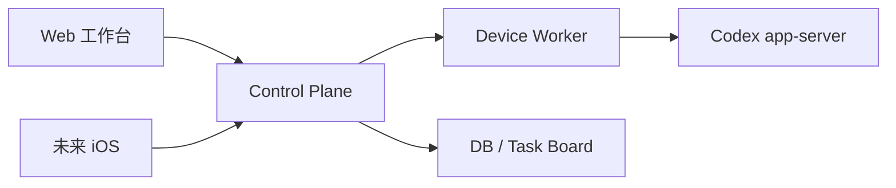
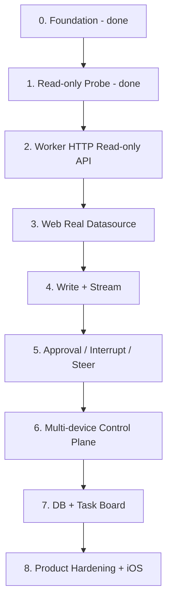

# Codex Remote Development Overview

## 总目标

构建一个自托管的多设备 Codex Web 控制台。

核心能力是在一个 Web 工作台中管理多台设备上的 Codex：查看设备状态、项目、对话和输出流，发送 follow-up，中止任务，处理 approval，并把不同设备上的 Codex conversations 关联到任务看板。

长期拓扑：

## 维护规则

`PLAN.md` 是项目路线图和进度综述的活文档。阶段状态、下一步建议、风险判断或调研结论变化时，必须同步更新本文件；阶段细节仍写入 `docs/superpowers/specs/` 和 `docs/superpowers/plans/`。

目录职责和依赖方向以 `PROJECT_STRUCTURE.md` 为准。新增阶段目录或移动代码前，先更新该文件。

产品定位和 MVP 范围以 `PRODUCT.md` 为准；视觉系统和组件风格以 `DESIGN.md` 为准。

## 架构原则

- `packages/api-contract/openapi.yaml` 是 Web、Worker、Control Plane、未来 iOS 的唯一 API 事实源。
- `packages/codex-protocol` 是 Codex app-server 协议唯一事实源。
- `apps/worker` 是唯一直接连接或启动 Codex app-server 的模块。
- `apps/web` 不接触 app-server 原始协议。
- 每阶段必须有明确目标和 non-goals，避免顺手扩范围。
- 每阶段只交付一个可验证主链，不铺无用架子。
- 抽象延迟：一次使用不抽象，第二次重复再提取。

## 阶段路线

| 阶段 | 目标 | 当前状态 |
| --- | --- | --- |
| 0. 架构底座 | monorepo、包边界、contract/protocol 事实源 | 已完成 |
| 1. Read-only Worker Probe | 验证本机 app-server read-only 主链 | 已完成 |
| 2. Worker HTTP API Read-only | 把 probe 能力变成 Web 可调用 API | 已完成本地可验证切片 |
| 3. Web 接真实数据 | Web 从 Worker/Control Plane-shaped API 读取设备、项目、对话、timeline | 已完成本地可验证切片 |
| 4. 写操作主链 | start、follow-up、stream 输出 | 已完成本地可验证切片 |
| 5. 控制主链 | interrupt、steer、approval request/response | 已完成本地可验证切片 |
| 6. Control Plane 多设备 | 多 Worker 注册、路由、状态聚合 | 下一阶段 |
| 7. 持久化与任务看板 | DB、任务关联、conversation 到任务映射 | 未开始 |
| 8. 产品化与扩展 | 安装、权限、安全审计、iOS API 复用 | 未开始 |

## 每阶段交付标准

每个阶段都必须产出：

- `docs/superpowers/specs/YYYY-MM-DD-xxx-design.md`
- `docs/superpowers/plans/YYYY-MM-DD-xxx.md`
- 明确目标、非目标、包边界和唯一事实源。
- 最小但有效的测试。
- fresh verification：`pnpm lint && pnpm typecheck && pnpm test && pnpm build`。

## 执行方式

建议按主链推进，而不是按技术层铺空架子：

1. 先确认本阶段服务哪条用户主链。
2. 先写 contract，再实现 Worker/Web。
3. 每次只做一个垂直切片。
4. 用边界测试守住事实源、安全和包依赖方向。
5. 阶段完成后复审、归档，再进入下一阶段。

## 主要风险

| 风险 | 影响 | 应对 |
| --- | --- | --- |
| app-server 协议变化 | Worker 调用断裂 | `codex-protocol` 生成物作为唯一事实源，协议变更先更新生成物 |
| WebSocket app-server 不稳定 | 本机 Worker 不可靠 | Stage 2 以 Worker-owned stdio 为目标方向，loopback WebSocket 仅保留为 probe/debug fallback；实现前必须用本机 Codex CLI 验证 |
| 多设备安全边界复杂 | token、project、approval 泄露风险 | Worker fail-closed，Control Plane 不保存 provider secrets |
| 过早做 Control Plane / DB | 偏离主链，产生冗余 | 先单设备 read/write 主链闭环 |
| Web 直接绑定 mock 数据 | 后续替换困难 | 先建立 datasource boundary |
| Approval 处理不严谨 | 可能误执行命令或文件操作 | approval 独立主链，显式用户决策，不自动接受 |
| streaming 不是可靠 event log | Web timeline 乱序、重复或断线后丢状态 | Worker 生成 `seq/eventId`，Web 做 snapshot reconciliation，断线补偿不依赖 app-server replay |
| DB 过早复杂化 | 分散主链实现成本 | Stage 7 默认 SQLite + Drizzle；多实例写入、remote sync、PostgreSQL 等到真实需求出现再评估 |
| 运行时版本承诺过早 | 本地可跑但产品化不可维护 | 本地开发可用当前 Node；产品/runtime 支持矩阵按 Node LTS 做阶段验证 |
| API contract 过度 Web-specific | 未来 iOS/Worker 破坏性迁移 | 保持 stable `operationId`、opaque cursor、明确 `additionalProperties` 和标准错误形态 |
| device-bound token 误降级 | 普通 bearer 被误当设备绑定凭证 | Stage 6 先写 threat model；bearer+rotation 只能作为明确降级或开发姿态 |

## 调研状态

已导入并初步解析的调研回答位于 `docs/references/questions/`。

| 范围 | 状态 | 结论 |
| --- | --- | --- |
| Q1-Q4 下一阶段 P0 调研 | 已回答 | Stage 2 可进入 Worker HTTP API Read-only MVP；建议 Hono 作为 HTTP 边界、5 个 read-only endpoint、stdio 作为目标 transport、`thread/turns/list` 作为可选 experimental capability |
| Q5-Q8 写/流/控制链路调研 | 已回答，Q8 需本地验证 | streaming 需 Worker event envelope/replay；start/follow-up/steer 分开建模；approval 需 Registry/CAS/idempotency；interrupt/steer 需 `expectedTurnId` 和 per-thread 串行化 |
| Q9-Q12 多设备/DB/iOS/产品化调研 | 已回答，Q11 只采纳 guardrails | 多设备采用 one-time pairing + device identity + reverse connection；DB 默认 SQLite + Drizzle；iOS 当前只固化 API guardrails；Worker 产品化 user-mode first |
| Q13 E2E / Playwright | 已回答 | 第一个可交互用户纵切链路出现时引入 Playwright smoke；Node/API integration 仍是主验证层 |
| Q14-Q17 DB driver / reverse connection / device auth / secret storage | 已回答，Q16 需 Stage 6 threat model 裁剪 | DB driver 默认 `better-sqlite3`；reverse connection 默认 WSS + 应用层 ack/lease/resume；device-bound token 长期方向为 DPoP-compatible sender-constrained token；Worker identity secret 默认 OS keyring |

当前不新增全网调研问题。剩余工作更适合放入阶段 spec 的本地验证清单。

## 当前技术栈

- TypeScript
- pnpm
- Turborepo
- Next.js Web
- OpenAPI 3.1
- openapi-typescript
- Node built-in test runner
- Node `fetch` / `WebSocket`
- Codex CLI app-server
- `packages/api-contract`
- `packages/codex-protocol`
- `apps/worker`

产品化支持矩阵以后续阶段 spec 为准；本地开发可用当前 Node 版本，但长期运行和分发优先按 Node LTS 验证。

`docs/references/codex-app-server.md` 是 app-server 协议解释性参考；`packages/codex-protocol` 的生成物仍是 Worker 代码使用的协议类型事实源。

## 下一步建议

最近完成的 Superpowers spec：

- `docs/superpowers/specs/2026-06-20-worker-write-stream-design.md`

最近完成的 Superpowers plan：

- `docs/superpowers/plans/2026-06-20-worker-write-stream.md`

Stage 4 已完成：

- `packages/api-contract/openapi.yaml` 定义版本化写接口：`POST /v1/conversations` 与 `POST /v1/conversations/{conversationId}/follow-up`；旧的未版本化 follow-up 写路径已移除。
- `apps/worker` 是唯一 app-server 写调用边界，使用生成的 `packages/codex-protocol` 方法类型映射 `thread/start` 和 `turn/start`。
- Worker 写路径实现 project/conversation guard、process-local bounded idempotency、same-key different-fingerprint conflict、sanitized `ErrorEnvelope`。
- Web 只通过 Worker HTTP client 发送 existing-conversation follow-up；成功显示 accepted、清空 composer 并刷新 metadata-only timeline；失败显示 compact failed 状态并保留 composer 文本。
- fake Worker smoke server 支持 Stage 4 POST endpoints，用于浏览器正常和失败路径验证。
- Web start conversation UI 明确延期；Worker/API start 已实现并测试。
- 未引入 Control Plane、DB、durable stream、SSE/WebSocket、approval、interrupt、steer、iOS、pairing 或产品化 auth。
- Chrome smoke 修复项：
  - 自定义 contenteditable composer 不能使用 `ComposerPrimitive.Send`，否则按钮会受 assistant-ui 内部 composer 状态限制并保持 disabled；已改为普通 send button。
  - shell 将 Worker failure 脱敏为 resolved failed result 后，composer helper 必须按显式结果判断是否清空 draft；已改为仅 `accepted` 清空。

验证：

- `pnpm --filter @codex-remote/api-contract test`
- `pnpm --filter @codex-remote/api-contract build`
- `pnpm --filter @codex-remote/worker test`
- `pnpm --filter @codex-remote/worker typecheck`
- `pnpm --filter @codex-remote/web test`
- `pnpm --filter @codex-remote/web typecheck`
- `pnpm lint`
- `pnpm typecheck`
- `pnpm test`
- `pnpm build`

Chrome 验证：

- 正常路径：fake Worker read state 加载为 `Smoke Worker conversation`、datasource `loaded`；输入 follow-up 后发送按钮启用；提交后显示 accepted、composer 清空、timeline 刷新出 metadata-only `turn in_progress`。
- 失败路径：输入 `smoke-fail` 后显示 `发送失败`，composer 文本保留，Chrome console 无 error。
- 泄漏检查：UI 不显示 token、raw Worker URL、prompt echo on success、command output、full diff、stack/cause 或 raw JSON-RPC。

最近完成的 Superpowers spec：

- `docs/superpowers/specs/2026-06-20-control-main-chain-design.md`

最近完成的 Superpowers plan：

- `docs/superpowers/plans/2026-06-20-control-main-chain.md`

Stage 5 已完成：

- `packages/api-contract/openapi.yaml` 定义版本化控制接口：interrupt、steer、pending approval list、approval decision；生成类型和 public aliases 从该 schema 派生。
- `apps/worker` 是唯一 app-server 控制调用和 JSON-RPC approval response 边界，使用生成的 `packages/codex-protocol` 类型映射 `turn/interrupt`、`turn/steer` 和 approval response。
- Worker control/approval 路径实现 allowed-project proof、`expectedTurnId`/expected approval identity guard、process-local bounded idempotency、same-key different-fingerprint conflict、sanitized `ErrorEnvelope`。
- Approval registry 只公开 command/file/legacy exec/legacy apply-patch 的 sanitized metadata；permissions approval、command text、cwd、patch、raw JSON-RPC id、raw URL、token、stack/cause 和私密路径不公开。
- Web 只通过 Worker HTTP client 执行 interrupt、steer、approval decision；成功后显示 accepted 并刷新 timeline/approval snapshot，失败只显示 compact failed 状态。
- fake Worker smoke server 支持 Stage 5 control endpoints，用于浏览器正常和 fallback 路径验证。
- 未引入 Control Plane、DB、reverse WSS、durable stream/event log、task board、iOS、pairing、产品化 auth、sandbox override、policy amendment UI 或 permission grant UI。
- Review 修复项：
  - approval observer 需要长生命周期 Worker session；已改为 HTTP context 复用 shared app-server session。
  - approval response 发送失败不能删除 pending approval；已改为 `sendApprovalResponse` 成功后才 `completeApproval`。
  - unknown approval start time 不能落 Unix epoch；已改为 Worker capture time。
  - approval list/decision 必须先证明 conversation 在 allowed root 内；已补 `assertConversationAllowed` 和 forbidden 回归测试。

验证：

- `pnpm --filter @codex-remote/api-contract test`
- `pnpm --filter @codex-remote/api-contract build`
- `pnpm --filter @codex-remote/worker typecheck`
- `pnpm --filter @codex-remote/worker test`（143/143）
- `pnpm --filter @codex-remote/web typecheck`
- `pnpm --filter @codex-remote/web test`（76/76）
- `pnpm lint`
- `pnpm typecheck`
- `pnpm test`
- `pnpm build`

Chrome 验证：

- 正常加载：fake Worker 数据显示 `Smoke Worker conversation`、datasource `loaded`、active turn `smoke-turn-1`、pending approval `command_execution · medium · Run smoke command`。
- Steer：提交后显示 accepted，draft 清空，active turn 保持；UI 不显示 raw Worker URL 或 token。
- Approval：点击 `accept` 后 pending approval 消失并显示 accepted；UI 不显示 raw Worker URL 或 token。
- Interrupt：点击前按钮可用；点击后显示 accepted、`turn completed`、`no active turn`，Interrupt/Steer 禁用。
- Fallback：停止 fake Worker 后刷新，显示 `request_failure`，无 smoke 数据，无 active turn，控制按钮禁用，且不显示 raw Worker URL 或 token。

Stage 5 剩余限制：

- Approval registry 和 idempotency memory 仍是 process-local；Worker restart 会丢 pending approval 和 accepted-command replay memory。
- Approval UI 仍只显示 sanitized summary/risk/kind，不展示命令、路径、patch 或权限详情。

下一步建议进入 Stage 6：Control Plane 多设备。

Stage 6 范围建议：

- 先写 Control Plane 多设备 spec，明确 Worker 注册、设备身份、路由、状态聚合、反向连接和审计边界。
- 先写 threat model，再决定 bearer 开发姿态、token rotation、revocation、device-bound token 是否进入本阶段。
- 默认只做本地多 Worker 可验证主链，不引入 DB 持久任务看板或 iOS UI，除非 Stage 6 spec 明确需要极小状态存储。
- Web 继续只调用 Control Plane-shaped API；Worker 继续是唯一 app-server 调用者。
- 不把 WSS send 当任务完成；如实现 reverse connection，必须设计 `msg_id/seq/ack/lease/resume/credit` 和 backpressure。

Stage 6 风险：

- 多设备路由和 auth 容易变成产品化安全系统；必须先收敛为本地可验证 slice，并把生产级 auth 明确标为后续。
- Control Plane 不能保存 provider/Codex secrets；设备身份、token hash、状态和审计可以保存，秘密留在 Worker 设备侧。
- 如果过早引入 DB/task board，会稀释多设备主链；Stage 7 才默认 SQLite + Drizzle。

后续阶段默认设计输入：

- Stage 6：Control Plane reverse connection 默认 WSS；必须设计应用层 `msg_id/seq/ack/lease/resume/credit`，不要把 WebSocket send 当作任务完成。
- Stage 6：device-bound token 以 DPoP-compatible sender-constrained token 为长期方向，但实现前必须先写 threat model。
- Stage 7：SQLite + Drizzle 默认使用 `better-sqlite3`，driver 隔离在 `packages/db` 边界内。
- Productization：Worker device identity secret 默认 OS keyring；Linux/headless file fallback 必须显式 opt-in。
