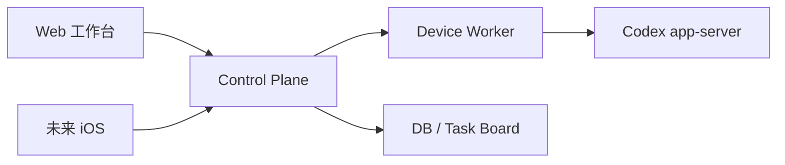
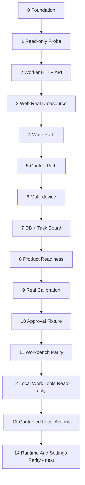

# Codex Remote Development Overview

## 总目标

构建一个自托管的多设备 Codex Web 控制台。

核心能力：在一个 Web 工作台中管理多台设备上的 Codex，查看设备状态、项目、对话和输出流，发送 follow-up，中止任务，处理 approval，并把不同设备上的 Codex conversations 关联到任务看板。

当前子目标：在不改变多设备 Control Plane 定位的前提下，把 Web 工作台做成 Codex App-like browser workbench。

## 维护规则

- `PLAN.md` 只保留当前路线、当前状态、活跃阶段和下一步。
- 完成阶段的长证据归档到 `docs/archives/`。
- 阶段细节写入 `docs/superpowers/specs/` 和 `docs/superpowers/plans/`。
- 产品定位以 `PRODUCT.md` 为准；视觉系统以 `DESIGN.md` 为准；目录职责以 `PROJECT_STRUCTURE.md` 为准。
- Codex App-like 能力路线以 `CODEX_APP_PARITY.md` 为准；支持状态以 `FEATURE_SUPPORT.md` 为准。

## 架构原则

- `packages/api-contract/openapi.yaml` 是 Web、Worker、Control Plane、未来 iOS 的唯一 API 事实源。
- `packages/codex-protocol` 是 Codex app-server 协议唯一事实源。
- `packages/db` schema 是持久化字段唯一事实源。
- `apps/worker` 是唯一直接连接 Codex app-server、本机文件系统、Git、Shell 的模块。
- `apps/web` 只能调用 Control Plane-shaped API。
- 每阶段必须有明确目标、non-goals、验证和归档记录。

## 阶段路线

| 阶段 | 目标 | 当前状态 |
| --- | --- | --- |
| 0. 架构底座 | monorepo、包边界、contract/protocol 事实源 | 已完成 |
| 1. Read-only Worker Probe | 验证本机 app-server read-only 主链 | 已完成 |
| 2. Worker HTTP API Read-only | 把 probe 能力变成 Web 可调用 API | 已完成 |
| 3. Web 接真实数据 | Web 从 Worker/Control Plane-shaped API 读取设备、项目、对话、timeline | 已完成 |
| 4. 写操作主链 | start、follow-up、stream 输出 | 已完成 |
| 5. 控制主链 | interrupt、steer、approval request/response | 已完成 |
| 6. Control Plane 多设备 | 多 Worker 注册、路由、状态聚合 | 已完成 |
| 7. 持久化与任务看板 | DB、任务关联、conversation 到任务映射 | 已完成 |
| 8. 产品化与扩展 | self-hosted readiness、运行手册、安全检查、iOS API guardrails | 已完成 |
| 9. 真实本机 Codex 闭环校准 | 用真实 Codex app-server 验证 Stage 3-8 能力 | 已完成；approval decision 留安全 real-gap |
| 10. Isolated Approval Fixture | 隔离验证 approval decision decline/cancel | 已实现 fixture；blocked 于 app-server 未产生 safe pending approval |
| 11. Conversation Workbench Parity | Codex App-like browser workbench | 已完成；approval decision 留既有安全 real-gap |
| 12. Local Work Tools Read-only | 文件/Git/MCP/插件等本地工作工具只读能力 | 已完成；MCP 在当前 real stack 可降级为 408 |
| 13. Controlled Local Actions | 显式用户本地动作、受控 shell/Git/review/extension 操作 | 已完成首批 confirmed review-start 切片 |
| 14. Runtime And Settings Parity | 模型/profile、账号/运行时/config 只读投影与设置面 | 下一阶段 |

## 当前状态

- Web -> Control Plane -> Worker -> Codex app-server 的本机主链已有 real evidence。
- Approval decision 仍没有稳定真实 pending approval，不能宣称 product-ready。
- Stage 11 已按 UI parity review 完成修复并归档：composer-centered start/follow-up/interrupt/steer/queue、Control Plane/DB durable queued messages、Settings archived restore、request cards、assistant actions、permission placeholders。
- Stage 11A app-server output calibration 与 Web projection cleanup 已完成；真实 timeline 缺失 `nodes` / `itemsView` 时 Web 保持 loaded 而不 fallback。
- Stage 11 closure verification 通过：`pnpm product:check`、`pnpm lint`、`pnpm typecheck`、`pnpm test`、`pnpm build`、`pnpm real:start`、`pnpm real:status`、`pnpm real:check`、`pnpm web:e2e:smoke`。`real:check` 结果为 total=19、real-pass=18、real-gap=1，唯一 real-gap 是 approval decision。
- Stage 12 已完成本地只读工具面：project-relative files/preview、Git summary、fuzzy search、MCP status、skills/hooks/plugins/apps inventory，Web 通过 Control Plane-shaped API 消费，Worker 继续作为唯一 filesystem/Git/app-server 边界。
- Stage 12 closure verification 通过：`pnpm product:check`、`pnpm lint`、`pnpm typecheck`、`pnpm test`、`pnpm build`、`pnpm real:check`、`pnpm web:e2e:smoke`。`real:check` 仍为 total=19、real-pass=18、real-gap=1，唯一 real-gap 是既有 approval fixture gap；Stage 12 direct API smoke 返回 fileEntries=28、searchMatches=5、extensionItems=305，MCP 在当前环境允许 408 degraded。
- Stage 13 已完成首批 controlled local action：Web -> Control Plane -> Worker -> Codex app-server 的 confirmed `review/start` for uncommitted changes。`thread/shellCommand`、`command/exec`、Git mutation、filesystem write、plugin/MCP/account/config mutation 仍未暴露。
- Stage 13 closure verification 通过：focused package tests、`pnpm product:check`、`pnpm lint`、`pnpm typecheck`、`pnpm test`、`pnpm build`、`pnpm real:check`、`pnpm web:e2e:smoke`、浏览器 Local Tools disabled/confirmation/accepted/fallback no-leak smoke。`real:check` 仍为 total=19、real-pass=18、real-gap=1，唯一 real-gap 是既有 approval fixture gap。

## Completed Stage 11

Archived docs:

- `docs/archives/specs/2026-06-21-conversation-workbench-parity-design.md`
- `docs/archives/plans/2026-06-21-conversation-workbench-parity.md`
- `docs/references/2026-06-21-feature-support-ui-audit.md`
- `docs/references/2026-06-21-app-server-protocol-inventory.md`

Stage 11 完成范围：

- Start/follow-up/interrupt/steer/queue 已收敛到 composer；queue-later 现在通过 Control Plane API 和 DB 持久化，支持刷新/跨设备恢复、取消、idle 后发送和失败状态。
- Archive 已从正常侧边栏过滤，恢复入口在 Settings -> 已归档对话。
- Timeline 使用 public safe nodes；真实 metadata-only turn 会显示安全 fallback。
- Request cards 已进入 timeline/workbench flow。
- Assistant message action row 保留 copy、thumbs up/down、fork/派生、hooks、timestamp；未有 public route 的行为保持 disabled。
- Permission menu 保留 UI，选项 disabled/TODO，未添加未确认行为。

Stage 11A reconciliation 结论：

- `ConversationTimelineNode` public model 方向可保留，但必须补 `Turn.itemsView` / partial snapshot 状态、生成类型和 redaction tests。
- Worker `ThreadItem` projection 必须重写为显式安全投影；禁止暴露 raw command、cwd、aggregated output、full diff、MCP arguments/results、collab prompt、image path、raw reasoning。
- Web 只能渲染 public timeline node；不能把 unknown tool 或 command/image 映射成 file-change UI。
- Permission menu 只能作为 disabled/protocol-derived placeholder，直到 OpenAPI 定义 public permission model。
- `local-project` 作为当前单项目边界可暂留，但必须记录为 deferred multi-project discovery。

Stage 11 non-goals：

- rollback、raw `inject_items`、任意 shell/filesystem 写、plugin install、account login/logout、realtime voice、Windows setup、feedback upload、external agent import、production approval safety model。

## Completed Stage 12

Archived docs:

- `docs/archives/specs/2026-06-21-local-workbench-readonly-design.md`
- `docs/archives/plans/2026-06-21-local-workbench-readonly.md`

Stage 12 完成范围：

- Public contract 增加 `/local-workbench/*` GET routes，覆盖 summary、files、file-preview、git、search、mcp、extensions。
- Worker 增加本地只读 adapter 和 redaction/projection：project-relative path、bounded text preview、Git file-level summary、MCP/tool/resource summary、skills/hooks/plugins/apps whitelist inventory。
- Control Plane 增加 device-scoped route pass-through，Web 增加 Local Tools 视图和 degraded section handling。
- Web optional MCP load 设置短超时，MCP 当前环境不可用时不会阻塞 Local Tools 主视图。
- Command evidence/output、shell 执行、filesystem 写、review start、MCP tool call、插件安装、config/account 写操作仍保持不支持。

## Completed Stage 13

Archived docs:

- `docs/archives/specs/2026-06-22-controlled-local-actions-design.md`
- `docs/archives/plans/2026-06-22-controlled-local-actions.md`

Stage 13 完成范围：

- 新增 public contract `POST /v1/devices/{deviceId}/conversations/{conversationId}/local-actions/review-start`，请求包含 `projectId`、`expectedConversationId`、`clientRequestId`、`confirmationText`。
- Worker 验证 conversation/project/allowed-root/confirmation 后，固定调用 app-server `review/start` with `target: { type: "uncommittedChanges" }` and inline delivery。
- Control Plane 只做 device-scoped routing；Web 只调用 Control Plane-shaped API，并在 Local Tools -> Git/Review 显示确认式 action。
- fake Worker smoke server 和真实浏览器验证覆盖 accepted、disabled、stale-context/failure no-leak。
- `thread/shellCommand` 因 full-access unsandboxed 且保留 shell syntax，延后到单独 allowlisted action policy。

Stage 13 non-goals：

- raw shell/PTY/command output/history、`command/exec`、`thread/shellCommand`。
- filesystem write/create/remove/copy/watch。
- Git stage/unstage/revert hunk/file。
- arbitrary review target (`baseBranch`、`commit`、`custom`)。
- skill/plugin/MCP/account/config/model mutation。
- raw command output、full diff、raw JSON-RPC、provider secrets、app-server URL、private path、stack/cause/prompt 暴露。

## Active Stage 14

Stage 14 下一步方向：

- Runtime And Settings Parity：model/profile、sanitized account/read、device platform/sandbox/auth projection、config read-only、richer skills/plugins/MCP/apps management。
- Stage 14 开始前先创建/更新 spec 与 plan，并按惯例执行架构 subagent 审核。

## Stage 11+ Draft Roadmap

1. Stage 11：Conversation Workbench Parity。Codex App-like browser workbench：open/resume、archive/unarchive、rename、loaded/live badge、snapshot-first timeline 内容展示、Worker-projected live/request events、approval/request pending/resolved cards、composer 内 start/follow-up/interrupt/steer/queue、Settings -> 已归档对话、assistant message action row、protocol-derived permission menu placeholder。
2. Stage 12：Local Work Tools Read-only。项目文件树/metadata/preview、Git/review 摘要、fuzzy search、MCP status/resources/tools list、plugin/skills/hooks/apps inventory。已完成；Command history/output 留到后续受控 shell/terminal 阶段。
3. Stage 13：Controlled Local Actions。已完成 confirmed uncommitted-changes review start；显式 shell command、allowlisted project actions、stage/unstage/revert hunk/file、enable/disable skill、OAuth/login-like flows 后续再拆。
4. Stage 14：Runtime And Extension Management。模型/profile、sanitized account/read、device platform/sandbox/auth projection、config read-only、skills/plugins/MCP/apps richer management。下一阶段。
5. Stage 15+：Advanced Platform Watchlist。realtime voice、Windows sandbox setup/readiness、feedback upload、external agent config import、remote GUI/computer use、automations。

## 当前技术栈

- TypeScript
- pnpm
- Turborepo
- Next.js Web
- OpenAPI 3.1
- openapi-typescript
- Node built-in test runner
- Node `fetch` / `WebSocket`
- Codex CLI app-server
- `packages/api-contract`
- `packages/codex-protocol`
- `apps/worker`

## 每阶段交付标准

- `docs/superpowers/specs/YYYY-MM-DD-xxx-design.md`
- `docs/superpowers/plans/YYYY-MM-DD-xxx.md`
- subagent 审核记录
- focused tests
- `pnpm product:check`
- `pnpm lint`
- `pnpm typecheck`
- `pnpm test`
- `pnpm build`
- Chrome 网页验证结果
- 阶段总结和归档记录

## 已归档内容

- Stage 2-10 spec/plan：`docs/archives/specs/` 与 `docs/archives/plans/`
- Stage 11 spec/plan：`docs/archives/specs/2026-06-21-conversation-workbench-parity-design.md` 与 `docs/archives/plans/2026-06-21-conversation-workbench-parity.md`
- Stage 12 spec/plan：`docs/archives/specs/2026-06-21-local-workbench-readonly-design.md` 与 `docs/archives/plans/2026-06-21-local-workbench-readonly.md`
- Stage 13 spec/plan：`docs/archives/specs/2026-06-22-controlled-local-actions-design.md` 与 `docs/archives/plans/2026-06-22-controlled-local-actions.md`
- Stage 11 pre-consensus spec/plan：`docs/archives/specs/2026-06-21-conversation-workbench-parity-design-pre-consensus.md` 与 `docs/archives/plans/2026-06-21-conversation-workbench-parity-pre-consensus.md`
- Root `PLAN.md` 历史证据摘要：`docs/archives/references/2026-06-21-plan-history.md`
- 调研回答：`docs/references/questions/`

## 下一步

下一步执行 Stage 14 spec/plan：围绕 runtime/settings parity 明确 model/profile、sanitized account/read、device platform/sandbox/auth projection、config read-only、skills/plugins/MCP/apps 管理范围，并在计划后执行架构 subagent 审核。
