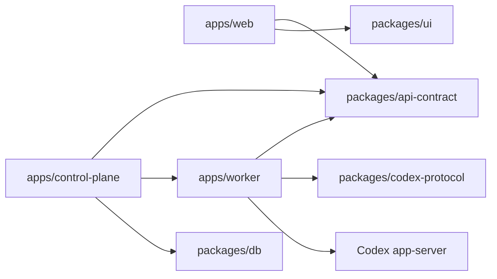

# Codex Remote Project Structure

## Purpose

This document defines where code and documents belong. It is a boundary guide, not a request to create empty folders.

Do not create future-stage directories until a stage spec needs real files there.

## Current And Deferred Shape

```text
apps/
  web/
    src/
      app/            # Next.js app shell only
      components/     # UI rendering and small interaction controllers
      data/           # API clients and datasource adapters
      domain/         # pure product logic derived from public contracts
      contracts/      # boundary/style/source-discipline tests
      test-support/   # test-only helpers
  worker/
  control-plane/

packages/
  api-contract/
  codex-protocol/
  ui/
  shared/           # 暂不主动扩展；只有跨包纯工具且复用两次以上才放
  db/

docs/
  references/
  archives/
    specs/
    plans/
    references/
  superpowers/
    specs/
    plans/

scripts/
logs/
```

## Applications

### `apps/web`

Purpose:

- Web workbench UI.
- Consumes Control Plane-shaped API contracts.
- Renders devices, projects, conversations, timelines, and user actions.

Allowed:

- Import public types from `packages/api-contract`.
- Import UI primitives/styles from `packages/ui`.
- Use Web datasource adapters.

Not allowed:

- Import `packages/codex-protocol`.
- Call Codex app-server directly.
- Define parallel DTOs that duplicate `api-contract`.
- Own Worker, Control Plane, DB, or app-server lifecycle logic.

Source layout rules:

- `src/app`: Next.js entrypoints, metadata, route-level composition only.
- `src/components`: React rendering, local UI state, and thin submit controllers. Components may call Web datasource/controller functions but must not own API schemas or app-server mapping.
- `src/data`: HTTP clients, datasource adapters, fallback classification, and public-contract response parsing. No React components.
- `src/domain`: pure product logic such as sidebar grouping, timeline projection, identity keys, status presentation, and capability state reducers. No HTTP, React, DB, or app-server imports.
- `src/contracts`: tests that enforce boundaries, source discipline, generated-contract use, and style-token use.
- `src/test-support`: test helpers only.

Capability module trigger:

- Do not create future directories preemptively.
- Keep a capability in the existing `components` / `data` / `domain` split while it is small.
- Create `apps/web/src/features/<capability>/` only when one capability needs all of these at once: datasource, domain reducer/model, submit controller, and multiple UI components.
- A feature directory must still follow the same internal split: data, domain, components, and tests. It must not become a catch-all.
- `components/shell/codex-remote-app.tsx` should remain orchestration glue. New capability surfaces should not be implemented inline there.

### `apps/worker`

Purpose:

- Local Device Worker.
- The only app that starts or connects to Codex app-server.
- Owns app-server transport, project allowlist, local security checks, and Worker diagnostics.

Allowed:

- Import public types from `packages/api-contract`.
- Import generated protocol types from `packages/codex-protocol`.
- Access local Codex app-server, filesystem, git, and terminal only through explicit Worker boundaries.

Not allowed:

- Expose raw app-server JSON-RPC to Web.
- Store provider secrets in Control Plane-facing payloads.
- Own DB schema, migrations, or task persistence.

Capability adapter rule:

- Worker owns app-server mapping for each product capability.
- Each new app-server-backed capability should isolate protocol calls behind a small Worker module before exposing HTTP handlers.
- Generated protocol types are used at the adapter boundary; public API types are used at the HTTP boundary.
- Worker projections must redact raw prompt text, command output, full diff, raw JSON-RPC ids, raw app-server URLs, provider secrets, stack/cause, and private local paths.

### `apps/control-plane`

Purpose:

- Local configured multi-Worker routing.
- Device-scoped proxying to Worker public APIs.
- Device status and conversation aggregation for Web and future iOS-shaped APIs.

Allowed:

- Import public types from `packages/api-contract`.
- Keep configured Worker upstream URLs and Worker bearer tokens only in runtime config/process memory.
- Normalize configured `deviceId` at the Control Plane boundary for known public Worker shapes.
- Import `packages/db` for task board persistence.

Not allowed:

- Directly call Codex app-server.
- Store OpenAI / ChatGPT / provider secrets.
- Persist device registry, token hashes, pairing state, revocation state, or audit log before productization stages.
- Import `packages/codex-protocol`, Web code, or Worker internals.

Capability coordination rule:

- Control Plane may route, aggregate, paginate, normalize device identity, persist task links, and expose degraded/empty state.
- Control Plane must not translate raw app-server protocol or invent capability data that should come from Worker.
- Device-scoped identities stay explicit in public shapes so duplicate project or conversation ids across devices do not merge.

## Packages

### `packages/api-contract`

Purpose:

- OpenAPI contract source for Web, Worker, Control Plane, and future iOS.
- `openapi.yaml` is the only source of truth for public API fields.

Allowed:

- OpenAPI schemas and generated TypeScript types.
- Public aliases derived from `components["schemas"]`.
- Contract generation and source-of-truth tests.

Not allowed:

- UI framework dependencies.
- app-server generated protocol types.
- Handwritten parallel DTOs.

Capability contract rule:

- New product capabilities start here before Worker, Control Plane, or Web implementation.
- Public schemas should describe user-facing capability concepts, not raw app-server method names.
- Opaque ids, opaque cursors, closed object schemas, stable `operationId`, and standard `ErrorEnvelope` semantics remain the default.

### `packages/codex-protocol`

Purpose:

- Generated Codex app-server protocol artifacts.
- Records generation metadata and Codex version context.

Allowed:

- Generated app-server request/response/notification types.
- Protocol schema and generation metadata.
- Worker-only protocol tests.

Not allowed:

- Web or Control Plane dependencies.
- Stable product contract definitions.
- Handwritten missing upstream request shapes.

### `packages/ui`

Purpose:

- Shared UI primitives and style assets.
- Pure visual tokens/components that are not tied to Codex app-server or Worker data ownership.

Allowed:

- CSS, visual tokens, layout primitives, reusable icon/style helpers.

Not allowed:

- Business entities such as device, project, conversation, task, approval, or timeline models.
- API calls, datasource adapters, app-server protocol imports, or DB logic.

### `packages/db`

Purpose:

- Database schema, migrations, and DB access helpers.
- DB schema becomes the persistence source of truth.
- Current Stage 7 scope owns task board persistence only.

Rules:

- Schema starts from `packages/db/src/schema`.
- Migrations are generated and committed.
- Driver details stay inside `packages/db`.
- Current driver is SQLite + Drizzle + `better-sqlite3`.

Not allowed:

- Import Web components, Worker internals, Control Plane HTTP code, or `packages/codex-protocol`.
- Store provider secrets, Codex auth, Worker bearer tokens, raw upstream URLs, raw JSON-RPC, prompts, command output, full diff, stack/cause, or private paths.
- Own pairing, revocation, audit log, reverse WSS, or productized auth before a later stage spec.

### `packages/shared`

Status: avoid by default. Do not create as a dumping ground.

Only create when:

- A pure utility is used by at least two packages.
- It has no app, UI, DB, Worker, or protocol ownership.
- Keeping it local would create real duplication.

Not allowed:

- `utils` catch-all modules.
- Product DTOs that should live in `api-contract`.
- Protocol helpers that should live in Worker or `codex-protocol`.

## Documents

### Root Documents

- `PLAN.md`: live roadmap, stage status, risks, and research status.
- `CODEX_APP_PARITY.md`: Codex App-like product capability target, parity gaps, and capability-area stage split direction.
- `PRODUCT.md`: product positioning, users, MVP scope, product principles, and non-goals.
- `DESIGN.md`: visual system, design tokens, component style, and frontend design constraints.
- `QUESTIONS.md`: research question queue and answer status.
- `PROJECT_STRUCTURE.md`: directory ownership and dependency boundaries.
- `AGENTS.md`: execution rules for agents working in this repo.

### `docs/references`

External references, imported research, source notes, screenshots, and non-authoritative background. References are evidence, not product/API facts of record.

Use these current references first:

- `docs/references/codex-app-server.md`: explanatory app-server protocol reference. `packages/codex-protocol` remains the type source of truth.
- `docs/references/openai-codex-app-pages/pages/`: official Codex App product behavior references, not API contracts or DTO sources.
- `docs/references/questions/SYNTHESIS.md`: research conclusion index.
- `docs/references/questions/q29-q33-codex-app-parity-research-answers/`: Codex App-like browser workbench planning research; reference only, not schema source.
- `docs/references/research/参考项目架构调研报告 v0.2.md`: reference-project evidence and adoption/rejection rationale.

Do not keep absorbed PRDs, specs, prompt logs, or import metadata in `docs/references/`; archive them under `docs/archives/`.

### `docs/archives`

Completed or superseded documents, including historical specs/plans and completed Superpowers workflow artifacts.

- `docs/archives/specs/`: superseded specs and PRDs.
- `docs/archives/plans/`: completed or superseded execution plans.
- `docs/archives/references/`: absorbed reference material, prompt/import logs, duplicate metadata, and old research summaries.

### `docs/superpowers`

Active Superpowers workflow artifacts:

- `docs/superpowers/specs/`: active stage specs.
- `docs/superpowers/plans/`: active execution plans derived from specs.

New stage specs and plans should go here, not under root-level `docs/specs/` or `docs/plans/`. Completed or superseded stage specs/plans move to `docs/archives/specs/` or `docs/archives/plans/`.

## Dependency Direction



Rules:

- Web never imports `codex-protocol`.
- Control Plane never calls app-server directly.
- Worker is the only app-server adapter.
- API contract does not depend on UI, Worker, Control Plane, or DB.
- DB does not depend on Web components.
- UI does not own business data.

## Adding New Files

Before adding a file, answer:

1. Which stage owns it?
2. Which source of truth does it derive from?
3. Which package may import it?
4. Is this used now, or is it only future scaffolding?

If the answer is “future,” do not add it yet.
