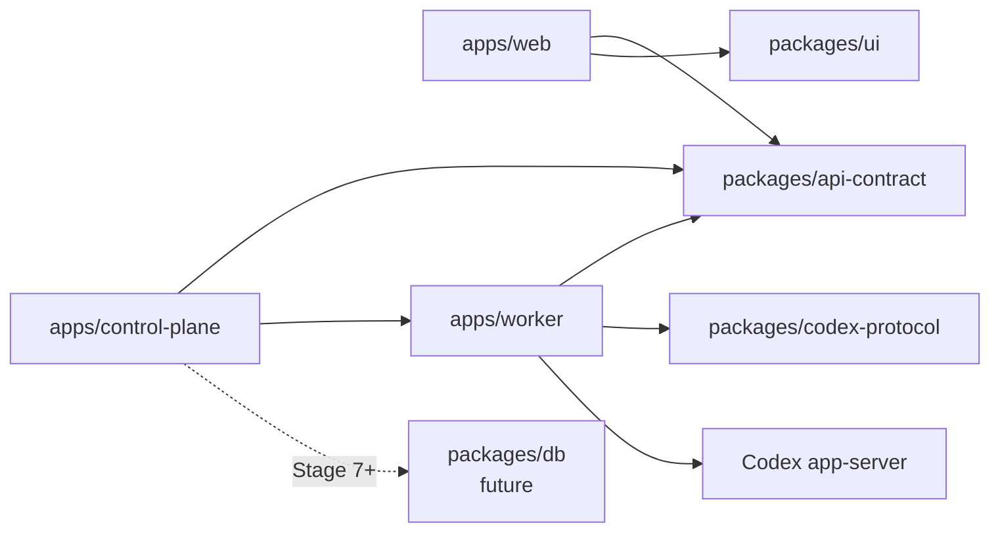

# Codex Remote Project Structure

## Purpose

This document defines where code and documents belong. It is a boundary guide, not a request to create empty folders.

Do not create future-stage directories until a stage spec needs real files there.

## Current And Deferred Shape

```text
apps/
  web/
  worker/
  control-plane/

packages/
  api-contract/
  codex-protocol/
  ui/
  shared/           # 暂不主动扩展；只有跨包纯工具且复用两次以上才放
  db/               # Stage 7 再创建

docs/
  references/
  archives/
    specs/
    plans/
    references/
  superpowers/
    specs/
    plans/

scripts/
logs/
```

## Applications

### `apps/web`

Purpose:

- Web workbench UI.
- Consumes Control Plane-shaped API contracts.
- Renders devices, projects, conversations, timelines, and user actions.

Allowed:

- Import public types from `packages/api-contract`.
- Import UI primitives/styles from `packages/ui`.
- Use Web datasource adapters.

Not allowed:

- Import `packages/codex-protocol`.
- Call Codex app-server directly.
- Define parallel DTOs that duplicate `api-contract`.
- Own Worker, Control Plane, DB, or app-server lifecycle logic.

### `apps/worker`

Purpose:

- Local Device Worker.
- The only app that starts or connects to Codex app-server.
- Owns app-server transport, project allowlist, local security checks, and Worker diagnostics.

Allowed:

- Import public types from `packages/api-contract`.
- Import generated protocol types from `packages/codex-protocol`.
- Access local Codex app-server, filesystem, git, and terminal only through explicit Worker boundaries.

Not allowed:

- Expose raw app-server JSON-RPC to Web.
- Store provider secrets in Control Plane-facing payloads.
- Add DB ownership before the DB stage.

### `apps/control-plane`

Purpose:

- Local configured multi-Worker routing.
- Device-scoped proxying to Worker public APIs.
- Device status and conversation aggregation for Web and future iOS-shaped APIs.

Allowed:

- Import public types from `packages/api-contract`.
- Keep configured Worker upstream URLs and Worker bearer tokens only in runtime config/process memory.
- Normalize configured `deviceId` at the Control Plane boundary for known public Worker shapes.

Not allowed:

- Directly call Codex app-server.
- Store OpenAI / ChatGPT / provider secrets.
- Persist device registry, DB state, token hashes, pairing state, revocation state, or audit log before the DB/productization stages.
- Import `packages/codex-protocol`, Web code, Worker internals, or DB code.

## Packages

### `packages/api-contract`

Purpose:

- OpenAPI contract source for Web, Worker, Control Plane, and future iOS.
- `openapi.yaml` is the only source of truth for public API fields.

Allowed:

- OpenAPI schemas and generated TypeScript types.
- Public aliases derived from `components["schemas"]`.
- Contract generation and source-of-truth tests.

Not allowed:

- UI framework dependencies.
- app-server generated protocol types.
- Handwritten parallel DTOs.

### `packages/codex-protocol`

Purpose:

- Generated Codex app-server protocol artifacts.
- Records generation metadata and Codex version context.

Allowed:

- Generated app-server request/response/notification types.
- Protocol schema and generation metadata.
- Worker-only protocol tests.

Not allowed:

- Web or Control Plane dependencies.
- Stable product contract definitions.
- Handwritten missing upstream request shapes.

### `packages/ui`

Purpose:

- Shared UI primitives and style assets.
- Pure visual tokens/components that are not tied to Codex app-server or Worker data ownership.

Allowed:

- CSS, visual tokens, layout primitives, reusable icon/style helpers.

Not allowed:

- Business entities such as device, project, conversation, task, approval, or timeline models.
- API calls, datasource adapters, app-server protocol imports, or DB logic.

### `packages/db`

Status: future Stage 7 directory. Do not create yet.

Purpose when introduced:

- Database schema, migrations, and DB access helpers.
- DB schema becomes the persistence source of truth.

Rules when introduced:

- Schema starts from `packages/db/src/schema`.
- Migrations are generated and committed.
- Driver details stay inside `packages/db`.
- Default direction is SQLite + Drizzle + `better-sqlite3`, pending native install validation.

### `packages/shared`

Status: avoid by default. Do not create as a dumping ground.

Only create when:

- A pure utility is used by at least two packages.
- It has no app, UI, DB, Worker, or protocol ownership.
- Keeping it local would create real duplication.

Not allowed:

- `utils` catch-all modules.
- Product DTOs that should live in `api-contract`.
- Protocol helpers that should live in Worker or `codex-protocol`.

## Documents

### Root Documents

- `PLAN.md`: live roadmap, stage status, risks, and research status.
- `PRODUCT.md`: product positioning, users, MVP scope, product principles, and non-goals.
- `DESIGN.md`: visual system, design tokens, component style, and frontend design constraints.
- `QUESTIONS.md`: research question queue and answer status.
- `PROJECT_STRUCTURE.md`: directory ownership and dependency boundaries.
- `AGENTS.md`: execution rules for agents working in this repo.

### `docs/references`

External references, imported research, source notes, screenshots, and non-authoritative background. References are evidence, not product/API facts of record.

Use these current references first:

- `docs/references/codex-app-server.md`: explanatory app-server protocol reference. `packages/codex-protocol` remains the type source of truth.
- `docs/references/openai-codex-app-pages/pages/`: official Codex App product behavior references, not API contracts or DTO sources.
- `docs/references/questions/SYNTHESIS.md`: research conclusion index.
- `docs/references/research/参考项目架构调研报告 v0.2.md`: reference-project evidence and adoption/rejection rationale.

Do not keep absorbed PRDs, specs, prompt logs, or import metadata in `docs/references/`; archive them under `docs/archives/`.

### `docs/archives`

Completed or superseded documents, including historical specs/plans and completed Superpowers workflow artifacts.

- `docs/archives/specs/`: superseded specs and PRDs.
- `docs/archives/plans/`: completed or superseded execution plans.
- `docs/archives/references/`: absorbed reference material, prompt/import logs, duplicate metadata, and old research summaries.

### `docs/superpowers`

Active Superpowers workflow artifacts:

- `docs/superpowers/specs/`: active stage specs.
- `docs/superpowers/plans/`: active execution plans derived from specs.

New stage specs and plans should go here, not under root-level `docs/specs/` or `docs/plans/`. Completed or superseded stage specs/plans move to `docs/archives/specs/` or `docs/archives/plans/`.

## Dependency Direction



Rules:

- Web never imports `codex-protocol`.
- Control Plane never calls app-server directly.
- Worker is the only app-server adapter.
- API contract does not depend on UI, Worker, Control Plane, or DB.
- DB does not depend on Web components.
- UI does not own business data.

## Adding New Files

Before adding a file, answer:

1. Which stage owns it?
2. Which source of truth does it derive from?
3. Which package may import it?
4. Is this used now, or is it only future scaffolding?

If the answer is “future,” do not add it yet.
