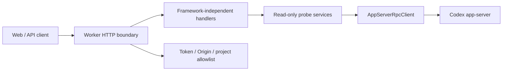

# Worker HTTP API Read-Only MVP Design

## Goal

Turn the existing Worker read-only probe capability into a small, stable HTTP API that Web and future Control Plane/iOS clients can consume through the shared OpenAPI contract.

This stage serves one vertical slice:

```text
Web or API client
  -> Worker HTTP API
    -> Worker read-only app-server adapter
      -> local Codex app-server
```

The API must remain Control Plane-shaped even though the first implementation talks directly to a local Worker. The Worker is still the only process allowed to start or call Codex app-server.

## Non-Goals

- No Control Plane server.
- No database.
- No Web datasource migration.
- No write operations: no start, follow-up, steer, interrupt, approval response.
- No streaming/SSE/WebSocket event stream.
- No task board persistence.
- No empty `apps/control-plane`, `packages/db`, or `packages/shared` scaffolding.
- No raw app-server JSON-RPC endpoint.
- No implementation or mounting of existing unversioned write paths such as `/conversations/{conversationId}/follow-up`.
- No implementation or extension of `ConversationEvent` or `ConversationTimelinePage`; those schemas are deferred for streaming/pagination stages.

## Source Of Truth

- Public API fields start in `packages/api-contract/openapi.yaml`.
- Public TypeScript types are generated from OpenAPI and exported as `components["schemas"]` aliases.
- App-server request/response types come only from `packages/codex-protocol`.
- Worker implementation may project app-server types into API contract types, but must not define parallel public DTOs.
- Product boundaries come from `PRODUCT.md`; implementation boundaries come from `PROJECT_STRUCTURE.md` and `AGENTS.md`.

## API Shape

Add or reconcile these paths in `packages/api-contract/openapi.yaml` before implementation:

| Method | Path | Purpose | Response schema |
| --- | --- | --- | --- |
| `GET` | `/v1/worker/health` | Worker and app-server readiness | `WorkerHealth` |
| `GET` | `/v1/worker/capabilities` | Read-only feature flags | `WorkerCapabilities` |
| `GET` | `/v1/worker/probe` | Run read-only probe and return sanitized diagnostics | `WorkerProbeSummary` |
| `GET` | `/v1/conversations` | List allowed project conversations | array of `CodexConversation` |
| `GET` | `/v1/conversations/{conversationId}/timeline` | Read selected conversation timeline snapshot | `ConversationTimeline` |

Existing unversioned paths may remain for Web fixtures during migration, but Stage 2 implementation should use the versioned paths above.

Worker route allowlist for this stage is exactly the five `GET` routes above. Any write, stream, approval, interrupt, steer, or raw RPC route is out of scope even if a schema already exists in OpenAPI.

### Query And Identity Rules

- `conversationId` is opaque to Web. Web must not parse or infer app-server `threadId` semantics.
- `GET /v1/conversations` requires a configured allowed project root in Worker runtime.
- Stage 2 does not expose public pagination. The route returns a bounded first page as an array of `CodexConversation`; cursor/envelope design is deferred.
- Worker may use app-server `cursor` internally to find allowed conversations, but must not expose app-server cursors unless OpenAPI adds a page envelope first.
- `GET /v1/conversations/{conversationId}/timeline` must prove that the selected conversation belongs to an allowed project root before calling `thread/read`.
- Timeline MVP uses `thread/read(includeTurns=true)`.
- `thread/turns/list` remains an optional experimental capability until generated protocol and runtime support are verified.

Each versioned path must define its non-2xx responses in OpenAPI using the shared error schema. Do not rely on undocumented default error responses.

## Worker HTTP Architecture



Design rules:

- Hono may be introduced only at the HTTP boundary.
- Business handlers should be plain TypeScript functions that accept typed inputs and return typed contract objects.
- Do not pass Hono `Context` into projection or app-server logic.
- Reuse existing Worker security helpers for bearer token, Origin allowlist, and realpath project allowlist.
- Reuse existing app-server process/RPC/probe modules where they match the read-only path.
- Do not leak raw app-server URL, raw JSON-RPC frames, raw upstream errors, prompts, command output, full diffs, tokens, or paths outside the allowed root.

## Runtime Configuration

Stage 2 needs a minimal explicit Worker runtime config:

| Field | Purpose |
| --- | --- |
| `deviceId` | local Worker identity for response payloads |
| `allowedProjectRoot` | required read boundary for `thread/list` and `thread/read` |
| `workerToken` | bearer token expected by HTTP routes |
| `allowedOrigins` | browser Origin allowlist |
| `appServerTransport` | current transport; initially loopback WebSocket, with stdio as product direction |
| `connectTimeoutMs` / `requestTimeoutMs` | app-server connection/request bounds |

Config can be passed through environment variables or a small local config object in this stage. Do not introduce a config database.

Config validation must fail closed:

- `workerToken` is required, must be non-empty, and has no default value.
- `allowedProjectRoot` is required, must exist, and must be realpath-canonicalizable.
- HTTP bind host must be loopback, such as `127.0.0.1` or `localhost`; reject `0.0.0.0`.
- `allowedOrigins` must be explicit; wildcard origins are not allowed.
- timeout values must be positive bounded numbers.
- Config diagnostics must not print tokens, raw app-server URLs, prompts, command output, or paths outside the allowed project root.

## Security Model

- Bind Worker HTTP only to loopback for this stage.
- Require `Authorization: Bearer <token>` for all HTTP routes.
- Reject browser requests with unexpected `Origin`, including read-only `GET`.
- Allow missing `Origin` for non-browser CLI/probe clients when bearer token is valid.
- Normalize configured Origins exactly enough to avoid ambiguity; do not accept wildcard, substring, or suffix matches.
- Return `401` for missing/invalid token.
- Return `403` for disallowed Origin or project-root violations.
- Return user-safe errors only; diagnostics must use sanitized error kinds.
- Project allowlist checks use realpath canonicalization where filesystem paths are involved.

## Error Model

Stage 2 should standardize error responses through `ErrorEnvelope` or a replacement schema added to OpenAPI first.

Minimum fields:

- `code`: stable machine-readable code.
- `message`: user-safe message.
- `requestId`: optional correlation id.
- `details`: sanitized optional object with allowlisted keys only.

Allowed `details` keys:

- `operation`
- `retryable`
- `diagnosticId`
- `reason`
- `field`
- `limit`

Forbidden in `details` and logs:

- `stack`
- `cause`
- raw upstream error
- raw JSON-RPC frame
- raw app-server URL
- token or auth material
- prompt text
- command output
- full diff
- path outside the allowed project root

Recommended HTTP mapping:

| Status | Meaning |
| --- | --- |
| `400` | invalid query/path/body shape |
| `401` | missing or invalid bearer token |
| `403` | Origin or project allowlist rejection |
| `404` | conversation not found inside allowed scope |
| `408` | app-server request timeout |
| `424` | app-server unavailable or not initialized |
| `500` | unexpected Worker bug with sanitized diagnostic |

Raw app-server errors must be classified before entering the response body.

Implementation must use a fixed error-code mapping, not arbitrary `Error.message` values, unless the message is already from a safe Worker-owned enum.

## Conversation Projection

`GET /v1/conversations` maps app-server `thread/list` results to `CodexConversation`.

Required behavior:

- Pass explicit `cwd`, `sourceKinds`, `archived`, `limit`, `sortDirection`, and `cursor` to app-server.
- Only return threads whose `cwd` is inside `allowedProjectRoot` after realpath verification.
- Preserve stable identifiers through opaque `conversationId`.
- Do not expose app-server raw thread object.
- If no allowed conversations exist, return an empty list, not a failure.

Stage 2 field mapping:

| `CodexConversation` field | Source / rule |
| --- | --- |
| `id` | app-server `thread.id`, treated as opaque outside Worker |
| `title` | first non-empty of `thread.name`, `thread.preview`, basename of `thread.cwd`, `"Untitled conversation"` |
| `deviceId` | Worker runtime config |
| `projectId` | optional; stable safe id derived by Worker for the allowed root, or omitted if not defined in OpenAPI implementation slice |
| `projectName` | basename of `allowedProjectRoot`, fallback `"Allowed project"` |
| `status` | mapped from app-server thread/turn status; unknown values map to `unknown` |
| `updatedAt` | app-server `updatedAt` or timestamp field normalized to ISO string; fallback to current read time only if explicitly documented in tests |
| `summary` | app-server `preview` or empty string; do not include full prompt or command output |
| `sandbox` | `"unknown"` unless a safe app-server field is available and mapped in tests |
| `approval` | `"unknown"` unless a safe app-server field is available and mapped in tests |
| `pinned` | omitted unless a safe source exists |

If a required field cannot be safely derived, the implementation plan must first change OpenAPI to make that field optional or define an explicit safe placeholder. Do not patch around missing fields in private ad hoc DTOs.

`GET /v1/conversations/{conversationId}/timeline` maps `thread/read(includeTurns=true)` to `ConversationTimeline`.

Required behavior:

- Verify the requested conversation was discovered inside the allowed project root before calling `thread/read`. The first implementation can prove this by running `thread/list(cwd=allowedProjectRoot)` and matching the opaque id.
- If a future implementation must call `thread/read` before proof, the out-of-root response may only be used for rejection and must not enter projection, logs, diagnostics, or error details.
- Re-check returned `thread.cwd` with realpath allowlist.
- Set `readStartedAt`, `readCompletedAt`, and `snapshotRevision`.
- Use `runtimeStatus`, `latestTurnStatus`, and `turns` from contract types.
- Do not represent unknown status as completed.
- Stage 2 timeline returns turn metadata only. It must not return turn items, prompt text, assistant text, command output, full diffs, raw tool arguments, or raw app-server item payloads.

Stage 2 timeline mapping:

| `ConversationTimeline` field | Source / rule |
| --- | --- |
| `deviceId` | Worker runtime config |
| `conversationId` | opaque id from path after allowed-root proof |
| `projectId` | same rule as `CodexConversation.projectId` |
| `readStartedAt` / `readCompletedAt` | Worker ISO timestamps around read operation |
| `snapshotRevision` | deterministic string from `conversationId` plus `readCompletedAt` for Stage 2; later stages may replace with durable revision |
| `runtimeStatus` | mapped from app-server thread status; unknown values map to `unknown` |
| `latestTurnStatus` | newest terminal turn status when available; otherwise `unknown` |
| `turns` | array of `ConversationTimelineTurn` metadata only |

Stage 2 `ConversationTimelineTurn` mapping:

| Field | Source / rule |
| --- | --- |
| `id` | app-server turn id or stable safe fallback if generated type exposes no id |
| `status` | app-server turn status; unknown values map to `unknown` |
| `startedAt` | numeric timestamp when available, otherwise `null` |
| `completedAt` | numeric timestamp when available, otherwise `null` |
| `durationMs` | app-server duration when available, otherwise derived from timestamps when both exist, otherwise `null` |

## Capabilities

`GET /v1/worker/capabilities` should make unsupported or deferred behavior explicit:

- `canReadProjects`: true only if the Worker can identify an allowed project root.
- `canReadConversations`: true only if `thread/list` path is configured.
- `canReadTimeline`: true only if `thread/read(includeTurns=true)` path is configured.
- `canRunReadOnlyProbe`: true when app-server probe dependencies are configured.
- `supportedSourceKinds`: initially explicit, likely `cli`, `vscode`, `appServer`.
- `threadTurnsList`: not a public field unless OpenAPI defines it; if added, it must be false/experimental until verified.

Do not imply write, approval, interrupt, steer, or stream support in this stage.

Existing `ConversationEvent`, `ConversationTimelinePage`, `FollowUpInput`, approval, interrupt, and steer schemas are deferred and must not appear in Stage 2 handler acceptance criteria.

## Testing Strategy

Tests should be focused on boundaries, not coverage volume.

Required tests:

- API contract generation test for new versioned paths and response schemas.
- Worker HTTP auth rejects missing/invalid bearer token.
- Worker HTTP Origin allowlist rejects unexpected browser origins.
- Worker HTTP allows no-Origin CLI-style requests with valid bearer token.
- Worker HTTP rejects wildcard origins, empty token configuration, non-loopback bind configuration, and non-canonicalizable project roots.
- Conversation list handler returns only allowed-root conversations.
- Timeline handler rejects unknown or out-of-root conversation ids before exposing data.
- Timeline projection does not include prompt text, assistant text, command output, full diffs, raw JSON-RPC, raw app-server URL, raw upstream error, token, or path outside the allowed root.
- Projection tests for unknown statuses and empty thread lists.
- Error mapping tests for timeout, app-server unavailable, project forbidden, and not found.
- Error details tests assert only allowlisted keys are emitted.
- RPC runtime tests cover connect timeout, request timeout cleanup, socket close/error rejecting pending requests, send failure, and HTTP layer non-hanging behavior.
- Boundary test ensuring Worker remains the only app-server caller and Web does not import `codex-protocol`.

Useful verification commands for the plan:

```bash
pnpm --filter @codex-remote/api-contract test
pnpm --filter @codex-remote/api-contract typecheck
pnpm --filter @codex-remote/worker test
pnpm --filter @codex-remote/worker typecheck
pnpm lint
pnpm typecheck
pnpm test
pnpm build
```

## Implementation Sequencing

The implementation plan should split the work into small reviewable slices:

1. Contract paths and generated types.
2. Contract reconciliation for `CodexConversation`, `ConversationTimeline`, and error responses, including field optionality or safe placeholders where app-server data cannot be derived.
3. Worker HTTP boundary with auth/origin middleware and health/capabilities using fake app-server dependencies only for boundary tests.
4. Read-only conversation list handler using existing app-server client abstractions.
5. Timeline handler using `thread/read(includeTurns=true)` and pre-read allowlist proof.
6. Probe route wrapping existing `runReadOnlyProbe`.
7. Focused verification and architecture review.

Do not start with Web UI changes. Web should only consume this API in the next stage after the Worker API is stable.

## Open Local Verification Items

These are local checks for the implementation plan, not new web research:

- Confirm current installed Codex CLI app-server transport behavior.
- Confirm whether generated protocol and local runtime expose `thread/turns/list`.
- Confirm Node runtime and Hono version assumptions.
- Confirm Hono test strategy using Node built-in test runner.
- Confirm current app-server error shapes can be safely classified without leaking raw upstream details.

## Completion Criteria

Stage 2 is complete when:

- Versioned read-only paths are defined in OpenAPI and generated TypeScript.
- Worker exposes loopback-only read-only HTTP API with bearer token and Origin allowlist.
- `health`, `capabilities`, `probe`, `conversations`, and `timeline` routes return contract-shaped payloads.
- Project allowlist is enforced for list/read.
- No raw app-server protocol or URL leaks to Web-facing responses.
- Fresh verification passes for affected packages and the repository gate.
