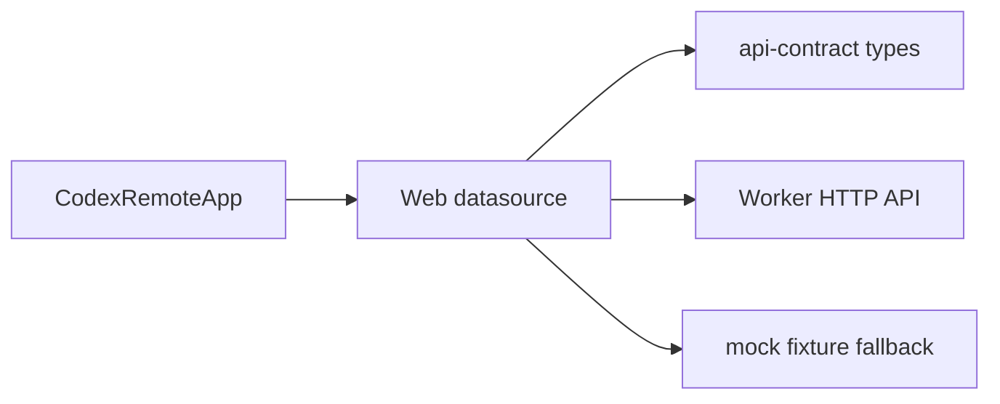

# Web Real Datasource Design

## Stage

Stage 3: Web 接真实数据。

## Goal

让 `apps/web` 从 Stage 2 Worker HTTP API 读取只读设备、项目、对话和 timeline 状态，并保留现有 mock 作为显式 fallback 和测试夹具。

This stage serves one vertical slice:

```text
Web workbench
  -> Web datasource boundary
    -> Control Plane-shaped Worker HTTP API
      -> apps/worker
```

## Non-Goals

- No write operations: no start, follow-up, steer, interrupt, approval response.
- No stream, SSE, WebSocket, event replay, or live output feed.
- No Control Plane server or `apps/control-plane`.
- No database or `packages/db`.
- No iOS API work.
- No productized pairing, auth rotation, device registration, or external deployment.
- No raw Codex app-server protocol in Web.
- No import from `@codex-remote/codex-protocol` in Web.
- No new API fields unless `packages/api-contract/openapi.yaml` changes first.

## Source Of Truth

- Public API fields come from `packages/api-contract/openapi.yaml`.
- Web imports public types only from `@codex-remote/api-contract`.
- Worker remains the only app that calls Codex app-server.
- Mock data in `apps/web/src/data/app-server/mockData.ts` remains a fixture/fallback, not a parallel contract source.
- UI copy and visual shape follow `PRODUCT.md` and `DESIGN.md`.
- Directory ownership follows `PROJECT_STRUCTURE.md`.

## Recommended Approach

Use a small Web-local datasource boundary:

- `apps/web/src/data/workerApi/client.ts`: typed fetch helpers and sanitized error parsing.
- `apps/web/src/data/workerApi/workbenchData.ts`: builds a Web workbench snapshot from Worker contract responses.
- `apps/web/src/data/workerApi/workbenchData.test.ts`: boundary tests with a fake fetch.
- Existing `mockData.ts`: keep conversation/device/project values as fixture source, but do not reuse its rich assistant timeline in Stage 3 fallback.
- `CodexRemoteApp`: load the datasource once on the client, then render the same workbench shell.

Reasons:

- It uses the existing Stage 2 contract and avoids a new framework or server layer.
- It keeps Web free of app-server protocol details.
- It is the shortest path to a real read-only vertical slice.

Risks:

- Stage 2 Worker has only one local device, so multi-device aggregation remains fake until Stage 6.
- Timeline returns turn metadata only; Web must not invent prompt, assistant text, command output, or diff content.
- Browser access needs a local Worker token. For local dev, the token is read from a public Next env var; this is acceptable only because Stage 2 Worker is loopback-only and self-hosted.

Next:

- Add focused datasource tests first.
- Implement the minimal fetch boundary.
- Wire the shell to render loaded/fallback/error state.
- Run Web and repository verification, then Chrome smoke on `http://127.0.0.1:5173`.

## Runtime Configuration

Web uses these client-visible environment variables:

| Variable | Purpose |
| --- | --- |
| `NEXT_PUBLIC_CODEX_REMOTE_WORKER_BASE_URL` | Worker HTTP base URL, default `http://127.0.0.1:8787`. |
| `NEXT_PUBLIC_CODEX_REMOTE_WORKER_TOKEN` | Local bearer token for Stage 3 browser calls. Empty means use fallback fixture. |

This stage does not add secret storage. Do not log the token or render it in UI.

## Data Flow



The datasource fetches:

1. `GET /v1/worker/health`
2. `GET /v1/worker/capabilities`
3. `GET /v1/conversations`
4. `GET /v1/conversations/{conversationId}/timeline` for the selected or first conversation

`GET /v1/worker/probe` stays available but is not loaded by default. It can be added to a diagnostics pane in a later read-only slice if needed.

## Projection Rules

### Device

Create one `Device` from `WorkerHealth`:

- `id`: `WorkerHealth.deviceId`
- `name`: `WorkerHealth.deviceId`
- `status`: `"Connected"` when `WorkerHealth.status` is ready/online-like; otherwise `"Not connected"`
- `ip`: hostname from Worker base URL, never raw app-server URL
- `lastOnlineAt`: `WorkerHealth.checkedAt` when present, otherwise `"刚刚"`
- `currentProject`: first conversation project name, otherwise `"未选择项目"`
- `model`: `"Codex"`

If health fails but conversations load, keep the fallback device and render a datasource warning.

### Projects

Derive `RemoteProject[]` from `CodexConversation[]` by `projectId`.

- Do not create a project when `projectId` is missing.
- Use `projectName` for `name`.
- Use `deviceId` from the conversation.
- Use a safe placeholder path `""` when the public contract has no path.
- Set `branch` to `"unknown"` and `hasChanges` to `false`.
- Preserve `expanded: true` for the first project so the initial view is usable.

This is a view projection, not a new product contract.

### Conversations

Use `CodexConversation[]` directly from the API contract. Do not copy fields into a new DTO.

### Timeline

Convert both real API timelines and fallback fixture timelines into `AssistantThreadSnapshot` with turn metadata only:

- `loadState`: `"loaded"` when timeline fetch succeeds.
- Each turn becomes one safe context node: `Turn <status>`.
- No prompt, assistant text, command output, file diff, tool arguments, or raw app-server item payload enters Web.
- If timeline fails, use `loadState: "readError"` and an empty timeline for that conversation.
- Fallback must not reuse the existing rich `assistantThreads` fixture, because that fixture intentionally contains prompt-like text, tool details, diffs, and paths for earlier UI work.

### Search

`WorkbenchData` includes `searchRecents` derived from its own `conversations`.

- `SearchDialog` must receive `searchRecents` as a prop.
- `SearchDialog` must not import `mockData.ts`.
- Search results must never point to conversations absent from the currently loaded `WorkbenchData`.

## Error Handling

- `401` and `403`: show a compact datasource warning and use fallback fixture.
- `424`: show Worker unavailable warning and use fallback fixture.
- Other failures: show generic datasource warning and use fallback fixture.
- Render only `ErrorEnvelope.code` and `ErrorEnvelope.message` if present.
- Never render token, raw app-server URL, raw JSON-RPC, stack/cause, prompt, command output, full diff, or private local paths.

## UI Behavior

- Existing shell remains the first screen.
- Add a compact datasource status line in the conversation topbar or sidebar header.
- On successful API load, lists and selected conversation come from the datasource.
- On fallback, keep the current fixture conversations/devices/projects and mark it as fallback, but render sanitized metadata-only timeline rows.
- Disabled write controls remain disabled.

## Testing Strategy

Focused tests:

- Datasource builds a workbench snapshot from fake Worker responses.
- Missing token returns fallback without calling fetch.
- `401`/`403`/`424` produce fallback with sanitized warning.
- Timeline projection creates metadata-only nodes and excludes unsafe strings.
- Project derivation uses `projectId` and does not create projects for projectless conversations.
- Search recents are derived from loaded conversations.
- Web boundary test still rejects `@codex-remote/codex-protocol`.
- A deterministic fake Worker normal path smoke verifies API-loaded browser behavior.

Repository gate:

```bash
pnpm --filter @codex-remote/web test
pnpm --filter @codex-remote/web typecheck
pnpm lint
pnpm typecheck
pnpm test
pnpm build
```

Chrome smoke:

1. Start a deterministic fake Worker server that implements the Stage 2 read-only endpoints.
2. Start Web with `NEXT_PUBLIC_CODEX_REMOTE_WORKER_BASE_URL` and `NEXT_PUBLIC_CODEX_REMOTE_WORKER_TOKEN`.
3. Open `http://127.0.0.1:5173`.
4. Verify API-loaded status is visible.
5. Verify conversation navigation and search use the fake Worker conversations.
6. Verify timeline rows are metadata-only.
7. Stop fake Worker and verify fallback is visible and sanitized.
8. Verify disabled write controls remain disabled.

## Architecture Review Record

Plan review was performed by a subagent as an architect review before implementation.

Reviewed dimensions:

- Architecture boundaries: Web stays on Control Plane-shaped Worker HTTP API and does not import app-server protocol.
- Source of truth: public fields derive from `@codex-remote/api-contract`; no Web DTO parallel to OpenAPI was introduced.
- DRY and modularity: datasource/client/projection are localized under `apps/web/src/data/workerApi`.
- Security: token, raw app-server URL, raw JSON-RPC, prompt, command output, full diff, stack/cause, and private paths stay out of UI.
- Test sufficiency: datasource success/fallback/error/timeline/search paths are covered before shell wiring.
- Maintainability: Stage 3 avoids Control Plane, DB, streaming, write, approval, pairing, and productized auth.

Findings fixed before implementation:

- Fallback timeline must be metadata-only and must not reuse rich mock assistant threads.
- Search recents must be derived from active `WorkbenchData`, not imported mock arrays.
- Timeline read failures must keep loaded conversation metadata while marking the selected thread as `readError`.

## Completion Criteria

Stage 3 is complete when:

- Web datasource boundary exists and imports only `@codex-remote/api-contract`.
- Web can render API-loaded conversations when Worker config is present.
- Web falls back to fixture data with sanitized warning when Worker config/API is unavailable.
- Timeline display uses safe metadata only.
- Search results derive from the loaded `WorkbenchData`, not from global mock data.
- Focused Web tests and repository gate pass.
- Chrome smoke verifies deterministic fake Worker normal path and fallback path.
- `PLAN.md` records Stage 3 status, verification, risks, and next Stage recommendation.
