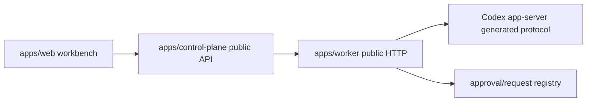

# Stage 11 Conversation Workbench Parity Design

## Goal

Ship the next Codex App-like conversation workbench slice: open/resume an existing conversation, archive/unarchive, rename, loaded/live badges, snapshot-first timeline state, Worker-projected live/request events, request cards, and approval pending/resolved UI state through the real Web -> Control Plane -> Worker -> Codex app-server path.

## Scope

Stage 11 implements only the conversation lifecycle and request-state surface needed by the main workbench.

Included:

- Open/continue an existing conversation from Web by calling a public `open` API that Worker maps to generated `thread/resume`.
- Archive and restore conversations with user-facing Archive/Restore actions.
- Rename conversation display titles without using names as routing keys.
- Add loaded/live/archived state to public conversation and timeline shapes.
- Keep timeline loading snapshot-first: Web reads a snapshot first, then shows projected live/request events when Worker has them.
- Project Worker-held approval state into stable public approval cards with pending and resolved states.
- Keep request-card decisions limited to existing approval decision behavior; no new production approval safety model.

Non-goals:

- Rollback.
- Raw `thread/inject_items`.
- Arbitrary shell or filesystem write.
- Plugin install.
- Account login/logout.
- Realtime voice.
- Windows setup.
- Feedback upload.
- External agent import.
- Fork/goal/compact unless needed only as disabled copy-free absence.
- Durable multi-process event store.

## Architecture

Public fields start in `packages/api-contract/openapi.yaml`. Worker maps generated app-server protocol from `packages/codex-protocol` into those fields. Control Plane only routes and normalizes device identity. Web consumes only Control Plane-shaped API and never imports app-server protocol types.

## Public Contract

Contract changes:

- `CodexConversation` gains `archived`, `loaded`, and `live`. Existing `title` remains the only public display title; Worker derives it from safe app-server `thread.name` when available and falls back to project name without using prompt preview.
- `ConversationTimeline` gains `loaded`, `live`, `archived`, and `events`.
- `ConversationWorkbenchEvent` is the stable Worker-projected event item:
  - `eventId`: opaque Worker-generated id.
  - `seq`: monotonic per conversation.
  - `deviceId` and `conversationId`: public opaque ids.
  - `kind`: `thread_opened`, `thread_archived`, `thread_unarchived`, `thread_renamed`, `approval_pending`, `approval_resolved`, `snapshot_reset`, or `turn_state`.
  - `createdAt`: ISO timestamp.
  - `source`: `snapshot` or `live`.
  - `gap`: optional boolean for reconciliation gaps.
  - `approvalCard`: optional sanitized `ConversationApprovalCard`.
- `ConversationApprovalCard` is the stable UI approval card item. Stage 11 does not expose `item/tool/requestUserInput` or `mcpServer/elicitation/request`; those stay unsupported and have no submit route.
- `OpenConversationResult`, `ConversationLifecycleInput`, and `RenameConversationInput` define lifecycle responses and inputs.
- Conversation list default includes archived conversations with `archived: true`; Web may visually group or de-emphasize them, but restore is discoverable from the same list.
- New Worker and Control Plane routes:
  - `POST /v1/conversations/{conversationId}/open`
  - `POST /v1/conversations/{conversationId}/archive`
  - `POST /v1/conversations/{conversationId}/unarchive`
  - `PATCH /v1/conversations/{conversationId}`
  - Device-scoped Control Plane equivalents under `/v1/devices/{deviceId}/...`

No raw app-server method names appear in Web labels or public schema names except inside documentation references.

## Worker Behavior

Worker:

- Uses generated `thread/resume`, `thread/archive`, `thread/unarchive`, `thread/name/set`, and `thread/loaded/list` request types through `AppServerWorkerClient`.
- Validates conversation ownership with `thread/read` and realpath before lifecycle writes.
- Maps archive/restore/rename/open failures to sanitized `ErrorEnvelope`.
- Lists archived and non-archived conversations by using the existing project root filter twice where needed.
- Computes `loaded` from `thread/loaded/list`.
- Computes `live` from `loaded` plus active/waiting runtime status.
- Projects pending approvals into `ConversationApprovalCard` without exposing command output, raw prompt, raw JSON-RPC, raw local paths, full diffs, provider secrets, stack, or cause.
- Marks resolved approval cards after a decision is accepted in the process-local registry.

## Control Plane Behavior

Control Plane:

- Adds device-scoped pass-through methods to `WorkerUpstreamClient`.
- Routes lifecycle operations to the owning configured Worker.
- Normalizes returned `deviceId` to configured device id.
- Does not persist raw Worker URLs, Worker tokens, app-server URLs, provider secrets, or JSON-RPC frames.

## Web Behavior

Web:

- Sidebar shows active/loaded/archived badges from `CodexConversation`.
- Conversation header shows loaded/live status and request-card count.
- Selecting a conversation calls `openConversation`, then refreshes snapshot data.
- Row/header actions support Rename, Archive, and Restore through Control Plane-shaped API.
- Approval cards show pending and resolved approval state in the main conversation control area.
- Empty/degraded states remain explicit and sanitized.

## Security And Redaction

No Stage 11 payload may include:

- OpenAI API key, ChatGPT auth, Codex auth, provider secrets, bearer tokens.
- Raw app-server URL, raw JSON-RPC frame, request id internals beyond public opaque ids.
- Raw prompt, full command output, full diff, stack, cause, or private local filesystem path.

Failure details may include only existing safe fields such as `operation`, `retryable`, `field`, `limit`, `reason`, `deviceId`, and `diagnosticId`.

## Verification

Focused checks:

- `pnpm --filter @codex-remote/api-contract test`
- `pnpm --filter @codex-remote/worker test`
- `pnpm --filter @codex-remote/control-plane test`
- `pnpm --filter @codex-remote/web test`

Full checks:

- `pnpm product:check`
- `pnpm lint`
- `pnpm typecheck`
- `pnpm test`
- `pnpm build`

Real browser checks with Chrome:

- Open existing conversation and confirm loaded/live badge.
- Rename conversation and confirm title changes without exposing prompt text.
- Archive conversation and confirm it remains discoverable with an archived marker.
- Restore archived conversation from the archived row and confirm it can be opened again.
- Confirm timeline renders from snapshot before live/approval state.
- Confirm duplicate or late events do not create duplicate visible rows, and `snapshot_reset` is handled as a snapshot-first refresh marker.
- Confirm pending approval cards render when fake or real pending state exists.
- Confirm resolved approval state after decline/cancel where a safe pending request exists; if real app-server still lacks a safe pending request, record the existing `real-gap` without product-ready claim.
- Confirm failure/degraded state is sanitized.
- Confirm no sensitive strings appear in visible UI or network responses.

## Current Status

- Implemented and verified by focused/full automated checks plus real stack API evidence.
- Stage closure remains blocked by @chrome browser verification because the Chrome control tool fails during initialization with missing sandbox metadata. This is recorded as a verification blocker, not a product-code pass.
