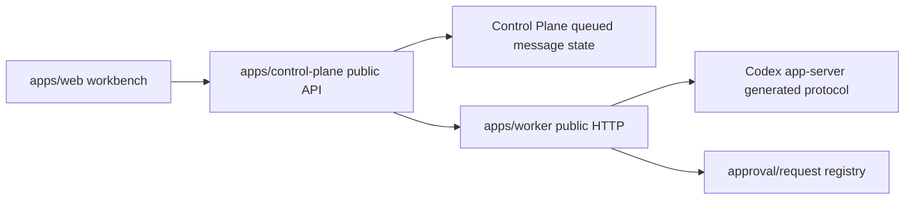

# Stage 11 Conversation Workbench Parity Design

## Status

This is the active Stage 11 spec after the 2026-06-21 product review. It replaces the pre-consensus Stage 11 spec archived at `docs/archives/specs/2026-06-21-conversation-workbench-parity-design-pre-consensus.md`.

Stage 11 is not closed. Previous implementation evidence is treated as useful protocol/API evidence, not proof of Codex App-like UI parity.

Stage 11A is the app-server output calibration slice inside Stage 11. It uses the protocol inventory to reconcile the current dirty draft before any UI repair continues.

## Goal

Build the conversation workbench as a Codex App-like product surface through the real Web -> Control Plane -> Worker -> Codex app-server path.

The target is not a minimal debug loop. The target is a complete workbench direction, split into verifiable vertical slices so future work can keep moving without removing confirmed UI.

## Product Principles

- Preserve confirmed UI surfaces even when the backend is not ready. Unsupported actions stay visible only as disabled/TODO placeholders, not as working no-ops.
- Web labels describe user intent, not raw app-server method names.
- Permission and access controls must be derived from generated app-server protocol and public API design. Do not invent behavior from labels alone.
- Archived conversations disappear from the normal sidebar immediately. Archived discovery and restore belong in Settings -> 已归档对话.
- A running conversation uses the composer as the control surface: send, interrupt, steer-now, and queue-after-current live together.
- Message actions live under each assistant response as a horizontal icon row: copy, thumbs up, thumbs down, fork/派生, hooks, timestamp.
- Timeline must show app-like conversation content, not metadata-only rows. Projection still must redact sensitive or high-risk fields.

## Protocol Calibration

Stage 11 implementation must use `docs/references/2026-06-21-app-server-protocol-inventory.md` as required design input.

Every app-server-derived field follows this chain:

```text
packages/codex-protocol generated type
  -> packages/api-contract/openapi.yaml public model
  -> generated public API types
  -> Worker projection
  -> Control Plane route/state
  -> Web datasource/domain/UI
```

Stage 11 may only calibrate conversation workbench data: lifecycle state, safe `Thread`/`Turn`/`ThreadItem` timeline projection, active turn state, request cards, composer state, archived conversation listing, permission placeholders, and message action capabilities.

Files, shell, Git, MCP, plugin, marketplace, account, realtime voice, Windows, feedback, and external agent protocol groups stay inventory-only in Stage 11.

Stage 11A reconciliation decisions:

- Keep the public `ConversationTimelineNode` concept, but require generated types, tests, `Turn.itemsView` partial-history state, and redaction checks before implementation is accepted.
- Rewrite Worker `ThreadItem` projection as safe projection helpers. Public text can include user/assistant visible message text; tool nodes must be neutral summaries.
- Reject direct exposure of raw command string, command cwd, aggregated output, full diff, MCP arguments/results, collab prompt, image path, raw reasoning content, stack/cause, tokens, raw JSON-RPC, and app-server URLs.
- Replace Web-side guessed tool mapping with rendering based on public node kind/status only.
- Keep permission labels only as placeholders until OpenAPI defines a public permission/profile model.

## Included Scope

- Open/resume selected conversation through public API mapped by Worker to generated `thread/resume`.
- Archive/unarchive conversations, with normal sidebar filtering and Settings-based archived restore.
- Rename conversation public `title`.
- Loaded/live badges in sidebar/header where they help explain current state.
- Snapshot-first timeline that renders safe conversation content from app-server history before live events.
- Worker-projected live/request events reconciled against snapshot state.
- Approval/request cards with pending and resolved state, shown in the conversation flow.
- Composer start/follow-up behavior for selected project or selected conversation.
- Composer running behavior:
  - interrupt active turn;
  - steer current turn via `turn/steer` when an active turn id is proven;
  - queue/send after current execution completes as a Control Plane product queue, not a raw app-server method.
- Permission menu UI kept in place, but behavior must be mapped from actual protocol support before requests are changed.
- Message action row placeholders, with only verified safe actions enabled.

## Non-Goals

- Rollback.
- Raw `thread/inject_items`.
- Arbitrary shell or filesystem write.
- Plugin install.
- Account login/logout.
- Realtime voice.
- Windows setup.
- Feedback upload.
- External agent import.
- Production approval safety model or automatic full-access approval.
- Raw app-server method passthrough from Web.

## Architecture



Public fields start in `packages/api-contract/openapi.yaml`. Worker maps generated app-server protocol from `packages/codex-protocol` into public shapes. Control Plane owns multi-device routing and product state such as queued messages. Web consumes only Control Plane-shaped APIs.

## Capability Mapping

| Product concept | Expected UI | Protocol/API basis | Stage 11 rule |
| --- | --- | --- | --- |
| Open/continue | Selecting a conversation opens it and renders history | `thread/resume`, `thread/read` | Must not require a separate Start button to show real data. |
| Start/follow-up | Shared composer send | `thread/start`, `turn/start` | Start and follow-up are one composer flow. |
| Interrupt | Stop/interrupt beside send while running | `turn/interrupt` | Remove debug control strip placement. |
| Steer | Running send mode: 引导当前执行 | `turn/steer` with `expectedTurnId` | Only enabled with active-turn proof. |
| Queue later | Running send mode: 排队发送 | Control Plane product queue, delayed `turn/start` | Must be designed as product state, not guessed app-server behavior. |
| Fork/派生 | Assistant message action row icon | `thread/fork` | Placeholder until public route exists. Not steer. |
| Hooks | Assistant message action row icon | `hooks/list` | Placeholder/read-only later; no hook execution in Stage 11. |
| Permission modes | Composer menu | `approvalPolicy`, `approvalsReviewer`, `sandboxPolicy`, `permissionProfile/list`, `item/permissions/requestApproval` | Keep UI, but do not alter request behavior until mapped and tested. |
| Archive | Row action removes from normal sidebar | `thread/archive` | Restore lives in Settings -> 已归档对话. |
| Restore | Settings archived conversation action | `thread/unarchive` | Restored row reappears in normal sidebar. |
| Timeline content | User/assistant content plus safe tool/request summaries | `thread/read`, Worker projection | No metadata-only timeline as the final UX. |
| Request cards | Inline timeline/workbench cards | approval registry and server request resolution | Pending/resolved states visible; real approval decision can remain a documented gap. |

## Safe Projection

Allowed by default:

- Public opaque ids.
- Conversation title after existing safe title rules.
- User and assistant message text from app-server history, after redaction checks.
- Turn state, timestamps, role, and status.
- Safe tool/request summaries that do not include raw command output, full diff, private paths, raw prompt, stack/cause, raw JSON-RPC, app-server URL, token, provider secret, or auth material.
- Partial-history state from `Turn.itemsView` when the app-server indicates the snapshot is not complete.

Rejected by default:

- Raw prompt payloads outside user-visible conversation messages.
- Raw command output.
- Full diff or patch body.
- Private filesystem paths.
- Raw command string, command cwd, image path, MCP arguments/results, collab agent prompt, and raw reasoning content.
- Provider secrets, bearer tokens, auth files, raw app-server URL, raw JSON-RPC frames.
- Stack traces and `cause` chains.

## Required UI Shape

- Sidebar:
  - project list and conversation list are separate but correctly grouped;
  - normal conversation list excludes archived rows;
  - Settings entry opens a real settings surface with 已归档对话.
- Main conversation:
  - selected conversation renders snapshot content immediately when available;
  - request cards live in the timeline/workbench flow;
  - assistant messages show the action row.
- Composer:
  - keeps permission menu UI;
  - sends start/follow-up from the same input;
  - while running, shows interrupt and send-mode choice for steer-now vs queue-later.
- Placeholders:
  - confirmed future affordances remain visible only when they are clearly disabled or marked by code TODO;
  - unsupported active-looking controls are not allowed.

## Verification Requirements

Before Stage 11 can close:

- Focused tests pass for api-contract, worker, control-plane, and web.
- Full checks pass: `pnpm product:check`, `pnpm lint`, `pnpm typecheck`, `pnpm test`, `pnpm build`.
- Real stack passes: `pnpm real:start`, `pnpm real:status`, `pnpm real:check`, `pnpm web:e2e:smoke`.
- Chrome verification covers:
  - open/resume normal path;
  - start/follow-up from composer;
  - interrupt from running composer;
  - steer-now and queue-later UI states;
  - archive disappearing from normal sidebar;
  - restore from Settings -> 已归档对话;
  - rename;
  - loaded/live badge;
  - snapshot-first timeline content;
  - request card pending/resolved state where safe evidence exists;
  - degraded/failure state;
  - no sensitive information in visible UI or network responses.

## Current Known Problems To Fix

- Existing UI still exposes debug-like Start/Interrupt/Steer strips.
- Timeline behavior is not yet proven as app-like content display.
- Archived rows are shown in the normal sidebar.
- Sidebar grouping can be wrong when Worker projection omits project association.
- Settings is not yet the archived-conversation restore surface.
- Permission menu behavior is not protocol-derived yet.
- Message action row is missing.
- Existing real smoke validates plumbing, not the final app-like workbench shape.
