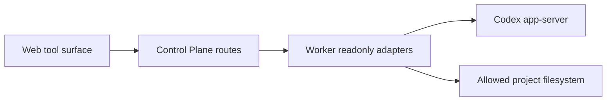

# Stage 12 Local Workbench Read-only Design

Stage 12 adds read-only local work surfaces to the Web workbench while preserving the existing Web -> Control Plane -> Worker -> Codex app-server path.

Stage 12 is not a shell, file editor, plugin installer, MCP executor, or config editor. It is an inspection surface for local evidence owned by the selected Worker device.

## Goal

Let the user inspect local project context from the browser:

- project-relative file tree, metadata, and bounded text preview;
- Git/review evidence already known to Codex/app-server;
- fuzzy file search results;
- MCP server status with resources, resource templates, and tools listed;
- skills, hooks, plugins, marketplace entries, and apps listed as read-only inventory.

## Source Of Truth

- Public API fields start in `packages/api-contract/openapi.yaml`.
- Codex app-server request/response shapes come from generated `packages/codex-protocol`.
- DB schema is unchanged unless a later Stage 12 decision needs persistence; current Stage 12 does not need DB.
- Worker is the only app-server, filesystem, Git, and shell boundary.
- Web consumes only Control Plane-shaped public APIs.

## Scope

Supported in Stage 12:

- Read project file/directory metadata through Worker allowlist checks.
- Read bounded text preview for files inside the selected project.
- Read project-relative directory entries.
- Read app-server-provided Git diff summary after Worker parses and discards raw diff text.
- Read app-server-provided review state summary.
- Run app-server fuzzy file search and expose bounded project-relative matches.
- Read MCP server status, tools, resources, and resource templates from app-server status.
- Read skills, hooks, plugin list/installed/read metadata, marketplace read/list metadata, and apps list.
- Render the data in a compact workbench tool surface and right detail pane.

Explicit non-goals:

- `fs/writeFile`, `fs/createDirectory`, `fs/remove`, `fs/copy`, `fs/watch`, `fs/unwatch`.
- Command evidence, command history, raw command output, `command/exec`, `command/exec/write`, `command/exec/terminate`, `command/exec/resize`, `thread/shellCommand`.
- `review/start`.
- `mcpServer/tool/call`, `mcpServer/resource/read`, `mcpServer/oauth/login`, MCP config reload.
- Plugin install/uninstall/share/update, marketplace add/remove/upgrade.
- Skills config write or extra roots write.
- Account login/logout, config write/read, model/runtime settings, Windows setup, realtime voice, feedback upload, external agent import.
- Any raw absolute path, raw prompt, raw command output, full diff, raw JSON-RPC, stack/cause, token, provider secret, or app-server URL exposure.

## Public Data Rules

- Paths exposed to Web are project-relative and use `/` separators.
- File previews are text-only, bounded by bytes and line count, and marked truncated when capped.
- Binary or oversized files return metadata and `previewKind: "unavailable"` with a safe reason.
- Directory listings are bounded and sorted directories first, then files by name.
- Git/review evidence exposes counts, filenames as project-relative paths, statuses, and bounded summaries; Worker must parse `gitDiffToRemote` output and discard raw diff hunk/header/body text before returning public data.
- MCP/tools/plugins/skills/apps expose only whitelisted names, ids, statuses, descriptions, and schema summaries. Tool invocation arguments/results are not exposed.
- Extension inventory must never expose raw protocol fields such as `path`, `sourcePath`, `marketplacePath`, `command`, `contents`, skill prompt bodies, hook commands, or plugin skill file contents.
- Every route returns `ErrorEnvelope` for validation, auth, not found, timeout, device unavailable, and internal failures.

## Architecture

Control Plane only routes and normalizes configured device ids. Worker performs allowlist checks, app-server mapping, and redaction.

## UI

Stage 12 adds a Local Tools view in the Web workbench:

- left or main tool navigation for Files, Git/Review, Search, MCP, Extensions;
- main panel for lists and previews;
- right detail pane for selected file/resource/plugin/server detail;
- degraded banners when one capability fails while others load.

Minimum states:

- loading;
- loaded empty;
- loaded with data;
- degraded dependency;
- unavailable capability;
- failed with sanitized error.

## Verification

Before closing Stage 12:

- focused contract, worker, control-plane, and web tests pass;
- `pnpm product:check`;
- `pnpm lint`;
- `pnpm typecheck`;
- `pnpm test`;
- `pnpm build`;
- real local stack starts and reports healthy;
- Chrome verifies normal, empty, degraded, and no-secret-leak states;
- `PLAN.md`, `FEATURE_SUPPORT.md`, and `CODEX_APP_PARITY.md` reflect Stage 12 support and remaining gaps.
