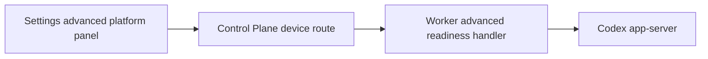

# Stage 15 Advanced Platform Readiness Design

Stage 15 starts the advanced App-like platform work with a read-only readiness surface. It must not become a realtime voice client, feedback uploader, external-agent importer, remote GUI controller, automation engine, or Windows setup wizard.

## Goal

Expose a safe project-scoped advanced platform support summary through Web -> Control Plane -> Worker -> Codex app-server.

First implementation slice:

- Windows sandbox readiness from generated `windowsSandbox/readiness`, projected as a safe readiness section;
- realtime voice, feedback upload, external agent config, remote control, and automations as static watchlist items derived from `CODEX_APP_PARITY.md`, `FEATURE_SUPPORT.md`, and the protocol inventory;
- compact Web Settings panel that shows supported, unavailable, degraded, and deferred states without enabling actions.

## Source Of Truth

- Public API fields start in `packages/api-contract/openapi.yaml`.
- Codex app-server method and notification shapes come from generated `packages/codex-protocol`.
- Worker is the only app-server, local platform, filesystem, remote-control, feedback, and automation boundary.
- Web consumes only Control Plane-shaped public APIs.
- No DB changes in this slice.

## Scope

Supported in the first Stage 15 slice:

- `GET /v1/devices/{deviceId}/projects/{projectId}/advanced-platform-readiness`
- Worker validates `projectId` against its allowed project boundary before returning project-scoped readiness.
- Worker calls only `windowsSandbox/readiness` from the advanced app-server group.
- Public response is one closed `AdvancedPlatformReadinessSummary` object with one bounded `readinessSections` array and one bounded `watchlistItems` array.
- Web shows the summary in Settings near Runtime & Settings and keeps archive restore intact.

Readiness section in this slice:

- Windows sandbox: app-server-backed readiness when available; degraded with sanitized error when the current runtime cannot report it.

Watchlist items in this slice:

- Realtime voice: watchlist only. Generated notifications exist, but no public start/control path is exposed.
- Feedback upload: watchlist only. No upload, logs, thread id, tags, or extra file inputs are exposed.
- External agent config: watchlist only. No home scan, repo scan, migration item, or import is exposed.
- Remote GUI / computer use: watchlist only. No browser, desktop, or extension control path is exposed.
- Automations: watchlist only. No recurring task, reminder, monitor, or thread wakeup path is exposed.

Explicit non-goals:

- starting realtime voice, WebRTC, SDP handling, transcript/audio stream, or microphone UI;
- `feedback/upload`, log upload, extra log file selection, tags, reason text, or thread id submission;
- `externalAgentConfig/detect` with `includeHome`, repo/home scanning, migration item display, or `externalAgentConfig/import`;
- `windowsSandbox/setupStart` or any setup mutation;
- remote GUI, computer-use, browser extension control, or automation creation/update/delete;
- account login/logout, config writes, model switching, shell execution, filesystem writes, plugin/MCP mutation, or provider abstraction;
- exposing app-server method names, raw notification payloads, local paths, logs, prompts, command output, stack/cause, raw JSON-RPC, app-server URLs, provider secrets, auth tokens, or full diffs.

Deferred slices:

- Windows sandbox setup only after a Windows-specific confirmation and rollback spec.
- Realtime voice only after protocol evidence defines a safe start path, event stream model, audio privacy rules, and close/error handling.
- Feedback upload only after a local-only confirmation model proves which logs are included and how secrets are scrubbed.
- External agent import only after read-only detection can avoid home-secret leakage and migration previews are user-reviewed.
- Remote GUI and automations only after separate security models.

## Public Data Rules

- Readiness section identifiers are stable product identifiers, not raw app-server method names.
- Readiness status uses a closed enum: `ready`, `not_applicable`, `degraded`, or `unavailable`.
- Watchlist item support uses a separate closed enum: `not_supported` or `deferred`. Watchlist items cannot use `ready`.
- `platform` may expose a coarse OS family such as `macos`, `windows`, `linux`, or `unknown`; it must not expose hostnames, usernames, install paths, or environment variables.
- Windows readiness may expose only generated readiness values mapped to public labels.
- On non-Windows platforms, Windows sandbox should prefer `not_applicable`; transport or app-server failures should be `degraded`.
- Watchlist items may expose a short reason and a next-safe-step label, but no input fields, executable action ids, support claims, or hidden enablement flags.
- Each app-server-backed section may degrade independently with sanitized `ErrorEnvelope`; one degraded advanced capability must not make Settings fallback to mock data.

## Architecture

Control Plane routes to the selected configured device and project. Worker owns project validation, app-server calls, local platform classification, and projections.

## UI

- Settings keeps Runtime & Settings and archived conversations sections.
- An Advanced Platform section appears as a compact readiness and support matrix panel.
- The panel uses dense rows, restrained status labels, and no clickable disabled no-op controls.
- Loaded, degraded, empty, and unavailable states are explicit.
- Unsupported future capabilities are visible only as `not_supported` or `deferred` watchlist state, not as promised actions.

## Verification

Before closing Stage 15:

- focused contract, Worker, Control Plane, and Web tests pass;
- source-boundary tests prove Web and Control Plane do not import `@codex-remote/codex-protocol`;
- tests prove only `windowsSandbox/readiness` is called from the advanced protocol group;
- tests prove `windowsSandbox/setupStart`, `feedback/upload`, `externalAgentConfig/detect`, `externalAgentConfig/import`, realtime start/control, remote GUI, automations, shell, filesystem write, config write, login/logout, and model switching are not exposed;
- fake Worker smoke server and serialized response-body leak scans cover tokens, provider secrets, app-server URLs, local paths, raw JSON-RPC, prompts, command output, logs, stack/cause, and full diff;
- `pnpm product:check`;
- `pnpm lint`;
- `pnpm typecheck`;
- `pnpm test`;
- `pnpm build`;
- real local stack checks and Web smoke pass;
- Chrome verifies loaded, degraded, empty, and no-secret-leak states.
