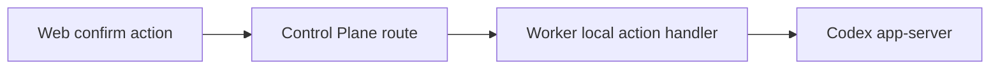

# Stage 13 Controlled Local Actions Design

Stage 13 adds explicit, user-confirmed local actions after Stage 12 read-only evidence. It must not become a raw remote shell, raw app-server proxy, plugin installer, or OAuth/config control panel.

## Goal

Let the Web workbench request a small set of local actions through Web -> Control Plane -> Worker -> Codex app-server while keeping Worker as the only local execution boundary.

First implementation slice:

- start app-server review mode for uncommitted changes only after explicit confirmation;
- return command-accepted state and refreshed safe conversation/workbench state, not raw diff or command output.

## Source Of Truth

- Public API fields start in `packages/api-contract/openapi.yaml`.
- Codex app-server method shapes come from generated `packages/codex-protocol`.
- Worker is the only app-server, filesystem, Git, shell, MCP, plugin, and auth caller.
- Web consumes only Control Plane-shaped public APIs.
- No DB changes in the first slice; action state is command-accepted plus existing conversation/timeline/local tools refresh.

## Scope

Supported in the first Stage 13 slice:

- `POST /v1/devices/{deviceId}/conversations/{conversationId}/local-actions/review-start`
- Worker verifies the conversation belongs to the allowed project before sending the app-server request.
- Worker always calls `review/start` with `target: { type: "uncommittedChanges" }` and inline/default delivery.
- Public input does not expose app-server `ReviewTarget`; base branch, commit, and custom instructions are not part of this slice.
- Request bodies include stale-context guards: `projectId`, `expectedConversationId`, `clientRequestId`, and `confirmationText`.
- Public responses use existing `CommandAccepted` shape or a narrow derivative from the OpenAPI contract.
- Web shows the action as accepted/failed and then refreshes the conversation timeline/local tools.

Explicit non-goals for this slice:

- `command/exec`, PTY, stdin/write/resize/terminate, raw terminal stream, raw command output, command history.
- `thread/shellCommand`; generated protocol says it preserves shell syntax and runs unsandboxed with full access, so it needs a later allowlisted action policy before Web exposure.
- filesystem write/create/remove/copy/watch.
- Git stage/unstage/revert hunk/file.
- skill config write, extra roots write, plugin install/uninstall/share, marketplace add/remove/upgrade.
- MCP tool call/resource read/OAuth login/reload.
- account login/logout/config writes/model runtime writes.
- exposing arbitrary review targets: `baseBranch`, `commit`, or `custom`.
- persisting raw command text, output, full diff, raw JSON-RPC, app-server URL, stack/cause, token, provider secret, private path, or prompt.

Deferred Stage 13 slices:

- allowlisted project actions such as package scripts after contract and UI allowlist are defined;
- shell-like actions only through allowlisted project actions; raw `thread/shellCommand` remains out of scope until a separate safety model exists;
- Git stage/unstage/revert only after a public file-change review model exists;
- skill enable/disable only after the protocol capability and safe public model are verified;
- OAuth/login-like flows only with local confirmation and no Control Plane secret persistence.

## Public Data Rules

- Request bodies include `projectId`, `expectedConversationId`, `clientRequestId`, and `confirmationText`.
- Worker rejects mismatched route conversation, expected conversation, selected project, or allowed project root before app-server calls.
- Worker validates matching confirmation text and allowed project root.
- Worker constructs the app-server review target itself: `{ type: "uncommittedChanges" }`.
- Public responses do not echo raw command text by default.
- Error envelopes are sanitized and must not include raw command text, app-server method names beyond public operation context, upstream URLs, stack/cause, local paths, or raw diff.

## Architecture

Control Plane routes the request to the selected configured device. Worker performs all local checks and app-server calls.

## UI

First slice UI:

- Review start action lives in the Git/Review section with an explicit confirmation control.
- Buttons stay disabled without a selected device, selected project, selected conversation, and required confirmation.
- Success state says the action was accepted and prompts refresh; it does not show output.
- Failure state shows sanitized error code/message only.

## Verification

Before closing Stage 13:

- focused contract, worker, control-plane, and web tests pass;
- source-boundary tests prove Web does not import `@codex-remote/codex-protocol`;
- leak tests cover raw command output, raw command echo in responses, local paths, full diff, raw JSON-RPC, token/secret, stack/cause, app-server URL;
- tests prove `thread/shellCommand`, `command/exec`, base-branch review, commit review, and custom review are not exposed in the first slice;
- `pnpm product:check`;
- `pnpm lint`;
- `pnpm typecheck`;
- `pnpm test`;
- `pnpm build`;
- real local stack starts and reports healthy;
- Chrome verifies disabled, confirmation, accepted, failed/degraded, and no-secret-leak states.
