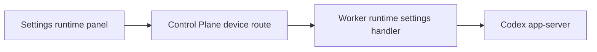

# Stage 14 Runtime And Settings Parity Design

Stage 14 adds read-only runtime and settings evidence to the Web workbench. It must not become an account console, config editor, model switcher, or raw app-server protocol browser.

## Goal

Expose a safe project-scoped runtime/settings summary through Web -> Control Plane -> Worker -> Codex app-server.

First implementation slice:

- model catalog summary from `model/list`;
- provider capability flags from `modelProvider/capabilities/read`;
- sanitized account/auth status from `account/read` and `getAuthStatus`;
- selected config posture from `config/read`;
- read-only permission profile and experimental feature summaries.

## Source Of Truth

- Public API fields start in `packages/api-contract/openapi.yaml`.
- Codex app-server method shapes come from generated `packages/codex-protocol`.
- Worker is the only app-server, config, account, auth, and local runtime caller.
- Web consumes only Control Plane-shaped public APIs.
- No DB changes in this slice.

## Scope

Supported in the first Stage 14 slice:

- `GET /v1/devices/{deviceId}/projects/{projectId}/runtime-settings`
- Worker reads app-server state with:
  - `model/list` with `includeHidden: false` and bounded limit;
  - `modelProvider/capabilities/read`;
  - `account/read` with `refreshToken: false`;
  - `getAuthStatus` with `includeToken: false` and `refreshToken: false`;
  - `config/read` with `includeLayers: false` and `cwd` derived from the selected public `projectId` after Worker validates it maps to the allowed project root;
  - `permissionProfile/list` with `cwd` derived from the selected public `projectId` after Worker validates it maps to the allowed project root and bounded limit;
  - `experimentalFeature/list` with bounded limit.
- Public response is one closed `RuntimeSettingsSummary` object with section statuses.
- Web shows the summary in Settings and keeps Stage 11 archive restore intact.

Explicit non-goals:

- model switching, profile switching, provider mutation, or config writes;
- account login/logout, token refresh, token display, rate limits, usage, credits, or add-credit email;
- `experimentalFeature/enablement/set`;
- `permissionProfile/list` as an enabled behavior selector;
- MCP OAuth/reload/tool calls;
- exposing config layers, raw config maps, instructions, developer instructions, compact prompts, tokens, provider secrets, auth tokens, raw app-server URLs, local paths, stack/cause, raw JSON-RPC, raw prompts, or command output.

Deferred slices:

- model/profile selection only after a public write policy exists;
- account login/logout only with local confirmation and no Control Plane secret persistence;
- config editing only after field-level allowlist and rollback semantics;
- richer skills/plugins/MCP management after Stage 14 read-only state is stable.

## Public Data Rules

- Account public shape exposes only `type`, `planType`, `emailDomain`, and `requiresOpenaiAuth`; full email is never exposed.
- `getAuthStatus.authToken` is never requested and never exposed.
- Config public shape is an allowlist: `model`, `reviewModel`, `modelProvider`, `approvalPolicy`, `approvalsReviewer`, `sandboxMode`, `reasoningEffort`, `serviceTier`, `webSearch`, and booleans for omitted sensitive instruction fields.
- Model public shape exposes id, display name, default flag, supported reasoning efforts, input modalities, and service tiers; hidden models are not requested.
- Permission profiles expose id/description only as read-only labels.
- Experimental features expose name/stage/display name/description/enabled/defaultEnabled only; no enable action.
- Each section may degrade independently with sanitized `ErrorEnvelope`; one failed section does not force the whole page to fallback.

## Architecture

Control Plane routes to the selected configured device and project. Worker owns project validation, app-server calls, and projections.

## UI

- Settings keeps the archived conversations section.
- A Runtime section appears above archive restore.
- Empty/degraded states are text-only and compact.
- Unsupported writes are absent, not disabled buttons.

## Verification

Before closing Stage 14:

- focused contract, Worker, Control Plane, and Web tests pass;
- source-boundary tests prove Web and Control Plane do not import `@codex-remote/codex-protocol`;
- fake Worker smoke server and serialized response-body leak scans cover auth token, full email, provider secret, raw config, prompt fields, config layers, local path, raw JSON-RPC, app-server URL, stack/cause, command output, and full diff;
- tests prove login/logout, token refresh, config writes, model switching, experimental enablement, and permission profile mutation are not exposed;
- `pnpm product:check`;
- `pnpm lint`;
- `pnpm typecheck`;
- `pnpm test`;
- `pnpm build`;
- real local stack checks and Web smoke pass;
- Chrome verifies loaded, degraded, empty, and no-secret-leak states.
