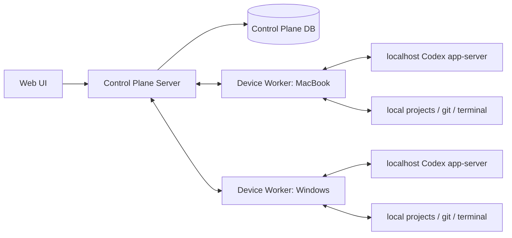

# 多设备 Codex 控制台 技术规格 v0.2

## 1. 定位

本项目是一个自托管多设备 Codex Web 控制台。

它不依赖同一 OpenAI / ChatGPT 账号，不要求所有设备使用同一 Codex 登录状态，也不要求所有设备使用同一种 API 配置。每台设备上的 Codex 运行时保留自己的 auth、API key、model provider、sandbox 和本地项目配置。

Control Plane 只负责设备接入、状态聚合、任务看板、路由和审计；它不保存 OpenAI / ChatGPT / provider secrets。

## 2. 第一版目标

第一版验证一个核心价值：

> 用户能否在一个 Web 页面中切换多台设备上的 Codex，并把不同设备、不同账号或不同 API 配置下的 Codex 对话手动关联到任务看板。

## 3. 架构



## 4. 安全边界

### 4.1 Secrets

- Control Plane 不保存 OpenAI API key。
- Control Plane 不保存 ChatGPT session 或 Codex auth file。
- Worker 读取本机已有 Codex 配置，但不上传 secrets。
- 日志中禁止记录 bearer token、API key、完整 auth file 内容。

### 4.2 网络暴露

- Codex app-server 默认只绑定 `127.0.0.1` 或本机 Unix socket。
- Worker 是唯一可被 Control Plane 调用的桥接层。
- Worker 到 Control Plane 的连接必须有 device token。
- 公网部署时优先通过反向连接或 relay，避免要求用户开放设备入站端口。

### 4.3 权限

- Worker 只能访问 project allowlist 中的目录。
- 高风险操作必须进入 audit log。
- MVP 可以先不做多人权限，但数据结构预留 actor 字段。

## 5. Turborepo 项目结构

第一版采用 pnpm + Turborepo。当前 Turborepo 使用 `tasks` 配置，不使用旧版 `pipeline`。

```text
apps/
  web/                # 第一版 Web 控制台
  control-plane/      # Control Plane HTTP/WebSocket API
  worker/             # 每台设备安装的 Worker

packages/
  shared/             # 通用类型、常量、工具函数
  codex-protocol/     # Codex app-server 生成 schema 与适配层
  db/                 # 数据库 schema、migration、repository
  api-contract/       # Control Plane <-> Web / Worker 契约
  ui/                 # Web 复用 UI 组件，未来可拆

docs/
  specs/
  plans/
  references/
  archives/
```

后续 iOS App 不直接复用 Web UI 代码，而复用协议和 API 契约：

```text
apps/ios/             # 后续 Swift / SwiftUI iOS client
packages/api-contract # iOS 根据 OpenAPI / JSON Schema 生成客户端类型
packages/shared       # 仅保留可跨语言映射的 schema，不强行共享 TS runtime
```

## 6. 推荐根配置草案

`pnpm-workspace.yaml`：

```yaml
packages:
  - "apps/*"
  - "packages/*"
```

`turbo.json`：

```json
{
  "tasks": {
    "build": {
      "dependsOn": ["^build"],
      "outputs": ["dist/**", ".next/**", "!.next/cache/**"]
    },
    "typecheck": {
      "dependsOn": ["^build"],
      "outputs": []
    },
    "test": {
      "dependsOn": ["^build"],
      "outputs": ["coverage/**"]
    },
    "lint": {
      "dependsOn": ["^lint"],
      "outputs": []
    },
    "dev": {
      "cache": false,
      "persistent": true
    }
  }
}
```

如果 package 需要 watch build，可在 package 自己的 `turbo.json` 中覆盖 `dev`。

## 7. 核心数据模型

### Device

```ts
type Device = {
  id: string
  name: string
  os: "macos" | "windows" | "linux"
  status: "online" | "offline"
  workerVersion: string
  lastSeenAt: string
  createdAt: string
  updatedAt: string
}
```

### RemoteProject

```ts
type RemoteProject = {
  id: string
  deviceId: string
  name: string
  path: string
  gitBranch?: string
  gitWorktree?: string
  hasChanges?: boolean
  lastOpenedAt?: string
}
```

### CodexConversation

```ts
type CodexConversation = {
  id: string
  deviceId: string
  projectId: string
  codexThreadId: string
  title: string
  status: "idle" | "running" | "waiting_approval" | "stopped" | "failed" | "done"
  model?: string
  sandboxMode?: string
  approvalMode?: string
  lastMessageSummary?: string
  updatedAt: string
}
```

### BoardProject

```ts
type BoardProject = {
  id: string
  title: string
  description?: string
  createdAt: string
  updatedAt: string
}
```

### BoardTask

```ts
type BoardTask = {
  id: string
  boardProjectId: string
  title: string
  description?: string
  status: "todo" | "in_progress" | "waiting" | "done" | "failed" | "archived"
  createdAt: string
  updatedAt: string
}
```

### ConversationLink

```ts
type ConversationLink = {
  id: string
  taskId: string
  conversationId: string
  deviceId: string
  projectId: string
  note?: string
  createdAt: string
}
```

### AuditLog

```ts
type AuditLog = {
  id: string
  actorId?: string
  deviceId?: string
  action: string
  targetType: "device" | "project" | "conversation" | "task" | "worker"
  targetId?: string
  summary: string
  createdAt: string
}
```

## 8. Worker 能力

### P0 Worker API

- `worker.health`
- `worker.register`
- `worker.heartbeat`
- `worker.projects.list`
- `worker.conversations.list`
- `worker.conversation.read`
- `worker.conversation.start`
- `worker.conversation.followUp`
- `worker.conversation.interrupt`
- `worker.events.subscribe`

### app-server 方法映射

| 产品能力 | app-server 方法 |
| --- | --- |
| 初始化连接 | `initialize`, `initialized` |
| 列出历史对话 | `thread/list` |
| 读取对话 | `thread/read`, `thread/turns/list` |
| 新建对话 | `thread/start`, `turn/start` |
| 继续对话 | `thread/resume`, `turn/start` |
| 运行中补充输入 | `turn/steer` |
| 中止 | `turn/interrupt` |
| 模型列表 | `model/list` |
| 输出流 | `item/*`, `turn/*`, `thread/status/changed` notifications |
| approval | server-initiated approval request |

## 9. 第一阶段协议探针

第一段可执行代码应是 Worker probe，而不是完整 UI。

探针必须验证：

1. 当前设备能启动或连接 `codex app-server`。
2. 能完成 `initialize`。
3. 能列出模型。
4. 能列出历史 thread。
5. 能读取指定 thread。
6. 能新建 thread 并启动 turn。
7. 能接收 streaming notifications。
8. 能发送 follow-up。
9. 能 interrupt。
10. 能在失败时输出可诊断错误。

## 10. MVP 验收

MVP 完成条件：

- 至少两台设备可以注册并展示 online/offline。
- 每台设备可以展示项目列表。
- 每个项目可以展示 Codex conversations。
- Web UI 可以打开任一 conversation。
- Web UI 可以查看 agent 输出流。
- Web UI 可以发送 follow-up。
- Web UI 可以中止运行中的 turn。
- 用户可以创建 Board Project 和 Board Task。
- 用户可以把两台设备上的 conversations 关联到同一个 task。
- Task 详情能展示所有 linked conversations 的设备、项目、状态、更新时间。

## 11. 主要风险

1. app-server schema 和行为随 Codex 版本变化。
2. Windows / macOS 的 app-server 连接方式和本地路径差异。
3. 历史 thread list 不能覆盖所有来源。
4. approval server request UI 处理不完整会导致任务卡死。
5. Worker 安装为系统服务后，环境变量和 Codex auth 路径可能与用户 shell 不一致。

## 12. 延后范围

- iOS App。
- 多 agent 编排。
- 自动迁移任务。
- 自动选择设备。
- OpenCode / MiniMax / Claude Code provider 抽象。
- provider proxy。
- 完整远程桌面。
- 多用户 RBAC。
