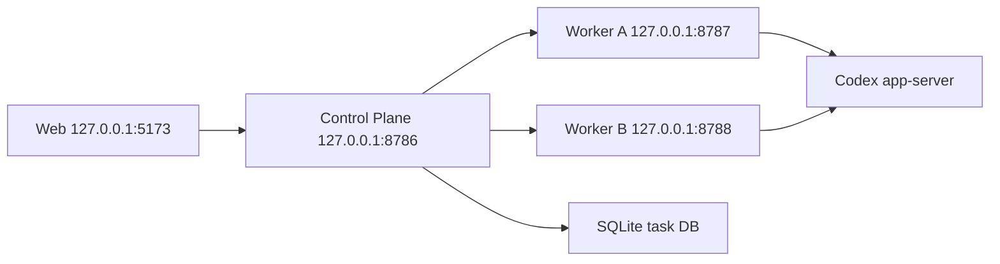

# Local Self-Hosting Runbook

This runbook describes the local development posture for Codex Remote. It is not an installer, production deployment guide, or secret-storage policy.

## Topology



## Secret Rules

- Keep real tokens in the shell environment or an operator-chosen local secret manager.
- Do not commit tokens, provider keys, Codex auth, ChatGPT auth, service arguments with secrets, raw upstream URLs with credentials, raw protocol frames, prompts, command output, full diffs, stack traces, or private paths.
- Use only placeholders in repo docs and examples: `REDACTED` or `example-token`.
- Current bearer tokens are a local development posture, not device-bound auth.

## Worker

Required environment:

```bash
export CODEX_REMOTE_WORKER_TOKEN=example-token
export CODEX_REMOTE_ALLOWED_ORIGINS=http://127.0.0.1:8786
export CODEX_REMOTE_ALLOWED_PROJECT_ROOT=.
export CODEX_REMOTE_DEVICE_ID=local-device
export CODEX_REMOTE_HTTP_PORT=8787
export CODEX_REMOTE_APP_SERVER_TRANSPORT=stdio
```

Start:

```bash
pnpm --filter @codex-remote/worker serve:read
```

Notes:

- Worker must bind loopback.
- Worker is the only app that talks to Codex app-server.
- `CODEX_REMOTE_APP_SERVER_TRANSPORT=stdio` is the default Worker-owned app-server transport.
- With `stdio`, the Worker starts `codex app-server` as its own child process and speaks JSON-RPC over stdio.
- `CODEX_REMOTE_APP_SERVER_TRANSPORT=debug-websocket` is an explicit loopback WebSocket debug fallback only; it is a Stage 9 readiness gap, not real stdio readiness evidence.

## Control Plane

Required environment:

```bash
export CODEX_REMOTE_CONTROL_PLANE_CONFIG='{"publicToken":"example-token","taskDatabasePath":"./logs/codex-remote-tasks.sqlite","devices":[{"id":"local-device","name":"Local Device","baseUrl":"http://127.0.0.1:8787","token":"example-token"}]}'
```

Start:

```bash
pnpm --filter @codex-remote/control-plane serve
```

Notes:

- Control Plane must bind loopback.
- Worker upstream URLs and bearer tokens stay in process memory.
- Control Plane persists only task board data in SQLite at this stage.

## Web

Web must use the public Next.js environment variable names. Non-`NEXT_PUBLIC_` Control Plane variables are not available to client-side Web code.

Start:

```bash
NEXT_PUBLIC_CODEX_REMOTE_CONTROL_PLANE_BASE_URL=http://127.0.0.1:8786 \
NEXT_PUBLIC_CODEX_REMOTE_CONTROL_PLANE_TOKEN=example-token \
pnpm web:start
```

Status and stop:

```bash
pnpm web:status
pnpm web:stop
```

Open the Web workbench at `http://127.0.0.1:5173`.

## Local Stack Lifecycle

Start, inspect, and stop the repeatable local stack:

```bash
pnpm real:start
pnpm real:check
pnpm real:status
pnpm real:stop
```

Defaults:

- Worker: `http://127.0.0.1:8787`
- Control Plane: `http://127.0.0.1:8786`
- Web: `http://127.0.0.1:5173`
- Local token placeholder: `example-token`
- App-server transport: `stdio`

With the default transport, `pnpm real:start` starts Worker, Control Plane, and Web. The Worker owns the local Codex app-server process over stdio; app-server output is not persisted by the lifecycle scripts.

Current default evidence:

- `pnpm real:start`: starts the default stdio real local stack.
- `pnpm real:check`: writes ignored `logs/real-check/latest.json`; current summary is `total=19 realPass=8 fixedPass=0 realGap=11`.
- `pnpm real:status`: Worker, Control Plane, and Web should be running after startup.
- `pnpm web:e2e:smoke`: passes against the real stack and must not skip or fake-pass as readiness.
- Remaining Stage 9 gaps include readable post-start conversation closure for timeline/follow-up/control/approval, task-link invalid-id rejection, Q23 cwd/pagination probes, and Q24 degradation fixtures.

For local debugging only, run the current loopback WebSocket fallback explicitly:

```bash
CODEX_REMOTE_APP_SERVER_TRANSPORT=debug-websocket pnpm real:start
```

That fallback sets `CODEX_REMOTE_START_APP_SERVER=true` for the Worker and must be treated as debug evidence only, not product readiness. `pnpm real:check` and readiness claims accept only `stdio` proof.

Status honors these port overrides:

```bash
CODEX_REMOTE_WEB_PORT=5173 \
CODEX_REMOTE_CONTROL_PLANE_PORT=8786 \
CODEX_REMOTE_WORKER_PORT=8787 \
pnpm real:status
```

## Validation

Run the product readiness check before using the local stack:

```bash
pnpm product:check
```

Run the real calibration check only after the real stack is intentionally started:

```bash
pnpm real:check
```

The report is local and ignored under `logs/real-check/`. It may record `real-pass`, `fixed-pass`, and `real-gap`, but tracked docs should only cite sanitized counts, opaque refs, and statuses.

Run the repository gate before committing:

```bash
pnpm lint
pnpm typecheck
pnpm test
pnpm build
```

## Troubleshooting

- Worker unavailable: device status should degrade without exposing Worker token or upstream URL.
- Invalid Control Plane config: startup should fail with a sanitized config error.
- Empty task DB: Web task board should show an empty state, not mock persisted tasks.
- Control Plane unavailable: Web should show a sanitized unavailable or fallback state without raw URLs, tokens, paths, protocol frames, prompts, command output, full diffs, or stack traces.

## Later Work

These are not part of the current local readiness slice:

- OS installer, LaunchAgent, systemd user service, Windows Scheduled Task, auto-update, or notarization.
- OS keychain, pairing, token rotation, revocation, device-bound auth, or audit log.
- Reverse WSS, relay server, public tunnel, cloud deployment, production TLS, or multi-tenant hosting.
- Full iOS app, mobile sync, or native build pipeline.
