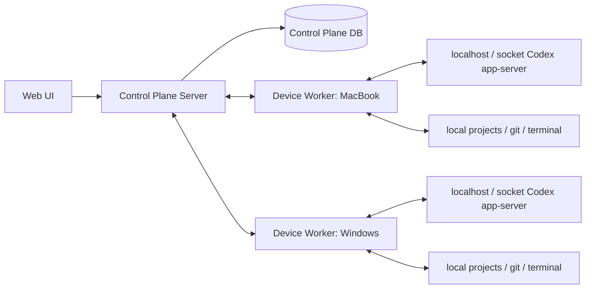

# 多设备 Codex 控制台 技术规格

## 1. 定位

本项目是一个自托管多设备 Codex Web 控制台。

它不依赖同一 OpenAI / ChatGPT 账号，不要求所有设备使用同一 Codex 登录状态，也不要求所有设备使用同一种 API 配置。每台设备上的 Codex 运行时保留自己的 auth、API key、model provider、sandbox 和本地项目配置。

Control Plane 只负责设备接入、状态聚合、任务看板、路由和审计；Control Plane 不保存 OpenAI / ChatGPT / provider secrets。

## 2. 第一版目标

第一版验证：

> 用户能否在一个 Web 页面中切换多台设备上的 Codex，并把不同设备、不同账号或不同 API 配置下的 Codex 对话手动关联到任务看板。

第一版不是：

- Codex Desktop clone。
- 官方 remote control 的同账号替代登录。
- provider proxy。
- 多 agent orchestration。

## 3. 架构



## 4. 事实源

### 4.1 Codex app-server 协议

`packages/codex-protocol` 是 Codex app-server 协议事实源：

- 从 `codex app-server generate-ts` / `generate-json-schema` 生成。
- 记录生成时的 Codex version。
- Worker 内部可以使用 app-server generated types。
- Control Plane / Web 不直接依赖 app-server 全量类型。

### 4.2 Control Plane API

`packages/api-contract` 是 Web、Worker、未来 iOS 的契约事实源：

- Device / Project / Conversation / Task / Pairing / Heartbeat 类型从这里导出。
- 未来 Swift client 从 OpenAPI / JSON Schema 生成。
- 禁止 UI、Worker、tests 手写平行字段结构。

### 4.3 DB Schema

`packages/db` 是持久化字段事实源：

- 不包含 OpenAI API key、ChatGPT auth、Codex auth file、provider secret。
- 存储设备状态、任务看板、conversation link、审计日志。

## 5. 安全边界

### 5.1 Secrets

- Control Plane 不保存 OpenAI API key。
- Control Plane 不保存 ChatGPT session 或 Codex auth file。
- Worker 读取本机已有 Codex 配置，但不上传 secrets。
- 日志、测试 fixture、截图、文档示例只使用 `REDACTED` 或 `example-token`。

### 5.2 网络暴露

- Codex app-server 默认只绑定 `127.0.0.1` 或本机 Unix socket。
- Worker 是唯一可被 Control Plane 调用的桥接层。
- Worker 到 Control Plane 的连接必须有 device token。
- 公网部署优先通过 Worker 反向连接或 future relay，避免要求用户开放设备入站端口。

### 5.3 权限

- Worker 只能访问 project allowlist 中的目录。
- 高风险操作必须进入 audit log。
- MVP 可以先不做多人权限，但数据结构预留 actor 字段。

## 6. Turborepo 项目结构

```text
apps/
  web/
  control-plane/
  worker/

packages/
  shared/
  codex-protocol/
  db/
  api-contract/
  ui/

docs/
  specs/
  plans/
  references/
  archives/
```

依赖方向：

```text
apps/web -> packages/api-contract, packages/ui, packages/shared
apps/control-plane -> packages/api-contract, packages/db, packages/shared
apps/worker -> packages/api-contract, packages/codex-protocol, packages/shared
packages/ui -> packages/api-contract, packages/shared
packages/api-contract -> packages/shared
packages/db -> packages/shared
```

禁止方向：

- `apps/web` 不依赖 `packages/codex-protocol`。
- `apps/control-plane` 不依赖 `packages/codex-protocol`。
- `packages/codex-protocol` 不依赖 Web / Control Plane / DB / UI。

## 7. 推荐根配置草案

`pnpm-workspace.yaml`：

```yaml
packages:
  - "apps/*"
  - "packages/*"
```

`turbo.json`：

```json
{
  "tasks": {
    "build": {
      "dependsOn": ["^build"],
      "outputs": ["dist/**", ".next/**", "!.next/cache/**"]
    },
    "typecheck": {
      "dependsOn": ["^build"],
      "outputs": []
    },
    "test": {
      "dependsOn": ["^build"],
      "outputs": ["coverage/**"]
    },
    "lint": {
      "dependsOn": ["^lint"],
      "outputs": []
    },
    "dev": {
      "cache": false,
      "persistent": true
    }
  }
}
```

## 8. 核心数据模型

### Device

```ts
type Device = {
  id: string
  serverId?: string
  name: string
  os: "macos" | "windows" | "linux"
  status: "online" | "offline" | "degraded"
  connectionPath: "direct" | "relay"
  workerVersion: string
  codexVersion?: string
  lastSeenAt: string
  createdAt: string
  updatedAt: string
}
```

### RemoteProject

```ts
type RemoteProject = {
  id: string
  deviceId: string
  name: string
  path: string
  allowed: boolean
  gitBranch?: string
  gitWorktree?: string
  hasChanges?: boolean
  lastOpenedAt?: string
}
```

### CodexConversation

```ts
type CodexConversation = {
  id: string
  deviceId: string
  projectId: string
  codexThreadId: string
  title: string
  status: "idle" | "running" | "waiting_approval" | "stopped" | "failed" | "done"
  model?: string
  modelProvider?: string
  sandboxMode?: string
  approvalMode?: string
  lastMessageSummary?: string
  updatedAt: string
}
```

### BoardProject

```ts
type BoardProject = {
  id: string
  title: string
  description?: string
  createdAt: string
  updatedAt: string
}
```

### BoardTask

```ts
type BoardTask = {
  id: string
  boardProjectId: string
  title: string
  description?: string
  status: "todo" | "in_progress" | "waiting" | "done" | "failed" | "archived"
  createdAt: string
  updatedAt: string
}
```

### ConversationLink

```ts
type ConversationLink = {
  id: string
  taskId: string
  conversationId: string
  deviceId: string
  projectId: string
  note?: string
  createdAt: string
}
```

### PairingOffer

```ts
type PairingOffer = {
  id: string
  serverUrl: string
  pairingToken: string
  installCommand: string
  installChannel: "pnpm-dlx" | "npm-dlx" | "curl-sh" | "powershell"
  suggestedDeviceName?: string
  expiresAt: string
  claimedAt?: string
  trustedDeviceSupported: boolean
}
```

### WorkerLocalConfig

```ts
type WorkerLocalConfig = {
  serverUrl: string
  deviceId: string
  deviceName: string
  projectAllowlist: string[]
  appServer: {
    transport: "websocket" | "unix-socket"
    url: string
  }
}
```

`deviceToken` 不进入普通 JSON 配置。优先存入 macOS Keychain、Windows Credential Manager、Linux Secret Service；MVP fallback 为权限 `0600` 的本机文件。

### ClientHeartbeat

```ts
type ClientHeartbeat = {
  clientType: "web" | "ios"
  focusedTaskId?: string
  focusedConversationId?: string
  appVisible: boolean
  lastActivityAt: string
}
```

### AuditLog

```ts
type AuditLog = {
  id: string
  actorId?: string
  deviceId?: string
  action: string
  targetType: "device" | "project" | "conversation" | "task" | "worker"
  targetId?: string
  summary: string
  createdAt: string
}
```

## 9. Worker 接入体验

第一版接入体验应是：

```text
Web: Add Device
  -> Control Plane 生成 PairingOffer
  -> Web 显示一条目标机器可执行命令
Device: 执行 worker setup 命令
  -> Worker 生成本机 deviceId
  -> Worker 用 pairingToken 注册
  -> Control Plane 返回长期 deviceToken
  -> Worker 保存本机配置和 deviceToken
  -> Worker 探测本机 Codex
  -> Worker 建立到 Control Plane 的长连接
  -> Web 显示设备 online / needs setup
```

推荐命令形态：

```bash
pnpm dlx @codex-remote/worker setup \
  --server http://192.168.1.10:8787 \
  --pair crp_example \
  --name macbook-pro
```

Windows 可由 Web 生成 PowerShell 命令，后续产品化再提供安装包。MVP 不要求安装为系统服务。

接入约束：

- pairing token 只能使用一次，且必须有短过期时间。
- 注册成功后 pairing token 立即失效，Worker 后续只使用 device token。
- Worker 主动出站连接 Control Plane；设备不需要开放入站端口。
- Worker 只连接本机 `localhost` / socket Codex app-server。
- 初次注册不强迫用户在命令行配置所有项目路径。
- 设备上线后进入 `needs setup`，由 Web 引导确认 project allowlist。
- Control Plane 只保存 device registry、状态、allowlist 元数据和审计，不保存 Codex secrets。

Control Plane 需要提供的接入 API：

- `pairing.offer.create`
- `pairing.offer.claim`
- `worker.register`
- `worker.heartbeat`
- `worker.events.connect`

Worker CLI MVP：

- `codex-remote-worker setup --server <url> --pair <token> [--name <name>]`
- `codex-remote-worker start`
- `codex-remote-worker status`
- `codex-remote-worker logs`

`install-service`、自动更新、macOS `.pkg`、Windows installer、Linux systemd installer 放到产品化阶段。

## 10. Worker 能力

### P0 Worker API

- `worker.health`
- `worker.register`
- `worker.heartbeat`
- `worker.projects.list`
- `worker.conversations.list`
- `worker.conversation.read`
- `worker.conversation.start`
- `worker.conversation.followUp`
- `worker.conversation.interrupt`
- `worker.approval.respond`
- `worker.events.subscribe`

### app-server 方法映射

| 产品能力 | app-server 方法 |
| --- | --- |
| 初始化连接 | `initialize`, `initialized` |
| 列出历史对话 | `thread/list` |
| 读取对话 | `thread/read` |
| 新建对话 | `thread/start`, `turn/start` |
| 继续对话 | `thread/resume`, `turn/start` |
| 运行中补充输入 | `turn/steer` |
| 中止 | `turn/interrupt` |
| 模型列表 | `model/list` |
| 输出流 | `item/*`, `turn/*`, `thread/*` notifications |
| approval | server-initiated approval request |

## 11. 第一阶段 Worker Probe

第一段可执行代码应是 Worker probe，而不是完整 UI。

探针必须验证：

1. 当前设备能启动或连接 `codex app-server`。
2. 能完成 `initialize` / `initialized`。
3. 能列出模型。
4. 能列出历史 thread，含 `cwd` filter。
5. 能读取指定 thread，含 `includeTurns=true`。
6. 能 resume 既有 thread。
7. 能新建 thread 并启动 turn。
8. 能接收 streaming notifications。
9. 能发送 `turn/steer`。
10. 能 `turn/interrupt`。
11. 能捕获 server request / approval request。
12. 能在失败时输出可诊断 JSON summary。

## 12. Web MVP

第一版 UI 是工作台，不是 landing。

页面和能力：

- 设备视图。
- Add Device / pairing command。
- 设备详情。
- 项目 / 对话列表。
- 对话输出流。
- pending approval 提示。
- 输入 follow-up。
- 中止按钮。
- 任务看板。
- Task 详情和关联 conversations。

验收：

- 至少两台设备可以注册并展示 online/offline。
- 用户可以在 Web 生成 pairing command，并在目标机器完成 Worker setup。
- 新设备首次上线后显示 `needs setup`，直到用户确认 project allowlist。
- 每台设备可以展示项目列表。
- 每个项目可以展示 Codex conversations。
- Web UI 可以打开任一 conversation。
- Web UI 可以查看 agent 输出流。
- Web UI 可以发送 follow-up。
- Web UI 可以中止运行中的 turn。
- 用户可以创建 Board Project 和 Board Task。
- 用户可以把两台设备上的 conversations 关联到同一个 task。
- Task 详情能展示所有 linked conversations 的设备、项目、状态、更新时间。

## 13. iOS 扩展预留

第一版不做 iOS App，但 API 设计要预留：

- iOS 只连接 Control Plane 或 future relay，不直接连接 Worker 或 Codex app-server。
- iOS 不持有 OpenAI / Codex secrets。
- iOS 类型从 OpenAPI / JSON Schema 生成。
- 预留 QR / one-time token / trusted device flow。
- 预留 `ClientHeartbeat`。

## 14. 证据来源

- 参考项目架构调研报告：`docs/references/research/参考项目架构调研报告 v0.2.md`
- 参考项目技术调研：`docs/references/research/参考项目技术调研 v0.1.md`
- Codex app-server 协议参考：`docs/references/codex-app-server.md`
- OpenAI Codex App 页面快照：`docs/references/openai-codex-app-pages/README.md`

## 15. 主要风险

1. app-server schema 和行为随 Codex 版本变化。
2. Windows / macOS 的 app-server 连接方式和本地路径差异。
3. 历史 thread list 不能覆盖所有来源。
4. approval server request UI 处理不完整会导致任务卡死。
5. Worker 安装为系统服务后，环境变量和 Codex auth 路径可能与用户 shell 不一致。
6. 过早引入 provider proxy / 多 agent 会稀释 MVP。
7. curl pipe shell 接入虽然方便，但需要清晰显示安装来源、server URL 和 token 过期时间，避免用户误连未知服务器。

## 16. 延后范围

- iOS App。
- 多 agent 编排。
- 自动迁移任务。
- 自动选择设备。
- OpenCode / MiniMax / Claude Code provider 抽象。
- provider proxy。
- 完整远程桌面。
- Worker 自动更新与正式安装包。
- 多用户 RBAC。
- 公共 relay。
