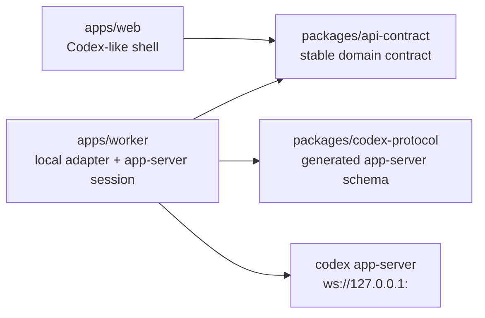
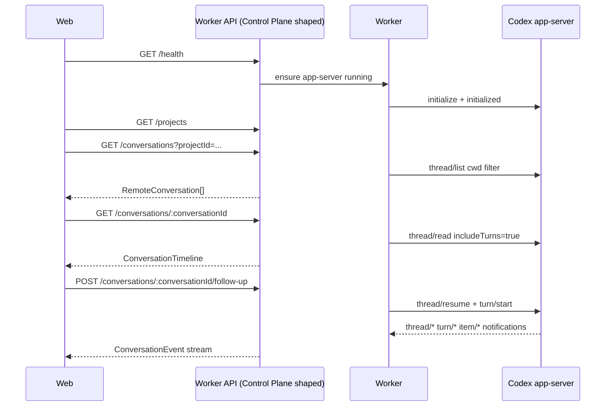

# Codex App Main Chain Design

## Goal

Build the first real Codex app-server operation spine for Codex Remote.

The first implementation should let the Web UI operate one local Codex runtime through a Worker, while preserving the final architecture shape where Web talks to a stable Control Plane-style API instead of the raw app-server protocol.

The product goal is that Codex Remote operations feel close to Codex App operations and affect the same Codex thread history where the app-server supports it.

## Confirmed Decisions

- First slice: Worker probe and connection layer.
- app-server transport: `ws://127.0.0.1:<port>`.
- Worker may start app-server with `codex app-server --listen ws://127.0.0.1:<port>`.
- Scope: single-device end-to-end first, with multi-device fields and event envelopes reserved.
- Runtime shape: Web uses a Control Plane-shaped contract; implementation may initially route to a local Worker adapter instead of a full Control Plane server.
- Approach: contract-driven, with Worker probe validating the real app-server behavior before broad UI work.

## Architecture Boundary



Rules:

- `apps/web` depends on `packages/api-contract`, not app-server generated types.
- `apps/worker` is the only package that starts, connects to, and manages Codex app-server.
- `packages/codex-protocol` is generated from `codex app-server generate-ts` and `generate-json-schema`, and records the Codex version used for generation.
- `packages/api-contract` defines Codex Remote's stable domain model for Web, future Control Plane, and future iOS.
- First implementation can defer full `apps/control-plane`, but API names and payloads should fit the final Control Plane direction.
- app-server remains loopback-only; no LAN or public app-server exposure.

## Module Responsibilities

### `packages/codex-protocol`

Stores the generated app-server protocol artifacts and generation metadata.

Responsibilities:

- Run or document generation from `codex app-server generate-ts` and `codex app-server generate-json-schema`.
- Record `codex --version` or equivalent version metadata.
- Export app-server request, response, and notification types for Worker internals.
- Avoid exposing app-server raw protocol types to Web or Control Plane contracts.

### `packages/api-contract`

Defines Codex Remote's stable contract.

Initial domain types:

- `RemoteDevice`
- `RemoteProject`
- `RemoteConversation`
- `ConversationTimeline`
- `ConversationEvent`
- `WorkerHealth`
- `ApprovalRequest`
- `StartConversationInput`
- `FollowUpInput`
- `InterruptTurnInput`

Every event includes `deviceId`. Conversation events include `projectId`, `conversationId`, and `turnId` when available.

### `apps/worker`

Owns local app-server lifecycle and projection into the Codex Remote contract.

Suggested services:

- `AppServerProcessService`: choose a loopback port, start/stop app-server, probe `/readyz`.
- `AppServerRpcClient`: WebSocket JSON-RPC, initialize handshake, pending request map, timeouts, notification dispatch, retry classification.
- `CodexThreadService`: `model/list`, `thread/list`, `thread/read`, `thread/start`, `thread/resume`, `turn/start`, `turn/interrupt`.
- `CodexEventProjector`: convert `thread/*`, `turn/*`, `item/*`, and server-initiated approval requests into `ConversationEvent`.
- `WorkerHttpServer`: expose local HTTP/SSE endpoints using Control Plane-shaped API payloads.

Worker must not persist or upload OpenAI, ChatGPT, provider, or Codex auth secrets.

### `apps/web`

Remains a Codex-like shell and consumes the stable contract.

First changes should:

- Introduce a data source boundary with fixture and Worker-backed implementations.
- Render conversation list/detail from `api-contract` view models.
- Feed live events into a timeline reducer.
- Route composer actions through `startConversation`, `followUp`, and `interruptTurn`.
- Keep app-server method names out of React components.

## Data Flow



Cold-start history comes from `thread/list` and `thread/read(includeTurns=true)`. Live state comes from app-server notifications and should not be overwritten by older snapshots.

## First Implementation Slice

### Phase 1: Protocol and Worker Probe

Deliver:

- `packages/codex-protocol` with generated protocol artifacts and version metadata.
- `apps/worker` skeleton.
- app-server startup on `ws://127.0.0.1:<port>`.
- `/readyz` probe.
- WebSocket JSON-RPC client.
- `initialize` and `initialized`.
- `model/list`.
- `thread/list`.
- `thread/read(includeTurns=true)`.
- Diagnostic JSON summary.

Completion evidence:

- A local probe command can start or connect to app-server and report each step as pass/fail.
- Failures include operation name, retryability, and sanitized details.

### Phase 2: API Contract and Read-Only Web Data

Deliver:

- `packages/api-contract` stable domain types.
- Worker local API:
  - `GET /health`
  - `GET /projects`
  - `GET /conversations?projectId=...`
  - `GET /conversations/:conversationId`
- Web data source abstraction:
  - fixture source
  - Worker source
- Web can display real app-server conversation list and conversation detail.

Completion evidence:

- Existing fixture UI remains available.
- Worker source renders real app-server data through the same view model boundary.

### Phase 3: Send, Stream, Interrupt

Deliver:

- Worker operations:
  - start conversation: `thread/start` then `turn/start`
  - follow-up: `thread/resume` then `turn/start`
  - interrupt: `turn/interrupt`
  - event subscription
- Web operations:
  - composer for new conversation
  - composer for existing conversation follow-up
  - running, waiting approval, failed, interrupted states
  - live timeline reducer
  - interrupt button for active turns

Completion evidence:

- Web can create a new thread and send a prompt.
- Web can resume an existing thread and send a follow-up.
- Web receives real-time item and turn updates.
- Web can interrupt an active turn.

### Phase 4: Codex App Parity Shell

Deliver a limited shell for Codex-like operations without implementing every backend action:

- archive/unarchive route and disabled/ready UI states as appropriate.
- rename route and disabled/ready UI states as appropriate.
- model/mode/sandbox/approval display.
- approval request UI.
- tool detail, command output, file change detail.
- diff/review entry point with clear unavailable or read-only state when not implemented.

Completion evidence:

- UI actions map to explicit capabilities, disabled states, or diagnostic unavailable states.
- No action silently closes or pretends to succeed.

## Status Model

The stable contract should not expose raw app-server status directly.

```ts
export type ConversationStatus =
  | "not_loaded"
  | "idle"
  | "running"
  | "waiting_approval"
  | "waiting_input"
  | "interrupted"
  | "failed"
  | "done"
  | "unknown";

export type TurnStatus =
  | "in_progress"
  | "completed"
  | "interrupted"
  | "failed";

export type TimelineItemStatus =
  | "pending"
  | "in_progress"
  | "completed"
  | "failed"
  | "declined"
  | "unknown";

export type ApprovalRequestStatus =
  | "pending"
  | "accepted"
  | "declined"
  | "cancelled"
  | "resolved"
  | "expired";
```

Projection rules:

- `thread/status/changed` is the primary live source for conversation status.
- `turn/started` to `turn/completed` implies active conversation state.
- Approval requests move the conversation to `waiting_approval` until `serverRequest/resolved` or a terminal turn event.
- `item/completed` is the authoritative final item state.
- Delta events append content only; they do not define terminal status.
- Unknown status must remain `unknown`, never silently become `done`.

## Event Contract

Initial event names:

- `conversation.status.changed`
- `turn.started`
- `turn.completed`
- `item.started`
- `item.delta`
- `item.completed`
- `approval.requested`
- `serverRequest.resolved`
- `connection.status.changed`
- `diagnostic.error`

Events should be idempotent where possible. Each event should include a stable `eventId`, `deviceId`, timestamp, and the narrowest available target identifiers.

## Error Model

Worker errors should be classified before reaching Web.

```ts
export type WorkerErrorKind =
  | "codex_not_found"
  | "app_server_start_failed"
  | "app_server_not_ready"
  | "app_server_connection_failed"
  | "app_server_not_initialized"
  | "app_server_request_timeout"
  | "app_server_overloaded"
  | "app_server_protocol_error"
  | "codex_auth_error"
  | "model_provider_error"
  | "approval_required"
  | "unknown";
```

Each error response includes:

- `kind`
- `message`
- `operation`
- `deviceId`
- `retryable`
- `diagnosticId`
- sanitized `details`

UI behavior:

- Retryable errors show retry.
- Auth, provider, missing Codex, and app-server startup errors show diagnostic or setup entry points.
- `waiting_approval` is not a failure.
- Streaming disconnect shows reconnecting/interrupted state instead of done.

## Testing Strategy

### Protocol Generation Smoke

- Generated TS artifacts exist.
- JSON Schema artifacts exist.
- Generation metadata records the Codex version.
- Worker imports generated types; Web does not.

### Worker Unit Tests

Cover:

- JSON-RPC pending request resolve and reject.
- initialize ordering.
- request timeout.
- notification dispatch.
- overloaded error classification.
- event projection for turn started/completed, item started/delta/completed, approval request, server request resolution, and unknown status.

### Worker Probe Integration

Real app-server probe covers:

- app-server startup.
- `/readyz`.
- WebSocket connect.
- initialize and initialized.
- model/list.
- thread/list.
- thread/read.

`turn/start` can be an explicit opt-in probe to avoid accidental model usage.

### Web Contract Tests

Cover:

- fixture source and Worker source produce compatible view models.
- snapshot plus live events merge correctly.
- composer disabled/enabled states for idle, running, waiting approval, failed, and disconnected.
- interrupt is available only for active turns.
- unknown status does not render as done.

## Deferred Scope

Not in the first implementation:

- Full `apps/control-plane` DB and pairing.
- Public relay.
- iOS app.
- Full worktree creation and handoff.
- Full review pane, staging, commit, push, PR flow.
- In-app browser, computer use, and Chrome extension.
- Provider proxy or shared OpenAI/Codex secrets.
- Multi-user RBAC.
- Automations and scheduled tasks.

## Open Follow-Up Decisions

These are intentionally deferred to implementation planning:

- Exact local Worker API route names and whether the first event stream uses SSE or WebSocket.
- Port selection range and conflict policy for app-server.
- Whether probe command defaults to read-only or includes opt-in `turn/start`.
- How Web selects fixture source vs Worker source in development.

