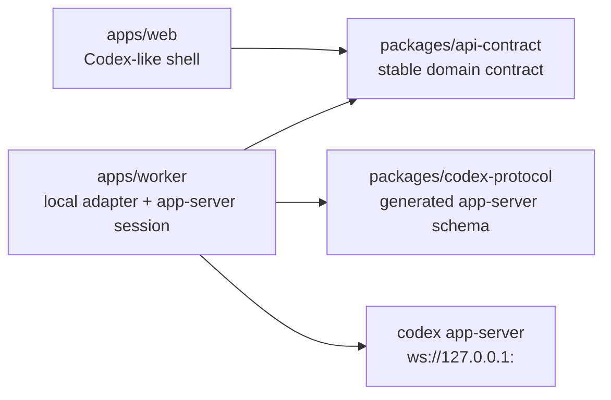
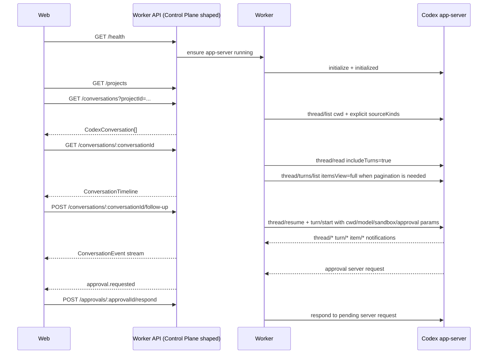

# Codex App Main Chain Design

## Goal

Build the first real Codex app-server operation spine for Codex Remote.

The first implementation should let the Web UI operate one local Codex runtime through a Worker, while preserving the final architecture shape where Web talks to a stable Control Plane-style API instead of the raw app-server protocol.

The product goal is that Codex Remote operations feel close to Codex App operations and affect the same Codex thread history where the app-server supports it.

## Confirmed Decisions

- First slice: Worker probe and connection layer.
- app-server transport: `ws://127.0.0.1:<port>`.
- Worker may start app-server with `codex app-server --listen ws://127.0.0.1:<port>`, but the Worker-facing HTTP API and app-server WebSocket transport must both be protected as described in the Security Requirements section.
- Scope: single-device end-to-end first, with multi-device fields and event envelopes reserved.
- Runtime shape: Web uses a Control Plane-shaped contract; implementation may initially route to a local Worker adapter instead of a full Control Plane server.
- Approach: contract-driven, with Worker probe validating the real app-server behavior before broad UI work.

## Architecture Boundary



Rules:

- `apps/web` depends on `packages/api-contract`, not app-server generated types.
- `apps/worker` is the only package that starts, connects to, and manages Codex app-server.
- `packages/codex-protocol` is generated from `codex app-server generate-ts` and `generate-json-schema`, and records the Codex version used for generation.
- `packages/api-contract` defines Codex Remote's stable domain model for Web, future Control Plane, and future iOS.
- First implementation can defer full `apps/control-plane`, but API names and payloads should fit the final Control Plane direction.
- app-server remains loopback-only; no LAN or public app-server exposure.

## Security Requirements

The first implementation is single-device, but it still exposes actions that can start Codex turns and may lead to shell, file, or process work through app-server. Localhost is not an authorization boundary. Worker security is therefore part of Phase 1, not a later product hardening task.

### Worker HTTP API Authentication

The local Worker HTTP API must require a development token even when bound to `127.0.0.1`.

Rules:

- Worker generates or accepts a local development token at startup.
- Web requests include the token in an `Authorization: Bearer <token>` header.
- Worker rejects missing or invalid tokens before routing to any app-server-backed operation.
- Worker returns `401` for missing/invalid credentials and never falls through to app-server.
- The token must not be logged.
- The token is not a replacement for future device tokens; it is the local adapter equivalent of the future Worker/Control Plane credential.

### Origin and CORS Policy

Worker should treat browser-originated requests as untrusted unless explicitly allowed.

Rules:

- Worker binds to loopback only.
- Worker accepts browser requests only from configured development origins, initially `http://127.0.0.1:5173` and `http://localhost:5173`.
- Worker rejects unexpected `Origin` headers for state-changing routes and event streams.
- Worker must not proxy app-server `/healthz` semantics directly to the browser. App-server `/readyz` and `/healthz` are Worker-internal diagnostics.

### app-server Transport Policy

Codex app-server WebSocket transport is documented as experimental and unsupported. The first implementation may use loopback WebSocket because it is the chosen product spike, but the risk must be explicit.

Rules:

- app-server listener is always `127.0.0.1`; never `0.0.0.0`, LAN, or public.
- Worker must support a transport abstraction so `stdio` or Unix socket can replace WebSocket if loopback WebSocket proves unstable.
- If Worker ever starts app-server on a non-loopback listener, it must configure app-server `--ws-auth` and fail closed when auth cannot be configured.
- The first Phase 1 implementation should prefer loopback WebSocket plus Worker API token, and record the fallback path to `stdio`/Unix socket in probe diagnostics.

### Project Allowlist

Worker must enforce project access before sending `cwd`, file, shell, or thread operations to app-server.

Rules:

- Phase 1 can use a single configured allowed project root.
- `thread/list` with `cwd`, `thread/start`, `thread/resume`, `turn/start`, `turn/steer`, and approval responses must be checked against the allowlist when they include or imply a project path.
- Paths in approval requests, sandbox roots, file changes, and command cwd must be normalized before comparison.
- Operations outside the allowlist are rejected by Worker before app-server is called.

### Approval Boundary

Worker must treat approval as an explicit user decision channel, not as an error.

Rules:

- Approval requests are projected into `ApprovalRequest`.
- Web sends decisions through `RespondApprovalInput`.
- Worker forwards the decision to the pending app-server server request.
- Worker records decision type and sanitized target metadata in diagnostics or audit-ready logs.
- Worker must not auto-accept approval requests in normal mode.

### Logging and Redaction

Logs must be useful for probe diagnostics without leaking credentials or user content.

Redact:

- bearer tokens and local Worker tokens
- app-server auth tokens
- OpenAI, ChatGPT, and provider credentials
- full prompt text by default
- command output by default in diagnostic summaries
- absolute paths outside configured project roots

Diagnostic summaries may include operation names, timings, status codes, error kinds, Codex version, transport kind, and redacted path basenames.

## Module Responsibilities

### `packages/codex-protocol`

Stores the generated app-server protocol artifacts and generation metadata.

Responsibilities:

- Run or document generation from `codex app-server generate-ts` and `codex app-server generate-json-schema`.
- Record `codex --version` or equivalent version metadata.
- Export app-server request, response, and notification types for Worker internals.
- Avoid exposing app-server raw protocol types to Web or Control Plane contracts.

### `packages/api-contract`

Defines Codex Remote's stable contract.

Initial domain types:

- `Device`
- `RemoteProject`
- `CodexConversation`
- `ConversationTimeline`
- `ConversationEvent`
- `WorkerHealth`
- `WorkerCapabilities`
- `ApprovalRequest`
- `RespondApprovalInput`
- `StartConversationInput`
- `FollowUpInput`
- `SteerTurnInput`
- `InterruptTurnInput`

Every event includes `deviceId`. Conversation events include `projectId`, `conversationId`, and `turnId` when available.

### `apps/worker`

Owns local app-server lifecycle and projection into the Codex Remote contract.

Suggested services:

- `AppServerProcessService`: choose a loopback port, start/stop app-server, probe `/readyz`.
- `AppServerRpcClient`: WebSocket JSON-RPC, initialize handshake, pending request map, timeouts, notification dispatch, retry classification.
- `CodexThreadService`: `model/list`, `thread/list`, `thread/read`, `thread/turns/list`, `thread/start`, `thread/resume`, `turn/start`, `turn/steer`, `turn/interrupt`.
- `CodexEventProjector`: convert `thread/*`, `turn/*`, `item/*`, and server-initiated approval requests into `ConversationEvent`.
- `WorkerHttpServer`: expose local HTTP/SSE endpoints using Control Plane-shaped API payloads.
- `ApprovalRequestRegistry`: track app-server server requests and route Web approval decisions back to the matching pending request.

Worker must not persist or upload OpenAI, ChatGPT, provider, or Codex auth secrets.

### `apps/web`

Remains a Codex-like shell and consumes the stable contract.

First changes should:

- Introduce a data source boundary with fixture and Worker-backed implementations.
- Render conversation list/detail from `api-contract` view models.
- Feed live events into a timeline reducer.
- Route composer actions through `startConversation`, `followUp`, and `interruptTurn`.
- Keep app-server method names out of React components.

## Data Flow



Cold-start history comes from `thread/list`, `thread/read(includeTurns=true)` for small or initially selected threads, and `thread/turns/list(itemsView: "full")` for paged or long history. Live state comes from app-server notifications and should not be overwritten by older snapshots.

## Upstream Protocol Alignment

Worker must encode app-server-specific behavior in one adapter layer.

### Thread Listing

`thread/list` must pass explicit filters rather than relying on upstream defaults.

Required params for conversation history:

- `cwd` when listing a project.
- `sourceKinds` explicitly configured to include every source Codex Remote should display. The minimum first-slice set is `["cli", "vscode", "appServer"]`; implementation planning may add sub-agent sources behind a capability flag.
- `archived: false` for normal lists and `archived: true` for archived lists.
- cursor pagination until exhausted or until the requested UI page is filled.

This avoids depending on app-server's default `sourceKinds`, which currently defaults to interactive sources only.

### Thread Start, Resume, and Turn Start Params

`StartConversationInput` and `FollowUpInput` must reserve fields that app-server accepts on thread and turn operations:

```ts
export interface CodexRuntimeOptions {
  cwd: string;
  model?: string;
  modelProvider?: string;
  approvalPolicy?: string;
  sandboxPolicy?: unknown;
  personality?: string | null;
  effort?: string;
  summary?: string;
  collaborationMode?: string;
}

export interface StartConversationInput extends CodexRuntimeOptions {
  deviceId: string;
  projectId: string;
  input: ConversationInputItem[];
}

export interface FollowUpInput extends Partial<CodexRuntimeOptions> {
  deviceId: string;
  conversationId: string;
  input: ConversationInputItem[];
}
```

Worker enforces project allowlist before forwarding `cwd` or sandbox roots.

### Steer Active Turn

`turn/steer` is not the normal follow-up path. It is a separate operation for adding input to an active turn.

```ts
export interface SteerTurnInput {
  deviceId: string;
  conversationId: string;
  turnId: string;
  input: ConversationInputItem[];
}
```

Worker maps it to `turn/steer` with `expectedTurnId`.

### Approval Response

Approval requires request-response state, not just a displayed event.

```ts
export interface RespondApprovalInput {
  deviceId: string;
  approvalId: string;
  decision:
    | { type: "accept" }
    | { type: "acceptForSession" }
    | { type: "decline" }
    | { type: "cancel" }
    | { type: "acceptWithExecpolicyAmendment"; execpolicyAmendment: string[] };
}
```

File-change approvals use the subset accepted by upstream. Command approval decisions include `acceptWithExecpolicyAmendment`.

### History Loading

`thread/read(includeTurns=true)` is acceptable for initial selected-thread reads, but long conversations need `thread/turns/list`.

Rules:

- `thread/read(includeTurns=true)` loads the selected thread snapshot.
- `thread/turns/list(itemsView: "full")` is required for paginated long history and "load older" UI.
- `thread/turns/items/list` is not used because upstream currently reserves it and may return unsupported.

## First Implementation Slice

### Phase 1: Protocol, Security, and Worker Probe

Deliver:

- `packages/codex-protocol` with generated protocol artifacts and version metadata.
- `apps/worker` skeleton.
- app-server startup on `ws://127.0.0.1:<port>`.
- `/readyz` probe.
- WebSocket JSON-RPC client.
- `initialize` and `initialized`.
- `model/list`.
- `thread/list` with explicit `sourceKinds`.
- `thread/read(includeTurns=true)`.
- `thread/turns/list(itemsView: "full")`.
- Worker HTTP token authentication and Origin checks.
- project allowlist enforcement for app-server-backed operations.
- Diagnostic JSON summary.

Completion evidence:

- A local probe command can start or connect to app-server and report each step as pass/fail.
- Failures include operation name, retryability, and sanitized details.
- The read-only probe passes without model usage.
- The full probe is opt-in and covers the technical specification's Worker probe matrix.

### Phase 2: API Contract and Read-Only Web Data

Deliver:

- `packages/api-contract` stable domain types.
- Worker local API:
  - `GET /health`
  - `GET /projects`
  - `GET /conversations?projectId=...`
  - `GET /conversations/:conversationId`
- Web data source abstraction:
  - fixture source
  - Worker source
- Web can display real app-server conversation list and conversation detail.

Completion evidence:

- Existing fixture UI remains available.
- Worker source renders real app-server data through the same view model boundary.

### Phase 3: Send, Stream, Interrupt

Deliver:

- Worker operations:
  - start conversation: `thread/start` then `turn/start`
  - follow-up: `thread/resume` then `turn/start`
  - steer active turn: `turn/steer`
  - interrupt: `turn/interrupt`
  - approval response
  - event subscription
- Web operations:
  - composer for new conversation
  - composer for existing conversation follow-up
  - explicit active-turn steer action
  - running, waiting approval, failed, interrupted states
  - approval decision UI
  - live timeline reducer
  - interrupt button for active turns

Completion evidence:

- Web can create a new thread and send a prompt.
- Web can resume an existing thread and send a follow-up.
- Web can steer an active turn with `expectedTurnId`.
- Web receives real-time item and turn updates.
- Web can respond to command and file-change approvals.
- Web can interrupt an active turn.

### Phase 4: Codex App Parity Shell

Deliver a limited shell for Codex-like operations without implementing every backend action:

- archive/unarchive route and disabled/ready UI states as appropriate.
- rename route and disabled/ready UI states as appropriate.
- model/mode/sandbox/approval display.
- approval request UI.
- tool detail, command output, file change detail.
- diff/review entry point with clear unavailable or read-only state when not implemented.

Completion evidence:

- UI actions map to explicit capabilities, disabled states, or diagnostic unavailable states.
- No action silently closes or pretends to succeed.

## Status Model

The stable contract should not expose raw app-server status directly.

```ts
export type ConversationStatus =
  | "not_loaded"
  | "idle"
  | "running"
  | "waiting_approval"
  | "waiting_input"
  | "interrupted"
  | "failed"
  | "done"
  | "unknown";

export type TurnStatus =
  | "in_progress"
  | "completed"
  | "interrupted"
  | "failed";

export type TimelineItemStatus =
  | "in_progress"
  | "completed"
  | "failed"
  | "declined"
  | "unknown";

export type ApprovalRequestStatus =
  | "pending"
  | "accepted"
  | "accepted_for_session"
  | "declined"
  | "cancelled"
  | "resolved";
```

Projection rules:

- `thread/status/changed` is the primary live source for conversation status.
- `turn/started` to `turn/completed` implies active conversation state.
- Approval requests move the conversation to `waiting_approval` until `serverRequest/resolved` or a terminal turn event.
- `item/completed` is the authoritative final item state.
- Delta events append content only; they do not define terminal status.
- Unknown status must remain `unknown`, never silently become `done`.

### Conversation Status Mapping

| Upstream signal | Codex Remote status |
| --- | --- |
| thread status `{ type: "notLoaded" }` | `not_loaded` |
| thread status `{ type: "active", activeFlags: [] }` | `running` while a turn is active; `idle` only after a terminal turn event |
| `activeFlags` contains `waitingOnApproval` | `waiting_approval` |
| `activeFlags` contains an input/request-user-input signal | `waiting_input` |
| `turn/completed` with `status: "completed"` | `done` for that turn; conversation becomes `idle` if no active turn remains |
| `turn/completed` with `status: "interrupted"` | `interrupted` |
| `turn/completed` with `status: "failed"` or error event | `failed` |
| unknown thread or turn status | `unknown` |

`done` describes the latest turn terminal result. `idle` describes that the loaded conversation currently has no in-flight turn. UI may display both latest turn result and current runtime state when needed.

## Event Contract

Initial event names:

- `conversation.status.changed`
- `turn.started`
- `turn.completed`
- `turn.diff.updated`
- `turn.plan.updated`
- `thread.tokenUsage.updated`
- `item.started`
- `item.agentMessage.delta`
- `item.plan.delta`
- `item.reasoning.summaryTextDelta`
- `item.reasoning.summaryPartAdded`
- `item.reasoning.textDelta`
- `item.commandExecution.outputDelta`
- `item.completed`
- `approval.requested`
- `serverRequest.resolved`
- `connection.status.changed`
- `diagnostic.error`

Events should be idempotent where possible. Each event should include a stable `eventId`, `deviceId`, timestamp, upstream method name, and the narrowest available target identifiers.

Delta events should include:

- `threadId`
- `turnId`
- `itemId` when upstream provides it
- `deltaKind`
- monotonic `sequence` assigned by Worker per app-server connection
- raw upstream method name

The Worker sequence is required because upstream delta notifications are append operations, not naturally idempotent resource replacements.

### Upstream Event Projection

| Upstream event/request | Codex Remote event |
| --- | --- |
| `thread/started` | `conversation.status.changed` plus snapshot refresh |
| `thread/status/changed` | `conversation.status.changed` |
| `thread/archived` / `thread/unarchived` | `conversation.status.changed` plus list refresh hint |
| `thread/closed` | `connection.status.changed` or conversation runtime unload |
| `turn/started` | `turn.started`, `conversation.status.changed` |
| `turn/completed` | `turn.completed`, `conversation.status.changed` |
| `turn/diff/updated` | `turn.diff.updated` |
| `turn/plan/updated` | `turn.plan.updated` |
| `thread/tokenUsage/updated` | `thread.tokenUsage.updated` |
| `item/started` | `item.started` |
| `item/agentMessage/delta` | `item.agentMessage.delta` |
| `item/plan/delta` | `item.plan.delta` |
| `item/reasoning/summaryTextDelta` | `item.reasoning.summaryTextDelta` |
| `item/reasoning/summaryPartAdded` | `item.reasoning.summaryPartAdded` |
| `item/reasoning/textDelta` | `item.reasoning.textDelta` |
| `item/commandExecution/outputDelta` | `item.commandExecution.outputDelta` |
| `item/completed` | `item.completed` |
| `item/commandExecution/requestApproval` | `approval.requested` |
| `item/fileChange/requestApproval` | `approval.requested` |
| `item/tool/requestUserInput` | `approval.requested` or `tool.userInput.requested` when modeled separately |
| `serverRequest/resolved` | `serverRequest.resolved` |

## Error Model

Worker errors should be classified before reaching Web.

```ts
export type WorkerErrorKind =
  | "codex_not_found"
  | "app_server_start_failed"
  | "app_server_not_ready"
  | "app_server_connection_failed"
  | "app_server_not_initialized"
  | "app_server_request_timeout"
  | "app_server_overloaded"
  | "app_server_protocol_error"
  | "codex_auth_error"
  | "codex_context_window_exceeded"
  | "codex_usage_limit_exceeded"
  | "codex_bad_request"
  | "codex_sandbox_error"
  | "codex_response_stream_failed"
  | "codex_response_too_many_failed_attempts"
  | "model_provider_error"
  | "unknown";
```

Each error response includes:

- `kind`
- `message`
- `operation`
- `deviceId`
- `retryable`
- `diagnosticId`
- `codexErrorInfo` when upstream provides it
- `httpStatusCode` when upstream provides it
- sanitized `details`

UI behavior:

- Retryable errors show retry.
- Auth, provider, missing Codex, and app-server startup errors show diagnostic or setup entry points.
- `waiting_approval` is not a failure.
- Streaming disconnect shows reconnecting/interrupted state instead of done.
- Approval requests are events, not `WorkerErrorKind` values.

## Testing Strategy

### Pre-Commit Gate

Before merging implementation work, run:

```bash
pnpm lint
pnpm typecheck
pnpm test
pnpm build
```

These are required in addition to Worker-specific probe commands.

### Protocol Generation Smoke

- Generated TS artifacts exist.
- JSON Schema artifacts exist.
- Generation metadata records the Codex version.
- Worker imports generated types; Web does not.
- `codex app-server --help` exposes the expected `generate-ts` and `generate-json-schema` commands.

### Worker Unit Tests

Cover:

- JSON-RPC pending request resolve and reject.
- initialize ordering.
- request timeout.
- notification dispatch.
- overloaded error classification.
- auth token rejection and accepted-token success.
- Origin rejection for unexpected origins.
- allowlist rejection for out-of-scope cwd/sandbox roots.
- event projection for turn started/completed, diff, plan, item started, every modeled delta type, item completed, approval request, server request resolution, and unknown status.
- error projection from `codexErrorInfo`.

### Worker Probe Integration

Worker probe has two modes.

Read-only probe, safe for local and CI-like environments with Codex installed:

- app-server startup.
- `/readyz`.
- WebSocket connect.
- initialize and initialized.
- model/list.
- thread/list with explicit `sourceKinds`.
- thread/read.
- thread/turns/list with `itemsView: "full"`.
- diagnostic JSON output.

Full probe, explicit opt-in because it can consume model quota and trigger approvals:

- thread/start.
- turn/start.
- streaming notifications.
- thread/resume.
- turn/steer.
- turn/interrupt.
- approval/server request capture. The probe may use a controlled prompt or sandbox setting to trigger approval, but it must at least prove server-request capture and diagnostic reporting.

The technical specification's 12 Worker probe capabilities are the full probe acceptance target. Read-only probe is an earlier safety gate, not a substitute for full acceptance.

### Diagnostic JSON Schema

Probe output must be machine-readable:

```ts
export interface WorkerProbeSummary {
  schemaVersion: 1;
  startedAt: string;
  completedAt: string;
  ok: boolean;
  mode: "readOnly" | "full";
  deviceId: string;
  codexVersion: string | null;
  appServer: {
    transport: "loopbackWebSocket" | "stdio" | "unixSocket";
    url?: string;
    startedByWorker: boolean;
    readyz: boolean;
  };
  checks: Array<{
    name: string;
    ok: boolean;
    durationMs: number;
    retryable?: boolean;
    errorKind?: WorkerErrorKind;
    diagnosticId?: string;
  }>;
}
```

CI should run unit tests and the read-only probe only when Codex is installed and configured in the runner. Full probe is a manual or explicitly enabled integration check.

### Web Contract Tests

Cover:

- fixture source and Worker source produce compatible view models.
- snapshot plus live events merge correctly.
- composer disabled/enabled states for idle, running, waiting approval, failed, and disconnected.
- interrupt is available only for active turns.
- unknown status does not render as done.
- steer is available only for active turns with a known turn id.
- approval response UI only enables decisions listed in `availableDecisions`.
- schema validation covers fixture source and Worker source outputs.

## Migration and Capability Model

The local Worker API is a development adapter for the future Control Plane path. The implementation must keep the transport replaceable:

```text
Phase 1/2 local runtime:
  Web -> local Worker API -> local app-server

Future multi-device runtime:
  Web -> Control Plane API -> Device Worker -> local app-server
```

Migration rules:

- API payloads keep `deviceId`, `projectId`, `conversationId`, and `turnId` even when only one device exists.
- Worker endpoints should be shaped like future Control Plane handlers so the Web data source can later swap base URLs rather than rewrite contracts.
- Worker auth token maps to future device token semantics; it is not a user session.
- Event envelopes must not assume a single device connection.
- Control Plane introduction should replace routing and persistence, not app-server projection logic.

`WorkerCapabilities` should advertise supported operations and protocol features:

```ts
export interface WorkerCapabilities {
  canStartConversation: boolean;
  canFollowUp: boolean;
  canSteerTurn: boolean;
  canInterruptTurn: boolean;
  canRespondToApprovals: boolean;
  canListArchivedThreads: boolean;
  canRenameThread: boolean;
  canArchiveThread: boolean;
  canReadDiffUpdates: boolean;
  canReadPlanUpdates: boolean;
  appServerTransport: "loopbackWebSocket" | "stdio" | "unixSocket";
  experimentalApiEnabled: boolean;
  supportedSourceKinds: string[];
}
```

UI actions must check capabilities and render disabled or unavailable states instead of silently no-oping.

## Deferred Scope

Not in the first implementation:

- Full `apps/control-plane` DB and pairing.
- Public relay.
- iOS app.
- Full worktree creation and handoff.
- Full review pane, staging, commit, push, PR flow.
- In-app browser, computer use, and Chrome extension.
- Provider proxy or shared OpenAI/Codex secrets.
- Multi-user RBAC.
- Automations and scheduled tasks.

## Open Follow-Up Decisions

These are intentionally deferred to implementation planning:

- Exact local Worker API route names and whether the first event stream uses SSE or WebSocket.
- Port selection range and conflict policy for app-server.
- How Web selects fixture source vs Worker source in development.
