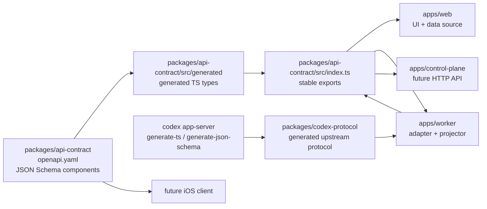
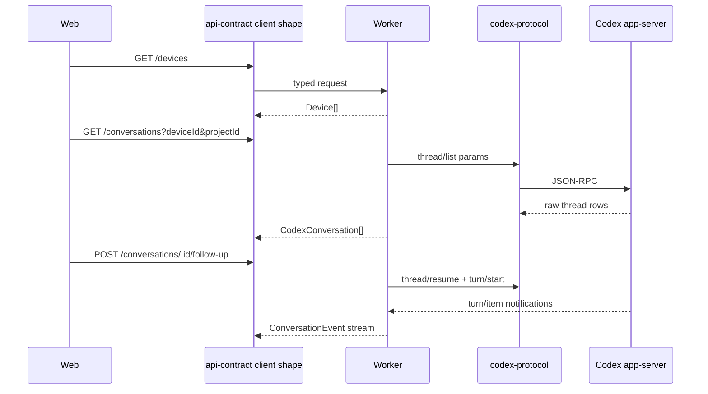

# Contract Source Of Truth Design

## Goal

Establish the next architecture step after the Web source reorganization: make protocol and API contracts enforce the single source of truth rule before adding Worker or Control Plane features.

The immediate outcome is not a new user-facing workflow. The outcome is a contract foundation that later lets Web, Worker, Control Plane, tests, and a future iOS client share the same field names, validation rules, and transport semantics without parallel type definitions.

## Decisions

### Conclusion

Use two explicit contract sources:

- `packages/api-contract`: Codex Remote Control Plane-shaped API source of truth.
- `packages/codex-protocol`: generated Codex app-server protocol source of truth.

### Reason

These contracts serve different stability boundaries. `api-contract` is the stable product contract consumed by Web, Worker, Control Plane, and future iOS clients. `codex-protocol` follows upstream Codex app-server and is only consumed by Worker internals.

### Risk

If Web or Control Plane imports Codex app-server types directly, upstream protocol changes can leak into the product API. If Worker or tests define local copies of API fields, schema changes will require manual edits and violate the single source of truth rule.

### Next Step

Implement schema-backed `api-contract`, then add generated `codex-protocol`, then build Worker probe against those packages.

## Architecture



Dependency rules:

- `apps/web` imports `@codex-remote/api-contract` and `@codex-remote/ui`; it does not import `@codex-remote/codex-protocol`.
- `apps/worker` imports both `@codex-remote/api-contract` and `@codex-remote/codex-protocol`.
- `apps/control-plane` imports `@codex-remote/api-contract` and later `@codex-remote/db`; it does not import `@codex-remote/codex-protocol`.
- `packages/ui` remains visual-only and does not import `@codex-remote/api-contract`.
- Tests import exported types or factories from the same package they validate; they do not redeclare entity field structures.

This `packages/ui` rule supersedes the older dependency-direction draft in `docs/specs/多设备 Codex 控制台 技术规格.md`, which allowed `packages/ui -> packages/api-contract`. The current project direction is stricter: product-specific mappings stay in apps, shared UI primitives stay domain-free.

## API Contract Source

`packages/api-contract/openapi.yaml` is the source of truth for the Control Plane-shaped API.

It owns:

- REST paths and method payloads.
- Event stream payload schemas.
- Component schemas for `Device`, `RemoteProject`, `CodexConversation`, `ConversationTimeline`, `ConversationEvent`, `BoardTask`, `WorkerHealth`, `WorkerCapabilities`, `ApprovalRequest`, and command inputs.
- Error envelope shape.

Generated TypeScript lives under `packages/api-contract/src/generated/` and is not edited manually. `packages/api-contract/src/index.ts` may re-export generated types and add semantic helper types only when they do not duplicate fields.

Current hand-written exports in `packages/api-contract/src/index.ts` are transitional. The next implementation should replace them with generated exports while preserving Web behavior.

## Codex Protocol Source

`packages/codex-protocol` is generated from the installed Codex CLI.

It owns:

- Generated TypeScript protocol types.
- Generated JSON Schema artifacts where available.
- Generation metadata: Codex version, generation command, generation timestamp, and output file list.
- A small README explaining that generated files are not hand-edited.

Worker is the only package allowed to map `codex-protocol` types into `api-contract` types. This mapping is explicit adapter code, not a parallel schema.

## Projection Boundary

The Worker adapter is the only place that knows both protocol worlds.

Examples:

- `thread/list` results project into `CodexConversation[]`.
- `thread/read` and `thread/turns/list(itemsView: "full")` project into `ConversationTimeline`.
- app-server notifications project into `ConversationEvent`.
- app-server approval server requests project into `ApprovalRequest`.
- Web approval decisions use `RespondApprovalInput` and are mapped back to the pending app-server request.

No React component should contain app-server method names, raw app-server item shapes, or ad hoc field translations.

## Data Flow



The Web data source reads only the API-shaped contract. Demo fixtures should be either:

- OpenAPI example payloads reused by tests, or
- typed factories that return `api-contract` exports.

## Error Handling

`api-contract` defines one error envelope for Control Plane-shaped APIs:

- `code`: stable machine-readable string.
- `message`: user-safe summary.
- `details`: optional structured diagnostic data.
- `requestId`: optional correlation id.

Worker maps app-server and transport failures into this envelope:

- app-server unavailable -> `worker_app_server_unavailable`
- auth failure -> `worker_auth_rejected`
- origin rejected -> `worker_origin_rejected`
- project allowlist rejected -> `project_not_allowed`
- approval missing or expired -> `approval_not_found`
- upstream protocol mismatch -> `codex_protocol_mismatch`

Raw upstream errors are logged with redaction and are not passed directly to Web.

## Testing Strategy

Contract tests:

- Verify `packages/api-contract/src/generated` is generated from `openapi.yaml`.
- Verify public exports do not redeclare schema fields outside generated files.
- Verify Web and tests import entity types from `@codex-remote/api-contract`.

Protocol tests:

- Verify `packages/codex-protocol` contains generation metadata.
- Verify generated protocol files are present.
- Verify Worker adapter imports protocol types only from `@codex-remote/codex-protocol`.

Boundary tests:

- `apps/web` must not import `@codex-remote/codex-protocol`.
- `apps/control-plane` must not import `@codex-remote/codex-protocol`.
- `packages/ui` must not import `@codex-remote/api-contract`.
- Worker projection tests use raw app-server fixture samples and assert only API contract outputs.

Verification commands:

```bash
pnpm lint
pnpm typecheck
pnpm test
pnpm build
```

## Migration Plan

1. Add `packages/api-contract/openapi.yaml` with current Web-facing demo entities and first Worker-ready command/event schemas.
2. Add a generation script for TypeScript contract types.
3. Replace hand-written `packages/api-contract/src/index.ts` field definitions with generated re-exports.
4. Move demo fixture construction to typed factories or OpenAPI examples.
5. Add `packages/codex-protocol` with generated app-server artifacts and generation metadata.
6. Add dependency boundary tests.
7. Start Worker read-only probe using `api-contract` outputs and `codex-protocol` inputs.

## Non-Goals

- Do not build `apps/worker` in this spec.
- Do not build `apps/control-plane` in this spec.
- Do not introduce database schema yet.
- Do not model every app-server method before the Worker probe proves which methods are needed.
- Do not make `packages/ui` domain-aware.

## Acceptance Criteria

- A schema file is the only definition point for API contract fields.
- TypeScript API contract exports are generated or directly re-exported from generated output.
- Codex app-server generated artifacts are isolated in `packages/codex-protocol`.
- Web keeps compiling without app-server protocol imports.
- Boundary tests fail if a package crosses the dependency rules above.
- A schema field rename causes either regeneration or TypeScript failures, not silent manual drift.
