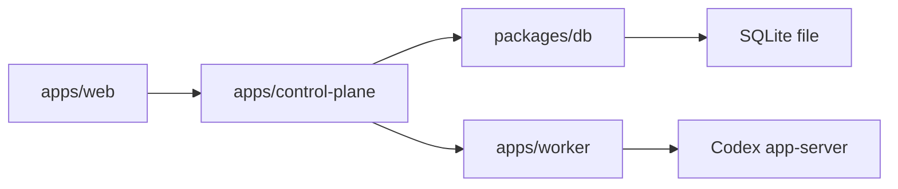

# DB Task Board Design

Stage 7: persistence and task board.

## Goal

Add the first DB-backed task board slice so Control Plane can persist tasks and manual conversation links, and Web can show a task board sourced from Control Plane instead of mock-only task data.



## Non-Goals

- No remote sync, PostgreSQL, libSQL, multi-writer clustering, or cloud DB.
- No pairing, reverse WSS, token rotation, revocation, productized auth, iOS, installer, or audit log.
- No automatic task inference, automatic device choice, or automatic task migration.
- No streaming event log or durable app-server event replay.
- No provider/Codex/OpenAI/ChatGPT secrets in DB.

## Recommended Approach

Use SQLite + Drizzle + `better-sqlite3` inside `packages/db`.

Reason: `PLAN.md` and `PROJECT_STRUCTURE.md` already name this as the Stage 7 direction, and Drizzle schema gives a TypeScript source of truth for persistence fields.

Risk: `better-sqlite3` is a native dependency. This Stage only validates local install/build on the current environment; product support matrix remains later productization work.

Rejected approach: Node built-in `node:sqlite`.

Reason: it would avoid dependencies, but current local Node emits an experimental warning. Using it now would turn Stage 7 into a runtime bet instead of a persistence slice.

## Source Of Truth

- Public API fields stay in `packages/api-contract/openapi.yaml`.
- DB persistence fields start in `packages/db/src/schema.ts`.
- Generated DB migrations are committed under `packages/db/drizzle/`.
- Web imports API contract types only; it does not import `packages/db`.
- Control Plane imports `packages/db`; Worker does not.

## Public API

Add versioned Control Plane task routes:

- `GET /v1/tasks`
- `POST /v1/tasks`
- `POST /v1/tasks/{taskId}/conversation-links`
- `DELETE /v1/tasks/{taskId}/conversation-links/{deviceId}/{conversationId}`

Schemas:

- `BoardTask`
  - `id`
  - `title`
  - `status`
  - `linkedConversations`
  - `createdAt`
  - `updatedAt`
- `TaskConversationLink`
  - `deviceId`
  - `conversationId`
  - optional `projectId`
  - `linkedAt`
- `CreateTaskInput`
  - `title`
  - optional `clientRequestId`
- `LinkTaskConversationInput`
  - `deviceId`
  - `conversationId`
  - optional `projectId`

Decision: replace `linkedConversationIds` with device-scoped links.

Reason: Stage 6 proved `conversationId` is not globally unique across devices.

Risk: mock data and Web task UI must update together with the contract.

## DB Schema

Minimum tables:

- `tasks`
  - `id text primary key`
  - `title text not null`
  - `status text not null`
  - `created_at text not null`
  - `updated_at text not null`
- `task_conversation_links`
  - `task_id text not null references tasks(id) on delete cascade`
  - `device_id text not null`
  - `conversation_id text not null`
  - `project_id text`
  - `linked_at text not null`
  - primary key `(task_id, device_id, conversation_id)`

No `devices` or `conversations` DB tables in this Stage.

Reason: devices and conversations are still Worker-derived runtime state. Stage 7 only persists user task organization.

## Control Plane Behavior

- Auth and CORS reuse existing Control Plane middleware.
- DB path is runtime config. Tests can use temp file DBs.
- `GET /v1/tasks` returns tasks ordered by `updatedAt desc`.
- `POST /v1/tasks` validates title length and creates one task.
- Link creation requires an existing task and a device-scoped conversation identity.
- Duplicate links are idempotent.
- Delete link is idempotent for missing links but fails for missing task.
- Errors use existing sanitized `ErrorEnvelope`.

## Web Behavior

- Add a task board view using `GET /v1/tasks`.
- Show task title, status, and linked conversation count.
- From the selected conversation view, allow linking the current conversation to an existing task.
- Keep task creation minimal: one title input and submit button.
- If Control Plane task API fails, show a compact failed datasource state; do not fallback to mock tasks as if they were persisted.

## Security

- DB never stores provider secrets, Codex auth, Worker bearer tokens, raw upstream URLs, raw JSON-RPC, raw prompt, raw command output, full diff, stack/cause, or private paths.
- Task titles are user input and must be length-limited.
- Conversation links store opaque ids and optional `projectId`; no local filesystem path.

## Testing

Focused tests:

- `packages/db`
  - schema exports tables;
  - migrations create temp SQLite DB;
  - repository creates/list tasks and adds/removes device-scoped links.
  - same `conversationId` from two different `deviceId` values can both link to one task.
- `packages/api-contract`
  - task routes and schemas are versioned;
  - public aliases derive from generated schema.
- `apps/control-plane`
  - task routes require auth;
  - tasks persist across reopening a file-backed DB;
  - duplicate links are idempotent;
  - same `conversationId` from different devices is stored and returned as two links;
  - errors are sanitized.
- `apps/web`
  - task datasource reads Control Plane routes;
  - duplicate conversation ids remain device-scoped in links;
  - empty task list renders an explicit empty state and does not fallback to mock tasks;
  - failed task API does not silently show mock persisted data.

Repository gate:

```bash
pnpm lint
pnpm typecheck
pnpm test
pnpm build
```

Chrome smoke:

1. Start Control Plane with a temp file DB and fake Worker.
2. Start Web against Control Plane.
3. Create one task.
4. Use two fake Workers that expose the same `conversationId` under different `deviceId` values.
5. Link each device-scoped conversation to the task.
6. Refresh Web and verify the task remains with two device-scoped links.
7. Start with an empty DB once and verify Web shows an empty task state, not mock tasks or an error.
8. Verify no token, raw Worker URL, private path, raw JSON-RPC, prompt, command output, full diff, stack/cause appears.

## Completion Criteria

- `packages/db` exists and owns DB schema/migrations/access.
- Control Plane task API persists tasks and device-scoped conversation links in SQLite.
- Web can create/list tasks and manually link the selected conversation.
- Focused tests, repository gate, subagent reviews, and Chrome smoke pass.
- `PLAN.md`, `PROJECT_STRUCTURE.md`, this spec, and the Stage 7 plan record status, verification, review findings, and remaining risks.
