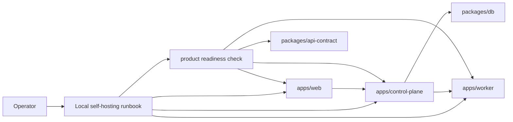

# Product Readiness Design

Stage 8: productization and expansion readiness.

## Goal

Turn the completed local Control Plane, Worker, Web, and DB slices into a repeatable self-hosted local console posture: documented startup, static readiness checks, explicit secret boundaries, and API guardrails that keep future iOS reuse contract-first.

This Stage does not make Codex Remote a packaged installer or cloud service. It makes the local self-hosted workflow understandable, checkable, and safe to run without putting secrets into repo files, docs examples, service definitions, or logs.



## Non-Goals

- No real OS installer, LaunchAgent, systemd unit, Windows Scheduled Task, auto-update, or notarization.
- No OS keychain integration, token generation, token rotation, revocation, pairing flow, QR code, DPoP, or device-bound auth.
- No reverse WSS, relay server, public tunnel, cloud deployment, TLS certificate automation, or production multi-tenant hosting.
- No full iOS app, mobile UI, mobile sync, mobile auth, or native build pipeline.
- No provider/Codex/OpenAI/ChatGPT secrets in DB, repo, docs examples, logs, service templates, or screenshots.
- No automatic task migration, automatic device selection, provider abstraction, or multi-agent orchestration.

## Recommended Approach

Add a local product readiness layer:

- `docs/references/local-self-hosting.md` as the operator runbook.
- A root `pnpm product:check` command backed by a Node script under `scripts/`.
- Focused tests that assert readiness checks enforce loopback defaults, script availability, API operation-id stability, secret-free docs/examples, and package boundaries.
- Minimal Web-facing product status evidence through the existing Control Plane health and task/device views; no new feature-heavy UI.

Reason: this directly advances the total goal from "implemented local slices" to "repeatable self-hosted local console" while avoiding pause conditions around real secrets, system services, external deployment, or legal/security commitments.

Risk: productization can sprawl quickly. This Stage intentionally treats installers, keychain, pairing, reverse WSS, and iOS as documented next steps with guardrails, not implementation work.

## Source Of Truth

- Public API and future iOS reuse guardrails remain in `packages/api-contract/openapi.yaml`.
- Codex app-server protocol remains in `packages/codex-protocol` generated artifacts.
- DB persistence fields remain in `packages/db/src/schema.ts`.
- Runtime secret values remain outside repo files and are supplied only through environment variables or local shell state.
- Operational docs are guidance, not schema; they must not define parallel DTOs or example real tokens.

## Product Readiness Checks

`pnpm product:check` should verify local invariants without starting real services:

- Root scripts expose the expected local commands.
- Web dev/start commands bind to `127.0.0.1`.
- Worker and Control Plane config code continues to reject non-loopback bind hosts and upstream URLs.
- Docs and scripts do not contain real-looking provider secrets, raw app-server URLs with credentials, raw JSON-RPC frames, prompts, command output, full diff, stack/cause, or private paths.
- API contract keeps stable `operationId` for every versioned operation.
- API schemas used by Web/Worker/Control Plane keep explicit `additionalProperties: false` unless a schema is intentionally open.
- `apps/web` does not import DB or codex-protocol; `apps/control-plane` does not import codex-protocol; `apps/worker` remains the only app-server caller.

## Runbook Behavior

The runbook should describe:

- Local topology and ports.
- Required environment variables by component.
- Where secrets must live: shell environment or local secret manager selected by the operator, never committed files.
- Startup order for Worker, Control Plane, and Web.
- How to run `pnpm product:check`, `pnpm lint`, `pnpm typecheck`, `pnpm test`, and `pnpm build`.
- Known local-only limitations: bearer tokens are development posture, no device-bound auth, no installer, no reverse WSS, no iOS app.
- Troubleshooting states: stopped Worker, invalid config, empty task DB, unavailable Control Plane.

## Web Verification Scope

Chrome verification should use fake Workers and local temp DB only:

- Control Plane health is visible through Web-loaded data.
- Device list loads from Control Plane, not mocks.
- Task board remains usable with local DB.
- When Control Plane is absent or misconfigured, Web shows a sanitized failure state without raw URLs, tokens, paths, stack/cause, raw JSON-RPC, prompt, command output, or full diff.

## Security

- The readiness check must fail if docs or scripts introduce secret-shaped literals outside allowed placeholder strings such as `REDACTED` and `example-token`.
- Service template examples, if added later, must not contain token values in command arguments.
- Startup summaries remain safe: no raw Worker upstream URL or bearer token.
- Productization docs must distinguish "development bearer token" from future device-bound auth.

## Testing

Focused tests:

- Readiness script tests:
  - passes on current repo invariants;
  - fails on unsafe doc/example secret literals in a temp fixture;
  - fails on missing required root scripts in a temp package fixture.
- API contract tests:
  - every `/v1` operation has `operationId`;
  - schemas used by public API stay closed unless explicitly allowlisted.
- Boundary tests:
  - existing Web/Control Plane/Worker package direction tests continue to pass.

Repository gate:

```bash
pnpm lint
pnpm typecheck
pnpm test
pnpm build
```

Chrome smoke:

1. Start fake Workers, Control Plane with a temp file DB, and Web.
2. Verify Web loads remote device/conversation/task data from Control Plane.
3. Stop or point Web away from Control Plane and verify sanitized unavailable state.
4. Verify DOM contains no token, raw Worker URL, private path, raw JSON-RPC, prompt, command output, full diff, stack/cause, or provider secret.

## Completion Criteria

- `pnpm product:check` exists and passes.
- Local self-hosting runbook exists and contains no real secrets.
- API/iOS guardrail tests pass without introducing iOS app code.
- Focused tests, repository gate, subagent reviews, and Chrome smoke pass.
- `PLAN.md`, `PROJECT_STRUCTURE.md`, this spec, the Stage 8 plan, and relevant references record final status, verification, review findings, remaining risks, and post-MVP work.
