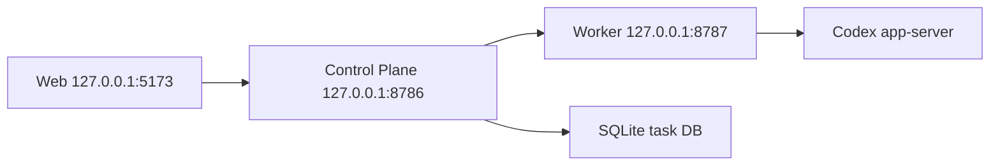

# Real Local Codex Calibration Design

## Purpose

This stage recalibrates Codex Remote against the real product goal: a self-hosted Web control surface that can operate the local Codex runtime through the full `Web -> Control Plane -> Worker -> Codex app-server` chain.

The stage does not add a new product direction. It validates and fixes the capabilities already claimed by Stages 3-8 against a real local Codex app-server instead of fake Worker smoke servers.

## Current Reality

The current codebase has real architecture pieces, but the verified path is weaker than the roadmap wording implies.

| Capability | Contract | Worker | Control Plane | Web | Real Codex E2E |
| --- | --- | --- | --- | --- | --- |
| List conversations | Implemented | Uses `thread/list` | Aggregates devices | Displays list | Not proven |
| Read timeline | Implemented | Uses `thread/read` | Device-scoped proxy | Metadata-only timeline | Not proven |
| Start conversation | Implemented | Uses `thread/start` and `turn/start` | Device-scoped proxy | Client method exists, no primary UI | Not proven |
| Follow-up | Implemented | Uses `turn/start` | Device-scoped proxy | Composer exists | Not proven |
| Interrupt | Implemented | Uses `turn/interrupt` | Device-scoped proxy | Control button exists | Not proven |
| Steer | Implemented | Uses `turn/steer` | Device-scoped proxy | Control input exists | Not proven |
| Approval list/decision | Implemented | Process-local registry and JSON-RPC response | Device-scoped proxy | Accept/decline/cancel exists | Not proven |
| Task link | Implemented | Not Worker-owned | SQLite through Control Plane | Task board exists | Not proven with real conversation |
| Output stream | Not implemented | Not implemented | Not implemented | Not implemented | Out of scope |
| Real multi-device | Local registry exists | Per-device Worker possible | Device-scoped routes exist | Device key routing exists | Out of scope |

Static readiness currently passes, but it does not prove runtime behavior. The current runbook also gives Web environment variables without the `NEXT_PUBLIC_` prefix required by Next client code.

## Goals

- Run the full local stack on the current Mac: Codex app-server, Worker, Control Plane, Web, and SQLite task DB.
- Verify real Codex app-server behavior for read, timeline, start, follow-up, interrupt, steer, approval, and task linking.
- Fix the smallest defects needed for those already-claimed capabilities to work.
- Make mock and fallback states unmistakable in Web so they cannot be mistaken for real device data.
- Update roadmap/runbook wording so fake Worker smoke is not presented as real product readiness.

## Non-Goals

- No real output streaming. This becomes a separate stage after command/control works against real Codex.
- No real multi-device validation. This stage uses one local device and preserves existing device-scoped routing.
- No installer, LaunchAgent, keychain, pairing, token rotation, reverse WSS, external deployment, iOS app, or production auth.
- No display of raw prompt text, command output, full diff, raw JSON-RPC frames, provider secrets, tokens, private paths, or stack traces.
- No broad UI redesign. UI changes are limited to removing misleading mock behavior and exposing already-implemented actions.

## Architecture



The stage keeps the existing ownership boundaries:

- `apps/web` calls only Control Plane-shaped HTTP APIs.
- `apps/control-plane` routes to configured Worker public APIs and owns task DB access.
- `apps/worker` is the only app that starts or talks to Codex app-server.
- `packages/api-contract/openapi.yaml` remains the public API source of truth.
- `packages/codex-protocol` remains the generated Codex app-server protocol source of truth.

## Runtime Flow

1. Worker starts with a local bearer token, a single `allowedProjectRoot`, and `CODEX_REMOTE_START_APP_SERVER=true` unless an explicit loopback `CODEX_APP_SERVER_URL` is used.
2. Worker starts or connects to a real app-server session and exposes public `/v1` Worker endpoints on loopback. The default Worker-owned path is `codex app-server --stdio`; loopback WebSocket is an explicit `debug-websocket` fallback only and cannot satisfy real readiness evidence.
3. Control Plane starts with one configured device pointing at the Worker and a local SQLite task DB.
4. Web starts with `NEXT_PUBLIC_CODEX_REMOTE_CONTROL_PLANE_BASE_URL` and `NEXT_PUBLIC_CODEX_REMOTE_CONTROL_PLANE_TOKEN`.
5. Web loads devices and conversations from Control Plane, not fallback fixtures.
6. Each user action goes through the device-scoped Control Plane route, then Worker, then app-server.

## Functional Requirements

### Read

- Web must load `/v1/devices` and `/v1/conversations` through Control Plane.
- Worker must map conversations from real `thread/list(cwd=allowedProjectRoot)`.
- If there are no real conversations, Web must show a real empty state, not mock data.

### Worker-Owned Stdio Lifecycle

- `pnpm real:start` must start the Worker with `CODEX_REMOTE_APP_SERVER_TRANSPORT=stdio` and `CODEX_REMOTE_START_APP_SERVER=true` by default.
- Worker must spawn `codex app-server --stdio` as a child process and communicate with newline-delimited JSON-RPC frames over stdio.
- Transport framing, buffering, child process close/error handling, request timeout, and pending-request cleanup belong inside `apps/worker`.
- Worker must not log or expose raw stdio frames, child stderr/stdout, raw initialize results, cwd, `allowedProjectRoot`, `codexHome`, private paths, tokens, stack/cause, raw prompts, command output, or full diffs.
- Worker health may expose only sanitized readiness proof: configured transport, connected/ready state, and a safe version or user-agent value when available.
- Stdio app-server method and notification types must come from `packages/codex-protocol` generated artifacts. If generated artifacts lack a needed upstream type, the stage must record `real-gap` or regenerate artifacts through the approved generation command instead of hand-writing parallel protocol DTOs.
- `debug-websocket` remains available only when explicitly selected for local debugging and must be labeled as non-readiness evidence.

### Timeline

- Web must read the selected real conversation timeline through `/v1/devices/{deviceId}/conversations/{conversationId}/timeline`.
- Worker must prove the conversation is inside `allowedProjectRoot` before `thread/read`.
- Timeline remains metadata-only in this stage.

### Start Conversation

- Web must expose a minimal start-conversation entrypoint.
- The entrypoint uses the current local device and current allowed project.
- Calibration test messages must include `codex-remote-calibration`.
- Worker maps start to `thread/start` followed by `turn/start`.

### Follow-Up

- Existing composer remains the follow-up entrypoint for selected real conversations.
- Success means Worker accepted and submitted `turn/start`; it does not mean the turn completed.
- After success, Web refreshes the read snapshot.

### Interrupt And Steer

- Interrupt and steer remain tied to an active turn id and require `expectedTurnId`.
- If real app-server cannot produce a stable active turn for the calibration scenario, record that as a real capability gap instead of using fake Worker evidence.
- Controls should be visually secondary unless a selected conversation has an active turn.

### Approval

- Approval list and decision must be validated against a real pending approval if a safe low-risk approval can be triggered.
- Only sanitized approval metadata may be shown.
- The calibration must not accept file-changing, destructive, private-data, or broad permission approvals.

### Task Link

- Task board must create a calibration task and link a real conversation id with device id and project id.
- Refresh must preserve the link through SQLite.

## UI Requirements

- When `source.reason !== "loaded"`, the Web UI must clearly say it is not connected to real Control Plane data.
- Fallback fixtures must be labeled as examples and must not look like real current work.
- A healthy Control Plane response with zero conversations is a real empty state, not fallback/example data.
- A Control Plane dependency failure must not be presented as a real empty conversation list. Web may show partial data when at least one configured Worker is reachable, but it must show a degraded/error state when all configured Workers fail.
- Primary conversation UI should prioritize real conversation title, source state, metadata timeline, start, and follow-up.
- Interrupt, steer, and approval belong in a run-control area, not as unexplained chat content.
- Disabled future controls such as model selection, attachment, and voice input should be hidden or clearly disabled.

## Error Handling And Safety

- Worker config errors stay sanitized as `worker_config_invalid`.
- Control Plane config errors stay sanitized as `invalid_config`.
- Missing Web token is a visible `not_configured` state, not a quiet mock state.
- app-server unavailability, timeout, and protocol drift must be surfaced as sanitized error code/message.
- Q24 Control Plane degraded-vs-empty semantics:
  - `/v1/control-plane/health` stays `200` and reports `status: "ok"` only when every configured Worker is connected; otherwise it reports `status: "degraded"` with sanitized counts.
  - `/v1/devices` stays `200` and reports each configured device as connected or not connected without leaking upstream URL, Worker token, raw error, stack/cause, or private paths.
  - `/v1/conversations` returns `200` with the reachable Workers' conversations when at least one Worker succeeds. A genuinely empty reachable Worker result is `200 []`.
  - `/v1/conversations` returns a sanitized dependency error, not `200 []`, when every configured Worker fails because it is unreachable, rejects the Worker token, times out, or otherwise cannot serve conversation reads.
  - Invalid Worker token and all-workers-down fixtures must be recorded by `pnpm real:check` as `real-pass`, `fixed-pass`, or `real-gap` without storing raw URLs, tokens, response bodies, stack/cause, command output, or raw ids.
- Logs may record endpoint, status, sanitized code, conversation id, turn id, and task id.
- Logs must not contain tokens, raw prompts, command output, full diffs, raw JSON-RPC frames, stack traces, or private paths.

## Calibration Data Policy

- Use only the current repository as the real project root.
- Created conversations and tasks use a `codex-remote-calibration` prefix.
- Test prompts must be low-risk and disposable.
- Do not automatically delete Codex conversation history.
- The sanitized report stores only opaque refs, counts, statuses, durations, and reason codes. It must not list raw conversation ids, turn ids, task ids, prompts, private paths, raw JSON-RPC, command output, stack/cause, or full diffs.
- While Stage 9 is in progress, the report may record `real-gap` entries until Worker stdio app-server lifecycle and safe real probes exist.

## Verification

### Static Gate

Run:

```bash
pnpm product:check
pnpm lint
pnpm typecheck
pnpm test
pnpm build
```

### Runtime Stack Gate

Verify:

- Worker listens on loopback and reports connected health.
- Control Plane listens on loopback and reports one configured device.
- Web starts with `NEXT_PUBLIC_CODEX_REMOTE_CONTROL_PLANE_*`.
- `5173`, `8786`, and `8787` are listening during the smoke run.
- Web shows real loaded state or a real empty state, not unmarked fixture data.

### Real E2E Gate

Verify through the full stack:

- List real conversations.
- Start a calibration conversation.
- Read its metadata timeline.
- Send a follow-up.
- Interrupt a running calibration turn when a safe scenario is available.
- Steer a running calibration turn when a safe scenario is available.
- List and decide a safe pending approval when a safe scenario is available.
- Create a calibration task and link the real conversation.

Each item ends as one of:

- `real-pass`: verified against real app-server.
- `fixed-pass`: failed first, fixed, then verified against real app-server.
- `real-gap`: current real app-server or product behavior cannot support it safely in this stage.

Fake Worker results cannot satisfy the real E2E gate.

## Completion Criteria

- A repeatable local command sequence can start Worker, Control Plane, and Web with real app-server access.
- Web no longer silently presents mock data as real data.
- The current already-implemented command/control/task capabilities have real E2E evidence or explicit `real-gap` records.
- `PLAN.md`, the local self-hosting runbook, and development context accurately state what is real, what is fake-smoke-only, and what remains out of scope.
- Output streaming is recorded as the next separate stage, not silently implied by this stage.
