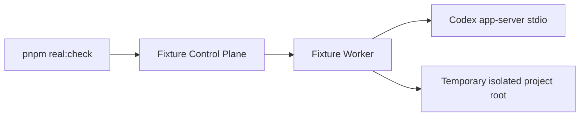

# Isolated Approval Fixture Design

## Purpose

Stage 10 closes the only Stage 9 real-check safety gap: `approval decision`.

Stage 9 proved the approval pending-list route against the real local stack, but it deliberately stopped before creating a pending approval in the real project. This stage adds one isolated local fixture that can safely produce a pending approval and decline or cancel it through the existing Web-shaped Control Plane and Worker approval decision route.

## Goals

- Prove `approval decision` with a real Codex app-server pending approval.
- Keep the fixture isolated from the repository project root.
- Use only `decline` or `cancel` decisions in automation.
- Keep `pnpm real:check` as the single readiness report writer.
- Preserve `Web -> Control Plane -> Worker -> Codex app-server`; scripts may orchestrate processes, but Worker remains the only app-server caller.

## Non-Goals

- No automatic approval `accept`.
- No `acceptForSession`.
- No persistent policy amendment.
- No production approval safety model.
- No external deployment, pairing, keychain, reverse WSS, iOS, or installer work.
- No raw prompt, command output, raw JSON-RPC, raw ids, raw URLs, stack/cause, token, provider secret, or private path in reports or tracked docs.

## Architecture



The fixture is process-local and temporary:

- `scripts/real-local-calibration.mjs` starts a second short-lived Worker and Control Plane on free loopback ports only when the normal real stack has no safe pending approval.
- The fixture Worker uses a temporary empty project root from the OS temp directory, outside the repository working tree.
- The fixture Worker receives a calibration-only runtime flag that makes Worker write calls include generated-protocol `approvalPolicy: "on-request"` and a constrained sandbox policy.
- The runner starts one calibration conversation, polls the existing public pending approval endpoint, sends a `decline` decision, and records only sanitized evidence.
- The fixture processes are always stopped before the runner exits.

## Public Contract

No OpenAPI change.

Existing routes remain the only public surface:

- `POST /v1/devices/{deviceId}/conversations`
- `GET /v1/devices/{deviceId}/conversations/{conversationId}/approvals`
- `POST /v1/devices/{deviceId}/conversations/{conversationId}/approvals/{approvalRequestId}/decision`

## Worker Boundary

- `apps/worker` remains the only code that calls Codex app-server.
- Calibration approval policy is Worker runtime config, not a public request field.
- Normal `pnpm real:start` behavior stays unchanged unless the calibration flag is set.
- Worker must derive request protocol fields from `packages/codex-protocol` generated types.

## Safety Rules

- The fixture root must be empty and outside the repository working tree.
- The fixture instruction targets one harmless write inside that temporary root so a real pending approval can be observed and declined before any write is allowed to complete.
- Expected public approval kinds are `file_change`, `command_execution`, `legacy_apply_patch`, or `legacy_exec`; any other kind is a sanitized fixture gap.
- Bounded polling must distinguish no model action from approval route failure with sanitized reason codes.
- The automated decision must be `decline` first. `cancel` is allowed as fallback only if decline is not accepted by the approval kind.
- The runner must verify no fixture-created file remains after decline.
- The report must not contain the fixture root path, raw prompt, raw command, raw output, raw approval id, or raw turn id.
- If no pending approval appears, keep `approval decision` as `real-gap` with `approval_fixture_no_pending_request`.

## Verification

Focused:

```bash
pnpm --filter @codex-remote/worker test
node --test scripts/real-local-calibration.test.mjs
```

Real:

```bash
pnpm real:start
pnpm real:check
pnpm real:status
pnpm web:e2e:smoke
pnpm real:stop
pnpm real:status
```

Full:

```bash
pnpm product:check
pnpm lint
pnpm typecheck
pnpm test
pnpm build
```

Chrome:

- Load `http://127.0.0.1:5173/` in Google Chrome.
- Confirm real Control Plane state remains loaded.
- Confirm the page does not show raw prompt text, private paths, raw Worker URLs, tokens, stack/cause, raw JSON-RPC, command output, or fake readiness claims.
